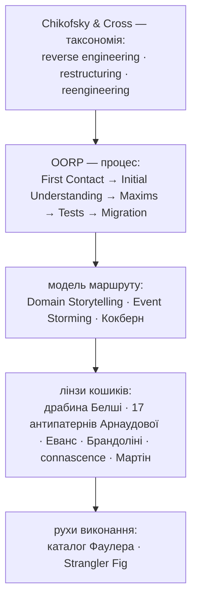
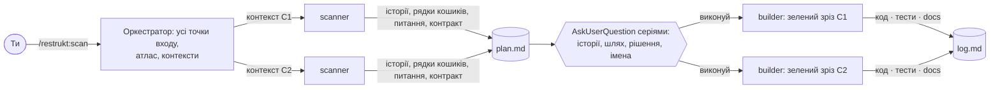
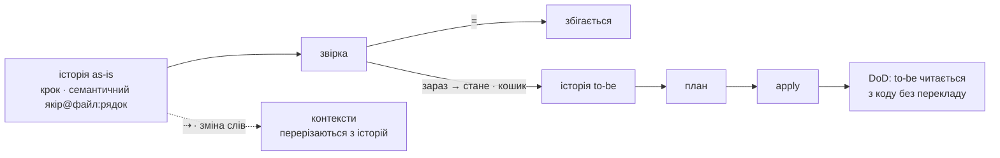

# restrukt

Плагін для Claude Code із сумісним шаром для Codex. **restrukt** — це три етапи: повний атлас маршрутів обраного обсягу й один прохід кодом з історіями, узгодження історій і пропозицій з тобою, перебудова до семантичної трасованості. На виході application orchestration читається приблизно як людська історія, а правила й інваріанти живуть у глибоких доменних модулях. Хребет — Object-Oriented Reengineering Patterns, модель — Domain Storytelling і Event Storming, міра — connascence, імена — драбина Белші, етапи названі за Chikofsky & Cross.



## Три етапи

| Етап | Команда | Вихід |
|---|---|---|
| 1 Збір | `/restrukt:scan [обсяг]` | `docs/restrukt/plan.md`: повний атлас, історії, контексти, шість кошиків, шляхи, питання |
| 2 Узгодження | серії питань `AskUserQuestion` після збору | підтверджені історії; ризикові рядки чекають окремого підтвердження; стани: `підтвердити` · `так` · `ні` · `змінено` |
| 3 Виконання | `/restrukt:apply [контекст]` | код, тести, документи, `docs/restrukt/log.md` |



## Звірка

Історія as-is звіряється з кодом крок за кроком, як два документи один проти одного: Speculate about Design. Крок, що збігся, несе `=`; крок, що розійшовся, несе `зараз → стане` зі сходинками Белші і кошиком. Хвости «стане» разом є історією to-be, а план є різницею між as-is і to-be.



Контексти оркестратор ставить ґрепом як гіпотезу; історії її перевіряють, і файл, що служить двом контекстам, сам стає рядком плану.

План до створення своїх артефактів фіксує commit і початкові зміни робочого дерева без `docs/restrukt/`. Apply за секунди звіряє основу; якщо код змінився після scan, перечитує лише файли обраних рядків і пропускає застарілі пропозиції, не запускаючи повний scan знову.

## Три максими

**Один прохід.** Спершу складається повний атлас усіх точок входу обраного обсягу. Step Through the Execution і Read All the Code in One Hour: сканер іде кожним бізнес-маршрутом, файл читає раз, пише історію та звіряє її з кодом. Атлас маршрутів є результатом; окремого інвентаря файлів і повторного проходу немає.

**Зелений зріз.** Модель належить контексту, але один apply виконує найменший зв'язаний зріз одного маршруту або спільного інваріанта: оцінка до 10 хвилин змін, максимум 5 рядків, ризиковий cutover окремо. Широка перебудова спершу розкладається на зелені дочірні кроки. Швидкий контракт проходить до й після; решта підтверджених рядків лишається на наступний apply.

**Час.** Ціль scan і apply — по 15 хвилин для правильно обмеженого обсягу. Apply не починає новий рядок після 10-ї хвилини й резервує решту на перевірку; довгий зовнішній test suite обліковується окремо.

## Шість кошиків

**слова → події → правила → межі → склад → місце**. Порядок кошиків є порядком виконання: перейменування ховає переміщення.

| Кошик | Що ловить | Connascence | Канон і рух |
|---|---|---|---|
| слова | слово з двома значеннями, `is*` не булеве, ім'я каже менше за тіло | Meaning в імені | Linguistic Antipatterns, Naming as a Process; Rename |
| події | стало правдою, а імені немає | Meaning, Execution | Domain Event; Extract Function |
| правила | те саме рішення у двох місцях, дозвільна гілка «невідомо» | Algorithm | Policy, fail-safe defaults; Transform Conditionals to Polymorphism |
| межі | сутність із кількома писарями | Value, Identity | Aggregate; Move Behavior Close to Data |
| склад | три «і» в Honest and Complete Name модуля | сильна на відстані | Split Up God Class, Strangler Fig |
| місце | однакові сигнатури в різних модулях, тека за видом коду | Algorithm на відстані | Detecting Duplicated Code, Screaming Architecture |

Документи проєкту є мовою експертів домену: ім'я, що розходиться з ними, показується з підставою по драбині; підтверджене править і документ.

Відсутність коду в знайдених історіях не доводить, що він мертвий. Видалення пропонується лише з доказом відсутності зовнішнього використання і разом зі зміною поведінки, публічного API, формату даних, межі контексту чи перебудовою модуля чекає окремого підтвердження.

## Кінець

Контекст готовий, коли всі його точки входу є в атласі, кожен бізнес-маршрут має історію й діаграму, а локальний orchestration home кожного сегмента читається доменними словами в причинному порядку історії. Правила й інваріанти можуть обслуговувати кілька маршрутів, але мають один глибокий дім. Ворота — `references/routes.md` і `references/apply.md`.

## Встановлення

### Claude Code

```
/plugin marketplace add romxnb/restrukt
/plugin install restrukt@restrukt
```

### Codex

З кореня локального клону додай marketplace:

```sh
codex plugin marketplace add ./
```

Потім у Codex відкрий Plugins Directory, вибери marketplace `restrukt` і встанови плагін. У Codex workflow запускається через skill:

```text
$restrukt scan [тека або модуль]
$restrukt apply [контекст]
$restrukt status
```

## Хто працює

| Хто | Робота | Читає код |
|---|---|---|
| оркестратор | точки входу, маршрути, контексти ґрепом; показує план, записує відповіді | лише ґрепом |
| `restrukt-scanner` | один контекст за один прохід: кошики, питання, контракт | так, кожен файл раз |
| `restrukt-builder` | один зелений зріз: до 10 хв змін і максимум 5 рядків, швидкий контракт, лог | лише файли зі зрізу |

Комітить користувач. Плагін в історію не пише.

## Сесія

Прогін іде в сесії проєкту, який ревізують. Правки плагіна — в іншій сесії.
