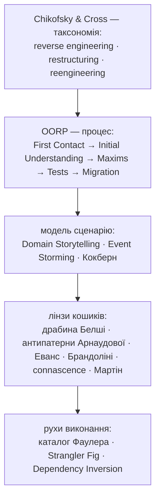
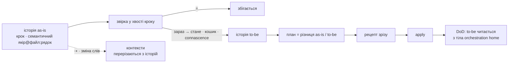

# restrukt

Плагін для Claude Code і Codex. **restrukt** — три етапи: план з повним атласом сценаріїв обраного обсягу й одним проходом кодом з історіями, узгодження історій і пропозицій з тобою, перебудова за рецептом до семантичної трасованості. В обох runtime механічна робота делегується дешевим агентам, а незалежні сценарії й контексти виконуються паралельно. На виході application orchestration читається приблизно як людська історія, правила й інваріанти живуть у глибоких доменних модулях, а зовнішні системи стоять за портами. Хребет — Object-Oriented Reengineering Patterns, модель — Domain Storytelling і Event Storming, ціль — Ports and Adapters, міра — connascence, імена — драбина Белші, етапи названі за Chikofsky & Cross.



## Три етапи

| Етап | Claude Code · Codex | Вихід |
|---|---|---|
| 1 План | `/restrukt:plan [обсяг]` · `$restrukt plan [обсяг]` | `docs/restrukt/plan.md` — рішення до 200 рядків · `atlas.md` · `stories/Cn.md` |
| 2 Узгодження | серії питань після плану | підтверджені історії; ризикові рядки чекають окремого підтвердження |
| 3 Виконання | `/restrukt:apply [контекст]` · `$restrukt apply [контекст]` | код, тести, документи, `docs/restrukt/log.md` |

```mermaid
flowchart LR
  U([Ти]) -->|/restrukt:plan| O[Оркестратор]
  O --> K[collector · механіка low: точки входу,<br/>контексти, драйвери, місце збирання]
  K --> M1[mapper · механіка low: атлас C1,<br/>графи S1, S2 з ⇥]
  K --> M2[mapper · механіка low: атлас C2]
  M1 & M2 --> A[(atlas.md + графи)]
  A -->|група сценаріїв| SC1[scanner · судження medium: спільні відрізки,<br/>історії, кошики, порти]
  A -->|група сценаріїв| SC2[scanner · судження medium]
  SC1 & SC2 --> CH[checker · механіка low:<br/>якорі, адреси, міри]
  CH --> P[(plan.md · stories/Cn.md)]
  P --> QA{{Питання серіями:<br/>історії, шлях, рішення, імена, ризик}}
  QA -->|виконуй| C1[cutter · судження medium: рецепт]
  C1 --> B1[builder · виконання low: рухи дослівно]
  B1 --> V1[cutter · судження medium: вердикт DoD]
  V1 -->|код · тести · docs| L[(log.md)]
```



## Звірка

Історія as-is звіряється з кодом крок за кроком, доки сканер іде викликами: окремого етапу порівняння немає, історія народжується вже звіреною. Крок, що збігся, несе `=`; крок, що розійшовся, несе `зараз → стане` зі сходинками Белші, кошиком і мірою connascence. Без міри хвоста «стане» немає: це гальмо проти вигаданих пропозицій. У шапці сценарію стоїть покриття: `звірка: 2 з 5 кроків =`.

Звіряється не пам'ять сканера, а **граф сценарію**: картограф, уже знаючи, які точки входу бізнесові, механічно обходить виклики від кожної і позначає виходи `⇥` до драйверів, а сканер зобов'язаний сказати про кожен вузол одне з трьох — це якір кроку, це деталь із причиною, або це не пояснено. Третє в готовому плані не лишається. Рядок покриття рахує код, а не лише кроки: `граф: 23 вузли, 5 якорів, 18 деталей, 0 не пояснених, 1 вихід`.

Сценарії, що ділять кроки, ділять і **спільний відрізок** `Jn`: він пишеться раз, а сценарії-тригери закінчуються `→ J1`. Поруч друкується **історія to-be** — ті самі кроки з погодженими іменами й портами і без адрес. Builder на етапі 3 звіряє з to-be тіло orchestration home: крок to-be без якоря в тілі означає, що трасованості немає. План є різницею між двома історіями.



## Три файли замість одного

Читач визначає файл. `plan.md` тримає лише рішення: контексти з картою, питання, пропозиції зі станами, імена, шляхи — до 200 рядків. `stories/Cn.md` тримає приймання зверху — контракт і to-be — і доказ знизу: as-is з якорями, покриття, діаграми там, де історія має гілку або перехід, деталі графа. `atlas.md` тримає всі точки входу. Id рядків стабільні між планами, тому лог і план не розходяться.

## Ціль: порти й адаптери

| Шар | Просте слово | Що там живе |
|---|---|---|
| вхід | точка входу | handler, UI action, CLI, consumer, job |
| orchestration | orchestration home | кроки сценарію в причинному порядку; use case, interactor |
| домен | глибокий модуль | правила, інваріанти, події |
| порт | порт | інтерфейс до зовнішньої системи доменними словами |
| адаптер | адаптер | реалізація порту для драйвера |
| збирання | місце збирання | де порти з'єднують з адаптерами |

Три правила замість тек: orchestration home не імпортує драйверів; глибокий модуль не імпортує нічого поза контекстом; кожна зовнішня система, яку називає крок, має один порт із доменним іменем. Контейнер DI плагін не вводить.

## Обсяг у штуках

Час не є правилом: він вимірюється і записується як факт. Обсяг тримають ліміти, і ліміт є правилом: до 15 сценаріїв деталізуються за один план, решта лишається в атласі на наступний запуск; контекст — до 8 файлів, інакше підконтексти; історія — до 7 кроків, довша ділиться спільним відрізком; до 40 рядків кошиків і 5 питань на контекст; `plan.md` — до 200 рядків; один apply — один зелений зріз до 5 рядків від зеленого контракту до зеленого. Ризикове — зміна поведінки, видалення, публічний API, формат даних, межа контексту, перебудова — чекає окремого «так» і йде окремим зрізом.

## Сім кошиків

**слова → події → правила → межі → виходи → склад → місце**. Порядок кошиків є порядком виконання: перейменування ховає переміщення, порт полегшує розріз.

| Кошик | Що ловить | Connascence | Канон і рух |
|---|---|---|---|
| слова | слово з двома значеннями, `is*` не булеве, ім'я каже менше за тіло | Meaning в імені | Linguistic Antipatterns, Naming as a Process; Rename |
| події | стало правдою, а імені немає | Meaning, Execution | Domain Event; Extract Function |
| правила | те саме рішення у двох місцях, магічне число в умові, дозвільна гілка «невідомо» | Algorithm, Value | Policy, fail-safe defaults; Transform Conditionals to Polymorphism |
| межі | сутність із кількома писарями | Value, Identity | Aggregate; Move Behavior Close to Data |
| склад | три «і» в Honest and Complete Name модуля | сильна на відстані | Split Up God Class, Strangler Fig |
| місце | однакові сигнатури в різних модулях, тека за видом коду | Algorithm на відстані | Detecting Duplicated Code, Screaming Architecture |
| виходи | orchestration або домен кличе драйвер напряму; порт названий за драйвером | Type, Name до драйвера | Ports and Adapters; Extract Interface, Dependency Inversion |

Принципи SOLID є колонкою «чому» кошиків, не окремим етапом: Dependency Inversion стоїть за виходами, Single Responsibility за лічильником «і», Open/Closed за правилами.

## Імена

Кожне ім'я, яке план міняє або вводить, стоїть окремим рядком у таблиці імен свого контексту: ім'я зараз зі сходинкою Белші, група лінгвістичного антипатерна Арнаудової, **чесне і повне ім'я** — що тіло робить насправді, усе через «і», — ім'я стане зі сходинкою, і число «і».

| id | зараз · сх | антипатерн | чесно і повно | стане · сх | «і» |
|---|---|---|---|---|---|
| C1a.1 | `check()` 2 | B.2 `validate*` не сигналізує про невдачу | перевіряє залишок і зменшує його і пише рядок у журнал | `reserveStock()` 5 | 3 → C1a.4a |

Чесне і повне ім'я — сходинка 3 драбини: не ціль, а інструмент. Три «і» і більше означають, що модуль робить три речі: кожне зайве «і» стає дочірнім рядком кошика склад, а нове ім'я покриває рівно один обов'язок. Те саме речення йде в питання про ім'я на етапі 2, тому вибір робиться без відкривання коду. Нове ім'я пишеться мовою коду, словом із документа проєкту, коли воно є, і ніколи словом зі списку заборон.

Документи проєкту є мовою експертів домену: ім'я, що розходиться з ними, показується з підставою по драбині; підтверджене править і документ. Видалення пропонується лише з доказом відсутності зовнішнього використання.

## Рецепт замість пропозиції

Дешевий builder працює лише тоді, коли рядок плану є операцією. Тому перед зрізом кроїльник перетворює підтверджені рядки на рецепт: упорядковані рухи за Фаулером з адресою, новим іменем або сигнатурою, файлом призначення, викликачами з ґрепу і тестом. Рух проходить ворота, коли його можна виконати як заміну за адресою або новий файл із заданою сигнатурою, без жодного рішення. Builder виконує рецепт дослівно; усе, чого рецепт не каже, іде в лог як пропущене. Після зрізу кроїльник читає сценарій із тіла orchestration home і звіряє його з to-be крок за кроком.

## Кінець

Контекст готовий, коли всі його точки входу є в атласі, кожен бізнес-сценарій має історію, а локальний orchestration home кожного сегмента читається доменними словами в причинному порядку історії й не імпортує драйверів. Правила й інваріанти мають один глибокий дім, зовнішні системи — порт із доменним іменем.

## Встановлення

### Claude Code

```
/plugin marketplace add romxnb/restrukt
/plugin install restrukt@restrukt
```

### Codex

З кореня локального клону:

```sh
codex plugin marketplace add ./
```

Потім у Codex відкрий Plugins Directory, вибери marketplace `restrukt` і встанови плагін. Виклик через skill:

```text
$restrukt plan [тека або модуль]
$restrukt apply [контекст]
$restrukt status
```

На `plan` і `apply` Codex використовує collaboration agents. Типово одночасно працюють до трьох помічників: картографи контекстів, групи scanner і checker-контексти стоять у черзі хвилі; залежні хвилі мають бар'єр. Якщо collaboration tools недоступні, плагін зберігає той самий процес у послідовному fallback.

Моделі профілів для обох runtime — в одній таблиці `skills/restrukt/references/models.md`; там же правило вибору, коли названої моделі в runtime немає.

## Хто працює

| Хто | Профіль | Робота | Читає код |
|---|---|---|---|
| оркестратор | сесійна | запускає помічників, склеює їхні файли, показує план, записує відповіді | не читає |
| `restrukt-collector` | механіка · low | один на обсяг: точки входу за видами й за опорами-ідіомами, гіпотеза контекстів, гарячі точки, драйвери, місце збирання, джерела мови, тести | лише ґрепом |
| `restrukt-mapper` | механіка · low | на кожні 8 точок входу кожного контексту: рядки атласу — актор, намір → результат, вид; у цільовому ще механічний граф кожного бізнес-сценарію з виходами до драйверів | ґрепом; у графі лише виклики й імпорти |
| `restrukt-scanner` | судження · medium | на групу сценаріїв, що ділять файли: спільні відрізки, історії, звірка за графом, кошики, імена, порти, контракт | кожен файл раз, одним пакетом |
| `restrukt-checker` | механіка · low | на контекст: якорі існують, адреси збігаються, міри є, вузли пояснені | лише рядки за адресами |
| `restrukt-cutter` | судження · medium | рецепт зрізу перед правками; вердикт DoD після | файли зрізу й orchestration home |
| `restrukt-builder` | виконання · low | рухи рецепта дослівно, швидкий контракт, лог | лише файли рецепта |

Профілі зіставлені з моделями в `references/models.md`; Claude Code копіює це у frontmatter агентів, Codex читає через `references/codex.md`. Механічний профіль тримає нотацію, адреси й правила на готовому тексті, але не отримує порівняльного судження над кодом. Ціну сканера робить обсяг файлів у його контексті, тому сканер читає файли сам.

Атлас повний для всього обсягу дешево: картографи йдуть на всі контексти. Дорогий прохід кодом дістають лише цільові контексти — до 15 сценаріїв за один план. Агентів стільки, скільки потрібно: картограф на кожні 8 точок входу, і він же будує графи; сканер на кожну групу сценаріїв; перевіряльник на контекст.

Комітить користувач. Плагін в історію не пише. Прогін іде в сесії проєкту, який ревізують; правки плагіна — в іншій сесії.
