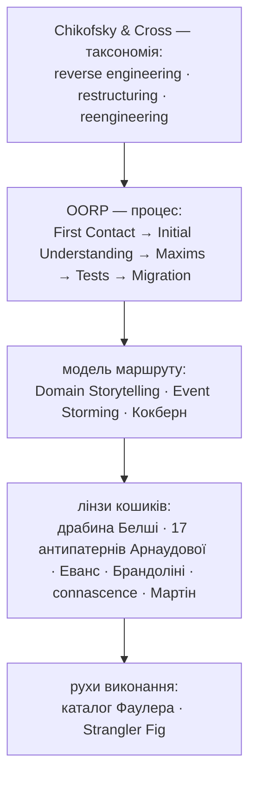
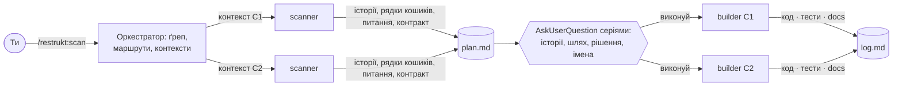
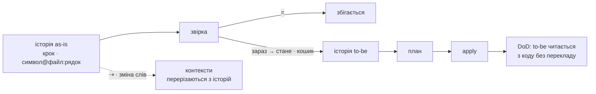

# restrukt

Плагін для Claude Code із сумісним шаром для Codex. **restrukt** — це три етапи: один прохід кодом, що пише історії маршрутів і звіряє кожен крок з кодом, узгодження історій і пропозицій з тобою, виконання пачкою до definition of done. Хребет — Object-Oriented Reengineering Patterns, модель — Domain Storytelling і Event Storming, міра — connascence, імена — драбина Белші, етапи названі за Chikofsky & Cross. Методи не переказуються, а називаються: агент знає їх за іменем.



## Три етапи

| Етап | Команда | Вихід |
|---|---|---|
| 1 Збір | `/restrukt:scan [обсяг]` | `docs/restrukt/plan.md`: історії маршрутів, контексти, шість кошиків пропозицій, шляхи, питання |
| 2 Узгодження | серії питань `AskUserQuestion` після збору | підтверджені історії; стани рядків: `так` · `ні` · `змінено` |
| 3 Виконання | `/restrukt:apply [контекст]` | код, тести, документи, `docs/restrukt/log.md` |



## Звірка

Історія as-is звіряється з кодом крок за кроком, як два документи один проти одного: Speculate about Design. Крок, що збігся, несе `=`; крок, що розійшовся, несе `зараз → стане` зі сходинками Белші і кошиком. Хвости «стане» разом є історією to-be, а план є різницею між as-is і to-be.



Контексти оркестратор ставить ґрепом як гіпотезу; історії її перевіряють, і файл, що служить двом контекстам, сам стає рядком плану.

## Три максими

**Один прохід.** Step Through the Execution і Read All the Code in One Hour: сканер іде маршрутом від точки входу, файл читається раз, там, де маршрут у нього входить; з проходу пишеться історія маршруту, з історії — кошики. Один прохід кодом, два проходи історією; окремого інвентаря і судження немає.

**Пачка.** Migrate Systems Incrementally: одиницею узгодження і виконання є контекст, Bounded Context за Евансом, або його підконтекст за спільним станом; словник спільний на контекст. Усередині контексту рядки виконуються без зупинок.

**Час.** Кожен помічник міряє свій час і повертає його. Чим швидше, тим краще; число в плагін не зашите, з виміряного плагін правиться.

## Шість кошиків

**слова → події → правила → межі → склад → місце**. Порядок кошиків є порядком виконання: перейменування ховає переміщення.

| Кошик | Що ловить | Connascence | Канон і рух |
|---|---|---|---|
| слова | слово з двома значеннями, `is*` не булеве, ім'я каже менше за тіло | Meaning в імені | Linguistic Antipatterns, Naming as a Process; Rename |
| події | стало правдою, а імені немає | Meaning, Execution | Domain Event; Extract Function |
| правила | те саме рішення у двох місцях, дозвільна гілка «невідомо» | Algorithm | Policy, fail-safe defaults; Transform Conditionals to Polymorphism |
| межі | сутність із кількома писарями | Value, Identity | Aggregate; Move Behavior Close to Data |
| склад | три «і» в Honest and Complete Name модуля | сильна на відстані | Split Up God Class, Strangler Fig |
| місце | однакові сигнатури в різних модулях, тека за видом коду | Algorithm на відстані | Detecting Duplicated Code, Screaming Architecture |

Документи проєкту є мовою експертів домену: ім'я, що розходиться з ними, показується з підставою по драбині; підтверджене править і документ.

## Кінець

Контекст готовий, коли історія to-be читається з коду без перекладу: одинадцять пунктів DoD у `references/apply.md`, кожен перевіряється ґрепом або тестом. Планові діаграми — mermaid: після кожної історії, Context Map у «Контекстах», «зараз / стане» під кошиками.

## Встановлення

### Claude Code

```
/plugin marketplace add romxnb/restrukt
/plugin install restrukt@restrukt
```

### Codex

З кореня локального клону додай marketplace:

```sh
codex plugin marketplace add ./
```

Потім у Codex відкрий Plugins Directory, вибери marketplace `restrukt` і встанови плагін. У Codex workflow запускається через skill:

```text
$restrukt scan [тека або модуль]
$restrukt apply [контекст]
$restrukt status
```

## Хто працює

| Хто | Робота | Читає код |
|---|---|---|
| оркестратор | точки входу, маршрути, контексти ґрепом; показує план, записує відповіді | лише ґрепом |
| `restrukt-scanner` | один контекст за один прохід: кошики, питання, контракт | так, кожен файл раз |
| `restrukt-builder` | один контекст цілком: правки, збірка, тести, лог | лише файли з плану |

Комітить користувач. Плагін в історію не пише.

## Сесія

Прогін іде в сесії проєкту, який ревізують. Правки плагіна — в іншій сесії.
