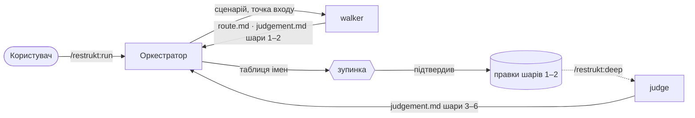

# restrukt

Плагін для Claude Code. Процес зветься **Ревізія**: перевірка з підрахунком того, що є, потім перегляд з виправленням.

## Навіщо

Перебудувати код можна лише тоді, коли знаєш, що саме перебудовуєш. Ревізія дає інвентар одного маршруту з адресами, судження над ним по шести шарах, і перебудову під контракт поведінки.

## Дві смуги

| Смуга | Команда | Шари | Що даєш на виході |
|---|---|---|---|
| швидка | `/restrukt:run [обсяг]` | 1 Слова · 2 Події | перейменування і названі події, перша правка коду за чверть години |
| глибока | `/restrukt:deep <маршрут>` | 3 Правила · 4 Межі · 5 Склад · 6 Місце | дім правилам, власники стану, вироки модулям |

Швидка смуга: огляд ґрепом, один маршрут, судження шарів 1–2 тим самим агентом, показ таблиці імен, зупинка, правки. Глибока не запускається сама: її кличуть, коли імена вже стоять.

## Встановлення

```
/plugin marketplace add /Users/roman/Documents/Projects/restrukt
/plugin install restrukt@restrukt
```

## Команди

| Команда | Що робить |
|---|---|
| `/restrukt:run [обсяг]` | швидка смуга до зупинки перед кодом |
| `/restrukt:deep <маршрут>` | шари 3–6 і зупинка перед кодом |
| `/restrukt:walk <сценарій>` | ще один маршрут із шарами 1–2 |
| `/restrukt:map [тека]` | повний огляд: висота сценаріїв, ребра, робочий набір |
| `/restrukt:rebuild <судження> [шар]` | виконати підтверджені рядки, зупинка на шар |
| `/restrukt:verify <маршрут>` | звірка з контрактом: порушення, дрейф, приріст |
| `/restrukt:second-opinion <маршрут>` | незалежне судження над тим самим інвентарем |
| `/restrukt:status` | що зроблено, що підтверджено, що далі |

Комітить користувач. Плагін в історію не пише.

## Хто працює

| Хто | Робота | Читає код |
|---|---|---|
| оркестратор | обирає обсяг і сценарій, запускає помічників, показує таблиці, править код | лише при правках |
| `revision-walker` | один маршрут: інвентар і шари 1–2 | так |
| `revision-judge` | шари 3–6 над інвентарем | лише щоб підтвердити рядок |
| `revision-scout` | точки входу, коли файлів понад 50 | так |
| `revision-consultant` | друга думка, лише за окремою командою | ні |

Оркестратор не читає інвентар і судження цілком, лише секцію того шару, який показує або виконує. Оркестратор, що прочитав маршрут на сорок кілобайт, носить його в кожному наступному ході.



## Артефакти

```
docs/revision/
  REPORT.md                              звіт: числа, імена, час
  _map.md                                точки входу і сценарії
  _glossary.md                           терміни цього коду
  _journal.md                            непройдені двері
  <сценарій>/<маршрут>.md                інвентар: шість реєстрів, контракт поведінки
  <сценарій>/<маршрут>.judgement.md      судження: спостереження, канонічна назва, пропозиція, стан
  <сценарій>/<маршрут>.verify.md         звірка
```

Інвентар є контрактом поведінки: перелік фактів, який має вижити після змін. Судження є списком рядків зі станом: `запропоновано` → `підтверджено` → `виконано`.

## Три закони

**Інвентар тлумачить, але не оцінює.** **Кожен запис має адресу.** **Подання — половина роботи.**

## Шість шарів

**слова → події → правила → межі → склад → місце**. Нижній шар без верхнього нечинний. Судження знаходить і пропонує, користувач підтверджує, перебудова виконує — один шар, одна зупинка.

Шар 5 вирішує, які модулі мають існувати. Чесне і повне ім'я модуля перелічує все, що він робить; кожне «і» в ньому — лінія розрізу. Ремонт лишає модуль і править зсередини. Перебудова виймає частини і дає їм нові доми. Вирок «розбирається» потребує двох пройдених маршрутів.

## Словник

Терміни прив'язані до канонічних назв: Use Case за Кокберном, Domain Event і Aggregate за Евансом, Command і Policy з EventStorming Брандоліні, Module за Парнасом, Naming as a Process за Белші, Linguistic Antipatterns за Арнаудовою, fail-safe defaults за Зальцером і Шредером. Агент знає їх за ключовим словом, тому довідники короткі. Повний перелік — `skills/revision/references/vocabulary.md`.

## Сесія

Прогін іде в сесії проєкту, який ревізують. Правки плагіна — в іншій сесії.
