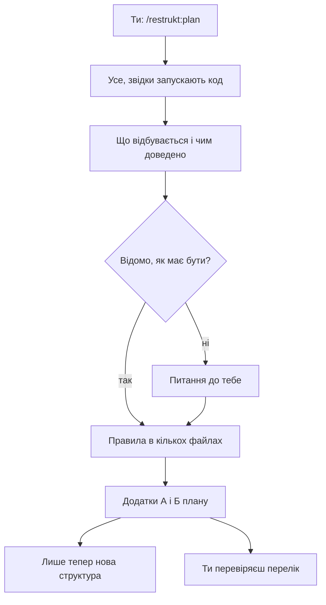

# Спершу агент записує, що вже працює

Ти хочеш перекроїти свій код, але боїшся, що після перебудови тихо зникне щось, на що ти покладався. Ти пишеш `/restrukt:plan`, і першим у плані з'являються не нові модулі, а перелік того, що твій код робить уже сьогодні. Нижче цей крок показано на справжньому плані, який restrukt склав для власного пакета: `docs/restrukt/package/plan.md`.

> **Коротко** · Спершу агент знаходить усе, звідки запускають твій код, і для кожного такого місця записує, що відбувається і чим це доведено: тестом, перевіркою чи рядком коду. Потім він шукає правила, що живуть у кількох файлах одразу, і для кожного перелічує, де воно тримається, а де його можна обійти. Лише на цьому записі агент обирає нову структуру, а ти отримуєш перелік того, що після перебудови має працювати так само. Від тебе потрібні дві речі: відповісти там, де ні код, ні тести не кажуть, який результат правильний, і до першої зміни перевірити, чи в переліку нічого не бракує.



*Рисунок 1 · Нова структура з'являється після запису того, що вже працює; ти відповідаєш лише там, де код мовчить.*

## Звідки агент знає, що робить мій код?

Агент бере все, звідки твій код запускають, і для кожного місця записує, що відбувається. У пакеті restrukt таких місць сім: команда Claude Code, виклик у Codex, роль помічника, встановлення через marketplace, випуск версії, перевірка документів і прогін тестового сценарію. Такі місця restrukt називає **входами**. Вхід — не лише команда: встановлення й випуск версії потрапили в перелік нарівні з командами.

**Агент починає з усіх входів, а не з одного шляху, що першим упав в око.** Великий застосунок він не розписує весь одразу: частину входів прямо відкладає й досліджує перед задачею, що змінює їхній код. У плані `package` відкладених входів немає, усі сім розписано.

## Що саме агент записує про кожен вхід?

Для кожного входу агент проходить справжні виклики. Ти пишеш `/restrukt:plan`, файл `commands/plan.md` передає твої аргументи в `SKILL.md` — головну інструкцію, яку план зве контрактом, — а та веде до довідника режиму `plan`. У плані цей шлях стиснуто до рядка таблиці «Додаток А. Поведінка»:

```
| Сценарій | Потрібний результат | Доказ | Перевірка |
|---|---|---|---|
| Команда Claude Code | `/restrukt:<режим> args` читає контракт і виконує режим з аргументами | `commands/*.md` | `check_plugin.py`: маршрут, `$ARGUMENTS` |
| Випуск | версії двох маніфестів однакові | `.claude-plugin/plugin.json`, `.codex-plugin/plugin.json` | `check_plugin.py` |
| Прогін фікстури | копія сценарію, `claude -p`, оцінка людиною | `prepare.py`, README фікстури | ще немає автоматичної; збереженого потоку подій у репозиторії немає |
```

Читай другу й четверту колонки. Друга каже, що після перебудови має лишитися так само, четверта — чим це перевірити, а «Доказ» лише показує, де це в коді. Рядок «Прогін фікстури» — запуск агента на тестовому сценарії — чесно визнає, що автоматичної перевірки ще немає: результат прогону оцінює людина. **Вхід без автоматичної перевірки перебудова може зламати непомітно.**

## А якщо код робить не те, що обіцяє назва?

Агент записує те, що код робить, а назву функції доказом не вважає. Назва може обіцяти одне, а код робити інше, і тоді опис за назвою дав би хибний крок, який успадкує нова структура.

> **Як гадаєш?** · Функція `frontmatter()` у `scripts/check_plugin.py` повертала лише заголовок файла між рисками `---` чи щось більше?

Функція `frontmatter()` перевіряла заголовок, а повертала весь текст файла. Прохід `/restrukt:refine names` помітив це й перейменував її на `entry_point()`; запис є в журналі плану, `docs/restrukt/package/log.md`. **Потрібний результат агент бере з тестів, вимог і коду, а не з назв.**

## Що буде, коли ні код, ні тести не кажуть, як правильно?

Коли джерело мовчить, агент не вирішує сам, а ставить тобі питання в плані. Так само він питає, коли дія виходить за те, що ти дозволив. У плані `package` таке питання одне — чи може агент сам запускати платні прогони `claude -p`:

```
### Q1 · Чи може apply запускати платні прогони фікстури

**Блокує** · [T6](#t6--справжній-прогін-оцінює-верифікатор). T1–T5 від відповіді не залежать.

**Рішення** · дозволено прогони лише зачеплених сценаріїв задачі; обсяг — задачі цього плану; джерело — користувач, сесія планування, 2026-09-24.
```

Між заголовком і рядком «Блокує» стоять контекст і два варіанти з наслідками, а біля одного з них агент пише «Рекомендую». Роботу план ділить на задачі `T1`–`T6`. **Питання без відповіді зупиняє лише задачі, що від нього залежать:** тут це `T6`, а `T1`–`T5` можна виконувати одразу. Рядок «Рішення» агент дописує після твоєї відповіді, з датою й тим, хто вирішив.

## Хіба одного пройденого шляху не досить?

Не досить: частина правил живе в кількох файлах одразу, і жоден окремий вхід не показує їх цілком. Тому після входів агент шукає, що і де записується, і збирає правила, які повторюються. У пакеті restrukt таке правило — набір режимів: `plan`, `apply`, `explain` та інші мають кожен свою команду, довідник і рядок у контракті.

> **Як гадаєш?** · Скільки місць довелося правити, коли в пакет додали режим `explain`?

Коміт `feat: add explain` змінив `SKILL.md` у трьох місцях, додав `commands/explain.md`, дописав `explain` у множину `modes` у `scripts/check_plugin.py`, у README і в маніфест Codex. Усі ці місця агент заздалегідь перелічив у «Додатку Б» плану, де лежать правила, що мають триматися завжди:

```
### Набір режимів

Кожен режим має рядок таблиці, команду, довідник і рядок `/restrukt:<режим>`.

- **Де забезпечено** · `check_plugin.py`: `commands/` = власна множина `modes`; `/restrukt:<режим>` у контракті.
- **Де обходиться** · рядок таблиці контракту не звірено; README і Codex `defaultPrompt` не звірено.
```

«Де забезпечено» — місця, де правило перевіряють. «Де обходиться» — місця, де його не перевіряє ніхто, тож там воно тримається лише на уважності того, хто править. **Кожне правило з кількох місць стає в плані задачею з одним власником.** У плані `package` це `T3 · Набір режимів визначає контракт`: перевірка пакета читатиме режими з таблиці в `SKILL.md`, а не з власної копії.

## Що мені робити з цим переліком?

Прочитай Додаток А до першої зміни коду. Варіанти нової структури агент проганяє через ті самі записані входи, а після перебудови простежує їх уже через новий код. **Вхід, якого немає в Додатку А, під час перебудови ніхто не пройде.** Ти знаєш свій код і його незвичні входи — нічний скрипт, адмінську команду, вебхук — краще, ніж видно з репозиторію.

> **Увага** · Перебудову перевіряють лише ті входи, що записані в плані: вхід поза Додатком А може зламатися без жодного червоного тесту.

> **Порада** · Перед першим `/restrukt:apply` пройдись по Додатку А й назви агентові кожен вхід, якого там бракує; він допише його до плану.

## Підсумок

- **План починається з того, що вже працює**: нова структура з'являється лише після Додатків А і Б.
- **Кожен вхід або розписаний, або прямо відкладений**, тож тихо пропущених у плані немає.
- **Колонка «Перевірка» показує, що зламається помітно**, а вхід без перевірки може зламатися непомітно.
- **Назва функції не доказ**: агент записує, що код робить насправді.
- **Ти відповідаєш лише там, де джерело мовчить**, і чекають тільки залежні задачі.
- **«Де обходиться» — перелік ручних правок**, доки правило не отримає одного власника.
- **Додаток А перевіряєш ти**, і найкраще — до першого `/restrukt:apply`.

## Чого джерело не каже

### Q1 · Скільки входів досить, щоб обирати структуру?

Довідник `plan` каже, що одного входу мало, і просить різні входи, зміни стану й ключові інтеграції, але межі не називає. Чи досить записано, ти перевіряєш сам — за переліком входів і відкладених.

### Q2 · Де в плані покроковий опис входу?

Шаблон плану просить над таблицею Додатка А описати кроки кожного входу, а план `package` має лише таблицю. Кроки на кшталт шляху від `/restrukt:plan` до довідника тобі доводиться відновлювати з коду самому.

## Додаток. Звідки це відомо

Поведінку restrukt описано за його контрактом, довідниками й методиками — це правила, як режим має працювати. Приклад — справжній план `docs/restrukt/package/plan.md`, його журнал, код пакета й git.

| Твердження | Статус | Де |
|---|---|---|
| План починається з поведінки; структура — після неї | правило | `references/plan.md`, «Віднови поведінку та знання» перед «Обери модель»; `methods/design.md`, «Коли» |
| Сім входів пакета restrukt | факт із плану | `docs/restrukt/package/plan.md`, «Додаток А. Поведінка» |
| Кожен справжній вхід, включно з реєстрацією й конфігурацією, — сценарій, технічний запуск або черга; великий обсяг деталізується перед реалізацією | правило | `references/plan.md`, «Віднови поведінку та знання» |
| У плані `package` відкладених входів немає | факт із плану | Додаток А плану `package` |
| `commands/plan.md` передає `$ARGUMENTS` у `SKILL.md`, той веде до довідника | факт із коду | `commands/plan.md`; `skills/restrukt/SKILL.md`, «Режими» |
| `SKILL.md` план зве контрактом | факт із плану | Додаток Б плану `package`, «Словник» |
| Три рядки Додатка А | факт із плану | Додаток А плану `package` |
| Прогін фікстури оцінює людина; без автоматичної перевірки регресія непомітна | факт із плану | Додаток А; Додаток В, D2, «Відхилено» |
| Потрібний результат не виводиться з назви функції | правило | `methods/stories.md`, дія про фактичну й потрібну поведінку |
| `frontmatter()` повертала весь текст і стала `entry_point()` | факт із журналу й коду | `docs/restrukt/package/log.md`, запис 2026-09-25; `scripts/check_plugin.py`, `entry_point` |
| Опис за назвою дав би хибний крок | висновок | з правила й прикладу вище |
| Невідомий потрібний результат або дія поза дозволом — питання; без відповіді блокується лише залежне | правило | `SKILL.md`, «Повноваження»; `references/plan.md`, «Віднови поведінку та знання» |
| Q1 про платні прогони; варіанти з рекомендацією; блокує лише T6; рішення від 2026-09-24 | факт із плану | `docs/restrukt/package/plan.md`, Q1 |
| Q1 — питання про дозвіл, а не про невідомий результат; оформлення однакове | висновок | Q1 плану; `SKILL.md`, «Повноваження» |
| Після історій агент перелічує стан, місця запису й правила; «де забезпечено / де обходиться» | правило | `methods/implicit.md`, «Дії» і «Приймання» |
| Коміт `feat: add explain` змінив `SKILL.md` (опис, таблицю, рядок команд), `commands/explain.md`, `modes`, README, маніфест Codex | факт із git | `git show 0b86aec` |
| Правило «Набір режимів» у Додатку Б | факт із плану, підтверджено кодом | Додаток Б плану `package`; `scripts/check_plugin.py`, множина `modes` |
| Додаток Б — правила, що мають триматися завжди | правило | `templates/plan.md`, «Додаток Б. Інваріанти та знання» |
| T3 робить таблицю контракту джерелом набору режимів | факт із плану | задачі T3, рішення D1 плану `package` |
| Варіанти структури проганяються через ті самі сценарії; після перебудови історія простежується через нові входи | правило | `methods/design.md`, варіанти; `methods/stories.md`, «Приймання» |
| Вхід поза Додатком А під час перебудови ніхто не пройде | висновок | з двох правил вище; `references/review-code.md` читає від справжніх входів, тож фінальний перегляд може його знайти |
| Нічний скрипт, адмінська команда, вебхук | вигадане | приклади незвичних входів, не з пакета restrukt |
| Агент допише названий вхід до плану | висновок | `references/plan.md`, «Віднови поведінку та знання»; план змінюється за доказом — `SKILL.md`, «Повноваження» |
| Q1: межі достатності входів не названо | висновок | `references/plan.md`, «Віднови поведінку та знання» |
| Q2: шаблон просить кроки над таблицею, план `package` має лише таблицю | факт із тексту | `templates/plan.md`, «Додаток А»; Додаток А плану `package` |
| Знахідка: методики називають вихід «Поведінка», «Інваріанти та знання», «Рішення й невідоме», а шаблон — «Додаток А. Поведінка», «Додаток Б. Інваріанти та знання», «Питання й рішення» | факт із тексту | `methods/stories.md`, `methods/implicit.md`; `templates/plan.md` |
| Знахідка: три словники статусів — шаблон (три), довідник `explain` (п'ять), методика пояснення (сім) | факт із тексту | `templates/plan.md`, Додаток Б; `references/explain.md`; `methods/explain.md`, «Будова» |
| Знахідка: «Приймання» історій вимагає підтвердження в коді, хоча текстове джерело для `explain` дозволене | факт із тексту | `methods/stories.md`, дії й «Приймання» |
| Знахідка: `defaultPrompt` Codex не має прикладу `refine`, а приклад `explain` — про стороннє «оформлення замовлення» | факт із коду | `.codex-plugin/plugin.json` |
