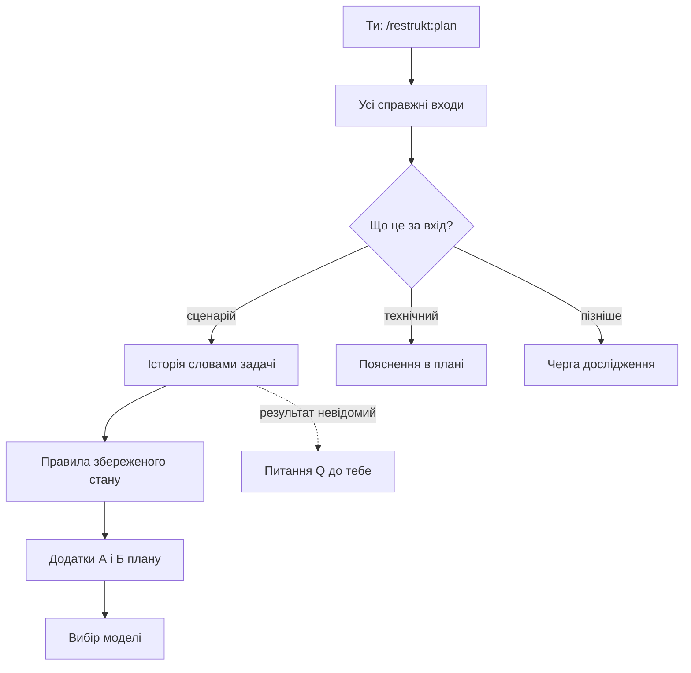

# Агент спершу записує, що твій код уже робить

Ти збираєшся перекроїти перевірку пакета restrukt — `scripts/check_plugin.py`, тести, фікстуру й README — і найбільше боїшся, що після перебудови тихо зникне щось, на що ти покладався. Ти запускаєш `/restrukt:plan` для пакета, і в плані `package` першими з'являються не нові модулі, а сім сценаріїв і п'ять правил, які пакет тримає вже сьогодні. Цей крок — відновлення сценаріїв — вирішує, що після перебудови має працювати так само.

> **Коротко** · Перед будь-яким рішенням про структуру агент робить два проходи. Спершу він перелічує всі справжні входи й для кожного сценарію записує історію: хто що робить, з чим і що отримує, з адресою в коді й доказом. Потім він перелічує збережений стан і шукає правила, що перетинають кілька сценаріїв, разом із місцями, де ці правила можна обійти. Сценарії лягають у Додаток А плану, правила — у Додаток Б, і відтоді вони — твій перелік того, що не має зламатися. Від тебе потрібна лише відповідь там, де ні код, ні вимоги не кажуть, який результат правильний.

*Рисунок 1 · Модель з'являється лише після того, як поведінку й правила записано; ти відповідаєш тільки там, де джерело мовчить.*

## Чому агент не пропонує нову структуру одразу?

**Поточний код доводить поведінку, але не правильність своїх шарів, назв і залежностей.** Множина `modes` у `check_plugin.py` каже, які режими є, але не каже, чи має ця множина взагалі існувати. Агент тому спершу з'ясовує, що пакет робить і має робити, а вже потім вирішує, де цьому жити. Проєктування моделі в restrukt починається з умови, що поведінку й ключові правила вже встановлено. Тож перша половина плану відповідає на питання «що має працювати далі», а не «як розкласти файли».

## Звідки агент знає, які сценарії в мене є?

**Кожен справжній вхід, включно з реєстрацією й конфігурацією, агент відносить до сценарію, технічного запуску або черги дослідження.** Для пакета restrukt входами виявилися не лише команди: маніфест Codex, роль помічника, marketplace, версії двох маніфестів, перевірка документів і прогін фікстури. У Додатку А плану `package` так з'явилося сім сценаріїв — від команди `/restrukt:<режим>` до прогону фікстури. Одного сценарію для вибору меж замало: агент проходить різні входи, зміни стану й ключові інтеграції. Великий обсяг агент не деталізує весь одразу, а решту явно ставить у чергу дослідження. Тож у плані немає тихо пропущених входів: кожен або описаний, або названий недослідженим.

## Як виглядає одна історія?

> **Визначення** · історія — короткий запис сценарію словами задачі: хто → що робить → з яким об'єктом → що отримує, з адресою реалізації біля суттєвого кроку й доказом біля потрібного результату.

**Історія розповідає, хто що робить і що отримує, словами задачі, а не назвами функцій.** Візьми команду Claude Code: ти пишеш `/restrukt:plan`, файл `commands/plan.md` передає твої аргументи контракту `SKILL.md`, а контракт веде до довідника режиму. Біля суттєвого кроку стоїть адреса — `commands/*.md`, біля потрібного результату — доказ: `check_plugin.py` перевіряє маршрут кожної команди й передачу `$ARGUMENTS`. Потрібний результат агент не виводить із назви функції, бо назва може обіцяти одне, а код робити інше. Тож історія каже тобі, що відбувається насправді.

> **Як гадаєш?** · Функція `frontmatter()` у `check_plugin.py` повертала лише заголовок файла між рисками `---` чи щось більше?

**`frontmatter()` повертала весь текст точки входу, а не лише frontmatter.** Прохід `refine names` помітив розбіжність між назвою й поведінкою і перейменував функцію на `entry_point()`; запис про це є в журналі плану `package`. Якби історію писали за назвою, у ній з'явився б хибний крок, і нова модель успадкувала б помилку. Тож читай сценарії в плані як опис того, що код робить, а не того, що обіцяють імена.

## Що буде, коли код робить не те, що треба?

**Фактичну поведінку й потрібну агент записує окремо, а невідомий потрібний результат стає питанням до тебе.** Відому помилку агент не закріплює як сумісність, тож «так працює зараз» ще не означає «так має бути». Прогін фікстури в Додатку А має чесний рядок: копію сценарію оцінює людина, автоматичної перевірки ще немає. Там, де ні код, ні вимоги не кажуть, що правильно, з'являється питання — у плані `package` це Q1: чи може `apply` запускати платні прогони `claude -p`. Питання Q1 блокує лише задачу T6, а T1–T5 від відповіді не залежать. Тож ти відповідаєш на один пакет — контекст, варіанти з наслідками, рекомендація, — а незалежна робота тим часом іде далі.

## Хіба простеженого шляху не досить?

**Правило, що перетинає кілька сценаріїв, видно лише з усіх місць запису стану, а не з одного шляху.** Після історій агент перелічує збережений стан і для кожного шукає всі місця запису та умови, за яких запис дозволений. Так у Додатку Б плану з'явилося правило «Набір режимів»: кожен режим має рядок таблиці «Режими» в контракті, команду, довідник і рядок `/restrukt:<режим>`. Біля правила стоять два переліки — де воно забезпечене і де його можна обійти. Тож правило в плані — не побажання, а адреси, де воно тримається й де ні.

> **Як гадаєш?** · Хто перевіряє, що новий режим справді має рядок у таблиці «Режими» контракту?

**Рядок таблиці «Режими» не звіряє ніхто.** Скрипт `check_plugin.py` порівнює команди з власною множиною `modes`, а README й підказки Codex не звіряються взагалі. Коли згодом з'явився режим `explain`, коміт `feat: add explain` змінив саме ці місця: контракт, `commands/explain.md`, множину `modes`, README і маніфест Codex. Рядок «Де обходиться» заздалегідь назвав усі копії, які довелося правити руками. Тож, доки задача T3 не зробить контракт єдиним джерелом набору режимів, новий режим означає правки в кількох файлах, а не в одному.

> **Увага** · Доки набір режимів не має одного власника, новий режим треба вручну дописати в контракт, команду, множину `modes`, README і маніфест Codex; пропущену підказку Codex перевірка пакета не помітить.

## Куди все це лягає і що мені з того?

**Сценарії лягають у Додаток А плану, а правила — у Додаток Б, кожне зі статусом і доказом.** У плані `package` Додаток А — таблиця: сценарій, потрібний результат, доказ і перевірка. Статус правила в Додатку Б — вимога, підтверджений факт або гіпотеза разом зі способом її перевірити. На цих додатках агент будує варіанти моделі й проганяє їх через ті самі сценарії, а перегляд плану й перегляд коду згодом знову йдуть від справжніх входів. Після перебудови та сама історія має простежуватися через нові точки входу. Тож Додаток А — твій перелік того, що не має зламатися, а вхід, якого ти не знайдеш ні серед сценаріїв, ні в черзі, варто назвати агентові до реалізації.

> **Порада** · Прочитай Додаток А нового плану до першого `apply` і назви агентові вхід, якого немає ні серед сценаріїв, ні в черзі дослідження: перегляд після перебудови проходить лише записаними сценаріями.

## А якщо я запускаю не plan?

**Інші режими відновлюють лише ту частину сценаріїв, яка потрібна їхньому результату.** Режим `implement` досліджує тільки входи й стан, яких торкається завдання, і весь застосунок не обходить. Режим `apply` бере підтверджені висновки з плану, звіряє їх з актуальним кодом і diff, а недосліджену поведінку своєї задачі відновлює перед заміною. Режим `explain` може взяти історію навіть із тексту — спеки, плану чи довідника; розбіжність між текстом і кодом стає окремим пунктом. Тож коротший прохід — не пропуск, а межа: кожен режим досліджує те, що сам змінює.

## Підсумок

- **План починається з поведінки, а не зі структури**: модель з'являється лише після сценаріїв і правил.
- **Кожен справжній вхід має місце в плані** — сценарій, технічний запуск або черга дослідження.
- **Історія описує, що код робить, а не що обіцяють назви**, з адресою реалізації й доказом.
- **Ти відповідаєш лише там, де джерело мовчить**, і відповідь блокує тільки залежні задачі.
- **Рядок «Де обходиться» — список ручних правок**, доки правило не має одного власника.
- **Додаток А — перелік того, що не має зламатися**: перевір його до першого `apply`.

## Чого джерело не каже

### Q1 · Скільки сценаріїв досить, щоб обирати модель?

Довідник `plan` вимагає різних входів, змін стану й ключових інтеграцій і каже, що одного сценарію мало, але межі не називає. Ти бачиш у плані, які сценарії досліджено, проте перевірити, чи їх досить, можеш лише за чергою дослідження.

### Q2 · Чи потрапляє в план історія, яку відновив apply?

Методика історій кладе результат у поведінку плану, а довідник `apply` оновлює план лише для переглянутих рішень і залежних контрактів. Після `apply` нова історія може лишитися тільки в журналі, і наступний виконавець відновлюватиме її знову.

### Q3 · Де в плані прочитати саму історію?

Методика історій і шаблон плану просять покрокову історію, а Додаток А плану `package` має лише таблицю з потрібним результатом, доказом і перевіркою. Ти знаходиш у плані, що має працювати, але кроки сценарію доводиться відновлювати з коду самому.

## Додаток. Звідки це відомо

Поведінку плагіна описано за його контрактом, довідниками й методиками — це правила того, як режим має працювати; приклад — справжній план `docs/restrukt/package/plan.md`, його журнал, код і git.

| Твердження | Статус | Де |
|---|---|---|
| Поточний код доводить поведінку, але не правильність класів, шарів, назв і залежностей | правило | `skills/restrukt/SKILL.md`, «Цільовий дизайн» |
| Сім сценаріїв і п'ять правил у плані `package` | факт із плану | `docs/restrukt/package/plan.md`, Додатки А і Б |
| Ти запускаєш `/restrukt:plan` для пакета | висновок | журнал `package`: план створено 2026-09-24; точні аргументи виклику не записані |
| Проєктування починається, коли поведінку й інваріанти встановлено | правило | `methods/design.md`, «Коли» |
| Кожен справжній вхід — сценарій, технічний запуск або черга; одного сценарію мало; великий обсяг — у черзі | правило | `references/plan.md`, крок 2 |
| Перелік входів пакета: команди, Codex, помічник, marketplace, версії, документи, фікстура | факт із плану | Додаток А плану `package` |
| Форма історії, адреса біля кроку, доказ біля результату | правило | `methods/stories.md`, дії 1–2 |
| Історія команди Claude Code: команда → контракт → довідник | висновок | рядок «Команда Claude Code» Додатка А; `commands/plan.md` |
| `check_plugin.py` перевіряє маршрут і `$ARGUMENTS` кожної команди | факт із коду | `scripts/check_plugin.py`, функція `check` |
| Потрібний результат не виводиться з назви функції | правило | `methods/stories.md`, дія 4 |
| `frontmatter()` повертала весь текст і стала `entry_point()` після `refine names` | факт із журналу й коду | `docs/restrukt/package/log.md`, запис 2026-09-25; `scripts/check_plugin.py`, `entry_point` |
| Фактична й потрібна поведінка окремо; відомі помилки не закріплюються як сумісність | правило | `methods/stories.md`, дія 4; `references/plan.md`, крок 2 |
| Прогін фікстури оцінює людина | факт із плану | Додаток А, рядок «Прогін фікстури» |
| Q1 про платні прогони блокує лише T6 | факт із плану | `docs/restrukt/package/plan.md`, Q1 |
| Питання — одним пакетом: контекст, варіанти, рекомендація; без відповіді блокується лише залежне | правило | `SKILL.md`, «Повноваження»; `references/plan.md`, крок 2 |
| Перелік стану, усі місця запису й умови | правило | `methods/implicit.md`, дія 1 |
| Правило «Набір режимів», де забезпечене й де обходиться | факт із плану, підтверджено кодом | Додаток Б; `scripts/check_plugin.py`, множина `modes` |
| Коміт `feat: add explain` змінив контракт, `commands/explain.md`, `modes`, README, маніфест Codex | факт із git | `git show --stat 0b86aec` |
| T3 робить контракт джерелом набору режимів | факт із плану | «Власники», T3, D1 |
| Підказки Codex перевірка пакета не звіряє | факт із коду | `scripts/check_plugin.py`; Додаток Г плану `package` |
| Статуси правил: вимога, підтверджений факт, гіпотеза зі способом перевірки | правило | `templates/plan.md`, Додаток Б |
| Варіанти моделі проганяються через ті самі сценарії | правило | `methods/design.md`, крок варіантів |
| Перегляд плану й коду йде сценаріями від справжніх входів | правило | `references/review-plan.md`; `references/review-code.md`, крок 2 |
| Та сама історія простежується після перебудови | правило | `methods/stories.md`, «Приймання» |
| Вхід поза сценаріями й чергою варто назвати до реалізації: перегляд проходить лише записаними сценаріями | висновок | `references/review-plan.md`; `references/review-code.md`, крок 2; `references/plan.md`, крок 2 |
| `implement` досліджує лише зачеплене | правило | `references/implement.md`, крок основи |
| `apply` звіряє висновки з кодом і diff, недосліджене відновлює | правило | `references/apply.md`, «Вибір» і цикл 1 |
| `explain` бере історію з тексту; розбіжність — окремий пункт | правило | `methods/stories.md`, дія 5 |
| Q1: межі репрезентативності не названо | висновок | `references/plan.md`, крок 2 |
| Q2: місце історії з `apply` не визначене | висновок | `methods/stories.md`, «Вихід»; `references/apply.md`, цикл 1 і 3 |
| Q3: Додаток А плану `package` без покрокових історій | факт із плану | Додаток А плану `package`; `templates/plan.md`, Додаток А |
| Знахідка: три словники статусів — шаблон (три), довідник `explain` (п'ять), методика пояснення (сім, з «висновком» і «вигаданим») | факт із тексту | `templates/plan.md`, Додаток Б; `references/explain.md`, крок 2; `methods/explain.md`, «Будова» 9 |
| Знахідка: форма історії розходиться — методика «хто → що робить → з яким об'єктом → що отримує», шаблон «актор → дії → результат»; методика називає секцію «Поведінка», шаблон — «Додаток А. Поведінка» | факт із тексту | `methods/stories.md`, «Вихід» і дія 2; `templates/plan.md`, Додаток А |
| Знахідка: «Приймання» історій вимагає підтвердження в коді, хоча дія 5 дозволяє текстове джерело для `explain` | факт із тексту | `methods/stories.md`, дія 5 і «Приймання» |
