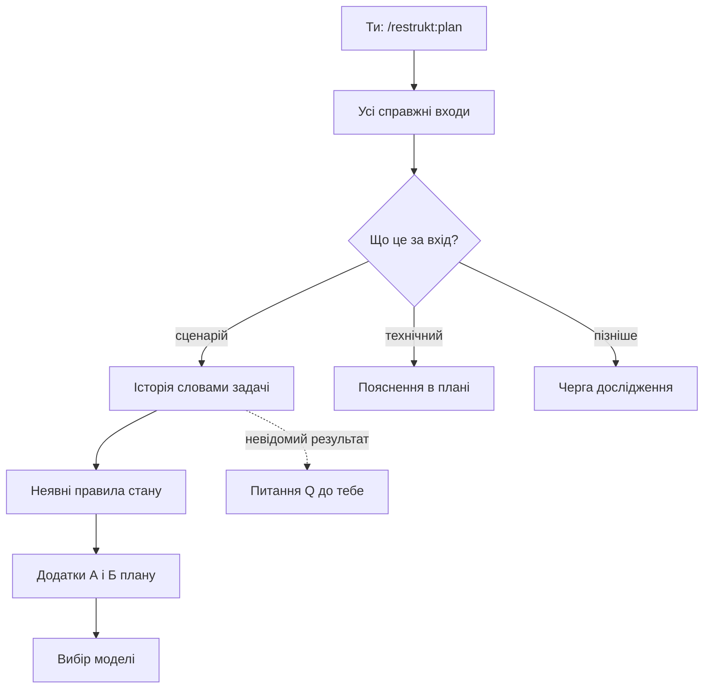

# Агент спершу розповідає, що насправді робить твій код

Ти хочеш навести лад у пакеті restrukt: `scripts/check_plugin.py`, тести, фікстуру й README. Ти пишеш `/restrukt:plan`, і перше, що з'являється в плані, — не нові модулі, а перелік того, що пакет робить сьогодні. Агент відновлює сценарії: кожен вхід, історію кожного сценарію, правила, які тримають стан, і місця, де ці правила можна обійти. Від тебе залежить одне: відповісти там, де код не каже, який результат потрібний.

*Модель з'являється лише після того, як поведінку й правила записано; твої відповіді потрібні тільки там, де джерело мовчить.*

## Чому агент не пропонує структуру одразу?

**Поточний код доводить поведінку, але не правильність своїх шарів і назв.** Агент тому не бере наявні файли за основу нової моделі, а спершу з'ясовує, що пакет має робити. Кожен справжній вхід, включно з реєстрацією й конфігурацією, стає сценарієм, технічним запуском або пунктом черги дослідження. У плані `package` таких сценаріїв сім: команда Claude Code, виклик Codex, помічник, встановлення, випуск, цілісність документів і прогін фікстури. Тож план починається з того, що має й далі працювати, а не з того, як зараз розкладено файли.

## Як виглядає одна історія?

**Історія каже, хто що робить, з чим і що отримує, словами задачі, а не назвами функцій.** Візьми команду Claude Code: ти пишеш `/restrukt:plan package`, `commands/plan.md` передає аргументи контракту, контракт веде до довідника режиму. Біля суттєвого кроку стоїть адреса реалізації, біля потрібного результату — вимога чи тест; тут це `commands/*.md` і перевірка маршруту та `$ARGUMENTS` у `check_plugin.py`. Як гадаєш, що повертала функція `frontmatter()`? Весь текст точки входу, а не лише frontmatter, тож пізніше її перейменували на `entry_point()`. Отже, ти читаєш у плані те, що код робить, навіть коли назва каже інше.

## А якщо код робить не те, що потрібно?

**Фактична поведінка й потрібна записуються окремо, а невідомий потрібний результат стає питанням до тебе.** Агент не закріплює відому помилку як сумісність і не виводить вимогу з назви. Прогін фікстури, наприклад, має чесний рядок: оцінює людина, автоматичної перевірки ще немає. Коли потрібний результат не видно ні з коду, ні з вимог, з'являється питання Q1: чи може `apply` запускати платні прогони `claude -p`? Питання блокує лише T6, а T1–T5 від нього не залежать. Тож ти відповідаєш на один пакет із варіантами й рекомендацією, а робота, що від відповіді не залежить, іде далі.

## Хіба простеженого шляху не досить?

**Правило, що перетинає кілька сценаріїв, видно лише з усіх місць запису стану, а не з одного шляху.** Після історій агент перелічує збережений стан і для кожного шукає, де його пишуть і за якої умови. Так у плані з'являється правило «Набір режимів»: кожен режим має рядок таблиці контракту, команду, довідник і рядок `/restrukt:<режим>`. Хто перевіряє, що рядок таблиці справді є? Ніхто: `check_plugin.py` звіряє команди з власною множиною `modes`, а README й Codex `defaultPrompt` не звіряє ніхто. Згодом коміт `feat: add explain` торкнувся саме цих місць: контракту, `commands/explain.md`, множини `modes`, README і маніфесту Codex. Тож рядок «Де обходиться» заздалегідь каже тобі, що доведеться правити руками, доки задача T3 не зробить власником контракт.

## Куди все це лягає і навіщо мені?

**Історії лягають у Додаток А плану, а правила — у Додаток Б із місцями, де правило тримається й де обходиться.** Кожне правило має статус: вимога, підтверджений факт або гіпотеза з тим, як її перевірити. На цих додатках агент будує варіанти моделі й проганяє через ті самі сценарії; перегляд плану й перегляд коду знову проходять ними від справжніх входів. Після перебудови та сама історія має простежуватися через нові входи. Отже, Додаток А — твій перелік того, що не має зламатися, а Додаток Б — перелік знань, які отримують одного власника.

## Що зміниться, якщо я запускаю не plan?

**Інші режими відновлюють лише ту частину сценаріїв, яка потрібна їхньому результату.** `implement` досліджує тільки сценарії й стан, яких торкається завдання, і весь застосунок не обходить. `apply` бере підтверджені висновки з плану, звіряє їх з актуальним кодом і diff, а недосліджену поведінку своєї задачі відновлює перед заміною. `explain` може взяти історію з тексту — спеки, плану чи довідника; розбіжність між текстом і кодом стає окремим пунктом. Для великого обсягу `plan` деталізує репрезентативні сценарії, а решту явно залишає в черзі дослідження. Тож коротший прохід не означає пропущений: недосліджене названо в плані.

## Чого джерело не каже

### Q1 · Скільки сценаріїв досить, щоб обирати модель?

Довідник `plan` вимагає різних входів, змін стану й ключових інтеграцій і каже, що одного сценарію мало, але межі не називає. Ти бачиш у плані, які сценарії досліджено, проте не можеш перевірити, чи їх досить, інакше ніж за чергою дослідження.

### Q2 · Чи потрапляє в план історія, яку відновив apply?

Методика історій кладе результат у поведінку плану, а довідник `apply` велить уточнити недосліджену поведінку й оновлює план лише для переглянутих рішень і нових понять словника. Після `apply` нова історія може лишитися тільки в журналі, і наступний виконавець відновлюватиме її знову.

## Додаток. Звідки це відомо

Поведінку плагіна описано за його довідниками й методиками (джерело — текст правил), приклад — за справжнім планом `docs/restrukt/package/plan.md`, журналом і git.

| Твердження | Статус | Де |
|---|---|---|
| Поточний код доводить поведінку, але не правильність класів, шарів і назв | правило | `SKILL.md`, «Цільовий дизайн» |
| Кожен справжній вхід стає сценарієм, технічним запуском або чергою дослідження | правило | `references/plan.md`, крок 2 |
| Історії, потім неявні правила; модель — після них | правило | `references/plan.md`, кроки 2–3; `methods/design.md`, «Коли» |
| Сім сценаріїв пакета | факт із плану | `docs/restrukt/package/plan.md`, Додаток А |
| Ти пишеш `/restrukt:plan package` | вигадане | точні аргументи створення плану не записані; журнал називає лише план `package` |
| Форма історії «хто → що робить → з яким об'єктом → що отримує», адреса й доказ | правило | `methods/stories.md`, дії 1–2 |
| Маршрут команди й перевірка `$ARGUMENTS` | факт із коду | `commands/plan.md`; `scripts/check_plugin.py`, `check` |
| `frontmatter()` повертала весь текст точки входу й стала `entry_point()` | факт із журналу й коду | `docs/restrukt/package/log.md`, запис `refine names`; коміт `0b86aec` |
| Потрібний результат не виводиться з назви функції | правило | `methods/stories.md`, дія 4 |
| Відомі помилки не закріплюються як сумісність; невідоме блокує лише залежні задачі | правило | `references/plan.md`, крок 2 |
| Прогін фікстури оцінює людина | факт із плану | Додаток А, рядок «Прогін фікстури» |
| Q1 блокує лише T6; рішення — прогони зачеплених сценаріїв | факт із плану | `docs/restrukt/package/plan.md`, Q1 |
| Питання — одним пакетом із варіантами й рекомендацією | правило | `SKILL.md`, «Повноваження» |
| Перелік стану, місця запису, носії поза шляхом | правило | `methods/implicit.md`, дії 1–2 |
| Правило «Набір режимів» і де воно обходиться | факт із плану, підтверджено кодом | Додаток Б; `scripts/check_plugin.py`, множина `modes` |
| Коміт `feat: add explain` змінив контракт, `commands/explain.md`, `modes`, README, маніфест Codex | факт із git | `git show --stat 0b86aec` |
| T3 робить контракт власником набору режимів | факт із плану | `docs/restrukt/package/plan.md`, «Власники», T3, D1 |
| Статуси правил: вимога, підтверджений факт, гіпотеза | правило | `templates/plan.md`, Додаток Б |
| Варіанти моделі проганяються через ті самі сценарії | правило | `methods/design.md` |
| Перегляд плану й коду проходить сценаріями | правило | `references/review-plan.md`; `references/review-code.md`, крок 2 |
| Та сама історія простежується після перебудови | правило | `methods/stories.md`, «Приймання» |
| `implement` досліджує лише зачеплене | правило | `references/implement.md`, крок основи |
| `apply` звіряє висновки з кодом і diff, недосліджене відновлює | правило | `references/apply.md`, «Вибір», цикл 1; `SKILL.md`, «Пам'ять і передача роботи» |
| `explain` бере історію з тексту; розбіжність — окремий пункт | правило | `methods/stories.md`, дія 5; `references/explain.md`, крок 2 |
| Великий обсяг: решта в черзі дослідження | правило | `references/plan.md`, крок 2 |
| Q1: межі репрезентативності немає | висновок | `references/plan.md`, крок 2, не називає критерію |
| Q2: місце історії з `apply` не визначене | висновок | `methods/stories.md`, «Вихід»; `references/apply.md`, цикл 1 і 3 |
| Знахідка: три словники статусів — шаблон (вимога / факт / гіпотеза), довідник `explain` (п'ять статусів), методика пояснення (сім, з «висновком» і «вигаданим») | факт із тексту | `templates/plan.md`, Додаток Б; `references/explain.md`, крок 2; `methods/explain.md`, «Будова» 7 |
| Знахідка: методика історій пише «хто → що робить → з яким об'єктом → що отримує», шаблон — «актор → дії → результат», а Додаток А плану `package` має лише таблицю без історій | факт із тексту | `methods/stories.md`, дія 2; `templates/plan.md`, Додаток А; `docs/restrukt/package/plan.md`, Додаток А |
| Знахідка: «Приймання» історій вимагає підтвердження в коді, хоча дія 5 дозволяє текстове джерело для `explain` | факт із тексту | `methods/stories.md`, дія 5 і «Приймання» |
