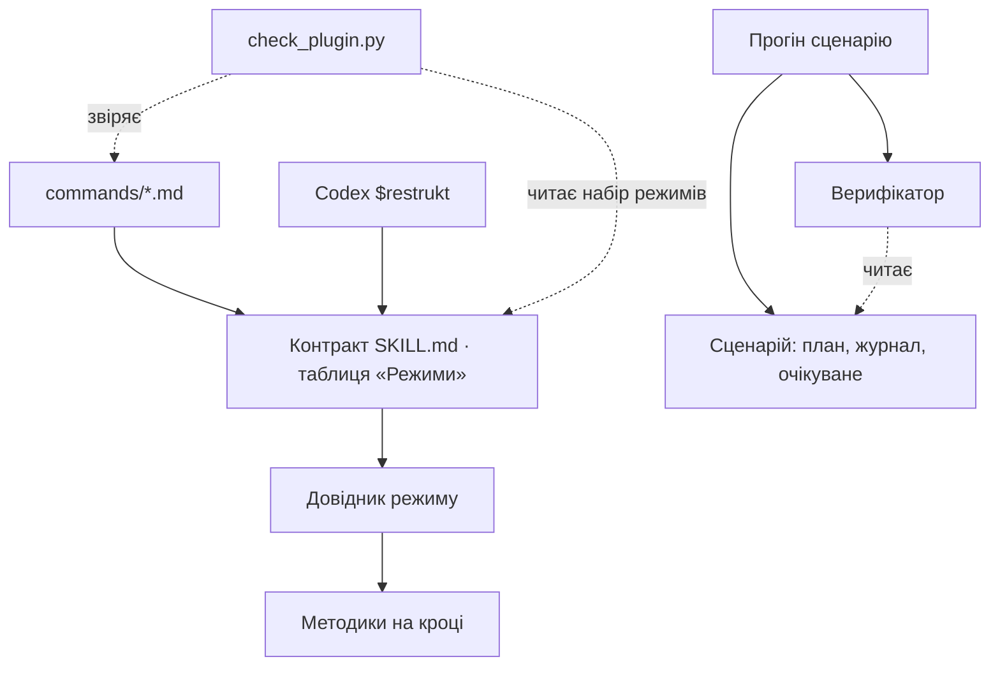
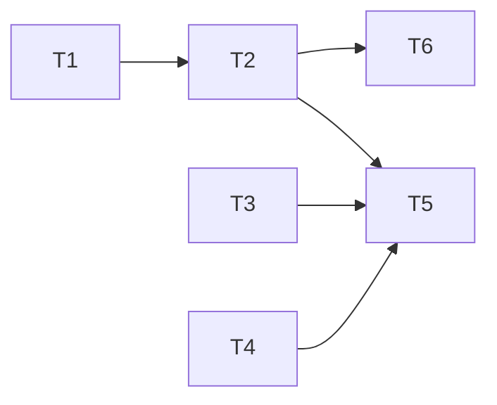

# Пакет restrukt

Перевірка пакета сама ловить розбіжності режимів і поведінки агента, а кожне правило пакета записане в одному місці.

> - **Перевірка цілого** · очікує
> - **Прогрес** · 0 з 6 задач готові
> - **Далі** · [T1 · Верифікатор оцінює копію сценарію](#t1--верифікатор-оцінює-копію-сценарію)
> - **Від вас** · нічого

**Зміст**

1. [Мета й межі](#1-мета-й-межі)
2. [Зміни поведінки](#2-зміни-поведінки)
3. [Питання й рішення](#3-питання-й-рішення)
4. [Модель](#4-модель)
5. [Задачі](#5-задачі)
6. [Перевірка плану](#6-перевірка-плану)
7. [Перевірка цілого](#7-перевірка-цілого)
8. [Продовження](#8-продовження)
9. [Додатки](#додаток-а-поведінка)

---

## 1. Мета й межі

**Мета**

- Очікуваний результат кожного сценарію фікстури перевіряє скрипт, а не читання звіту агента.
- Фікстури перевіряють план чинного формату (огляд, сталі ID, додаток готових задач); попередній формат лишається одним сценарієм сумісності.
- Перевірка пакета читає набір режимів із таблиці «Режими» контракту й звіряє з нею команди й довідники.
- Правила процесу записані в контракті й довідниках; README їх не повторює.

**Входить**

- `scripts/check_plugin.py`, `tests/` (юніт-тести, фікстура `plan-state`, `acceptance.md`, `principles.md`).
- `README.md`.
- Маніфести `.claude-plugin/`, `.codex-plugin/` і `commands/` — лише як об'єкти перевірки.

**Не входить**

- Зміст інструкцій `skills/restrukt/**` і `agents/`: поведінку агента в режимах зберігаємо. Знахідка в них стає новою задачею з погодженням.
- Нові режими, публікація й випуск версії.

**Основа** · commit `11765de` (release 0.22.0); робоче дерево чисте, крім теки цього плану.

**Обмеження користувача**

- Поведінка всіх режимів у Claude Code і Codex не змінюється; джерело — головний контракт.
- Коміт і публікація — лише за дорученням.

---

## 2. Зміни поведінки

Агентна поведінка режимів не змінюється. Перевірка пакета стає суворішою — це інструмент розробника, не результат для користувачів плагіна.

### R1 · README веде до контракту, а не повторює його

**Було** · README переказує правила процесу: стани, автоматичне коло, повноваження, делегування. README змінено в 21 коміті з 36, контракт — у 22.

**Стане** · README коротшає за розділами:

- **Лишаються без змін** · вступ, «Використання», «Встановлення», «Устрій і перевірка».
- **Скорочуються до посилань** · «Workflow» — чотири пункти по реченню; «Реалізація завдання» — два речення й посилання на довідник `implement`; «Вузькі доопрацювання» — одне речення й посилання на `refine`.
- **Зникають** · «План і самостійність» і «Результат і витрати»: їхні правила вже є в контракті («Пам'ять і передача роботи», «Повноваження», «Стан плану», «Відповідь») і в довіднику виконання й делегування.

**Хто помітить** · читачі README на GitHub.

**Підстава** · одне знання — одне місце ([текст плану](../../../skills/restrukt/methods/writing.md), правило 7); спільні зміни README з контрактом у `git log`.

**Відхилено** · перевіряти скриптом збіг тексту README з контрактом — синхронізує копію, а не прибирає її.

**Рішення** · видимий результат: погоджено користувачем у сесії планування, 2026-09-24, у переліку розділів вище. Реалізує [T4](#t4--readme-веде-до-контракту). Відхилення скасовує T4 і не блокує [T5](#t5--зведення-перевірок-пакета).

---

## 3. Питання й рішення

### Q1 · Чи може apply запускати платні прогони фікстури

**Контекст** · захисна перевірка поведінки агента — прогін `claude -p` на сценарії фікстури. Кожен прогін витрачає токени підписки й кілька хвилин.

**Варіанти**

- **Дозволити зачеплені сценарії** — `apply` проганяє лише сценарії, які його задача змінила; поведінку доведено. Рекомендую.
- **Лише синтетичні перевірки** — верифікатор перевіряється на підготовлених станах без агента; справжні прогони запускаєте ви за командою з [T6](#t6--справжній-прогін-оцінює-верифікатор).

**Блокує** · [T6](#t6--справжній-прогін-оцінює-верифікатор). T1–T5 від відповіді не залежать.

**Рішення** · дозволено прогони лише зачеплених сценаріїв задачі; обсяг — задачі цього плану; джерело — користувач, сесія планування, 2026-09-24.

---

## 4. Модель

**Поточна модель.** Інструкції вже мають власників: «Стан плану» живе в контракті, режим читає свій довідник, методики підключаються на кроці. Слабкі місця — навколо них:

- Набір режимів записано щонайменше у восьми місцях: таблиця й опис frontmatter контракту, рядок команд Claude Code, `commands/`, множина `modes` у `check_plugin.py`, README, Codex `defaultPrompt` і `longDescription`. Скрипт звіряє команди з власною копією, а не з контрактом. Описи для людей лишаються копіями ([додаток Г](#додаток-г-можливі-доопрацювання)).
- Очікуваний результат сценаріїв фікстури існує лише прозою двічі: у `tests/fixtures/plan-state/README.md` і `tests/acceptance.md`. Прогін оцінює людина.
- Усі дев'ять сценаріїв фікстури мають попередній формат плану (`# План: магазин`, без ID і огляду). Формат 0.22.0 жодним прогоном не перевірено, хоча `tests/principles.md` посилається на «нові сценарії приймання».
- README повторює правила контракту ([R1](#r1--readme-веде-до-контракту-а-не-повторює-його)).



*Цільова модель. Суцільні стрілки — шлях агента, пунктир — перевірки. Перевірки читають власників, а не копії.*

### Власники

| Знання або операція | Власник | Гарантія |
|---|---|---|
| Набір режимів | таблиця «Режими» в [контракті](../../../skills/restrukt/SKILL.md) | кожен режим має команду, довідник і рядок команд |
| Звірка пакета | `scripts/check_plugin.py` | набір режимів береться з контракту ([D1](#d1--набір-режимів-читається-з-контракту)) |
| Очікуваний результат сценарію | тека сценарію фікстури | один запис; прозові таблиці посилаються на нього ([D2](#d2--очікуване-лежить-у-теці-сценарію)) |
| Перевірка прогону | верифікатор фікстури | однаково оцінює прогін будь-якої версії пакета, що підтримує формат плану сценарію |
| Формат планів фікстури | шаблон плану | чинний формат, один сценарій сумісності ([D4](#d4--фікстури-в-чинному-форматі-один-сценарій-сумісності)) |
| Правила процесу | контракт і довідники | README лише посилається ([R1](#r1--readme-веде-до-контракту-а-не-повторює-його)) |

Дерево `skills/restrukt/` лишається ([D3](#d3--дерево-skills-лишається)). Нові файли — лише в `tests/fixtures/plan-state/` і, за потреби, `scripts/`.

**Виконавець обирає сам** · формат файла очікуваного, розклад `check_plugin.py` на функції, назви внутрішніх функцій верифікатора, спосіб зберегти потік подій прогону.

### Що зникає

- Множина `modes = {...}` у `check_plugin.py`.
- Прозові очікувані результати в таблиці `tests/fixtures/plan-state/README.md` — замість них посилання на очікуване сценарію.
- Переказ правил у README.
- Тест `test_numbered_template_section_keeps_its_state_legend`: нумерований заголовок `## 6. Задачі` уже тримають `test_current_package_is_valid` (легенда в нумерованому розділі) і `test_template_anchor_must_name_a_heading`.

---

## 5. Задачі

| ID | Задача | Залежить від | Стан |
|---|---|---|---|
| T1 | [Верифікатор оцінює копію сценарію](#t1--верифікатор-оцінює-копію-сценарію) | — | очікує |
| T2 | [Фікстури в чинному форматі плану](#t2--фікстури-в-чинному-форматі-плану) | T1 | очікує |
| T3 | [Набір режимів визначає контракт](#t3--набір-режимів-визначає-контракт) | — | очікує |
| T4 | [README веде до контракту](#t4--readme-веде-до-контракту) | — | очікує |
| T5 | [Зведення перевірок пакета](#t5--зведення-перевірок-пакета) | T2, T3, T4 | очікує |
| T6 | [Справжній прогін оцінює верифікатор](#t6--справжній-прогін-оцінює-верифікатор) | T2 | очікує |

Стани: `очікує`, `в роботі`, `готово`, `заблоковано: причина`. Стан задачі зберігай лише тут. ID задачі не змінюється й не використовується повторно. У черзі весь обсяг, включно з дослідженням і зведенням.



*Зелене — готово, помаранчеве — в роботі. T1, T3 і T4 незалежні й доступні одразу.*

Готові задачі — у [додатку Д](#додаток-д-готові-задачі).

### T1 · Верифікатор оцінює копію сценарію

Tracer bullet без агента: справжня копія з `prepare.py` → стан після прогону, відтворений правками файлів → верифікатор → висновок «пройшов / ні» з причинами. Перевіряє [D2](#d2--очікуване-лежить-у-теці-сценарію): чи зводиться головне очікуване сценаріїв до перевірюваних фактів.

**Результат** · верифікатор приймає теку копії сценарію й, за наявності, збережений потік подій і друкує висновок за очікуваним цього сценарію.

**Контекст** · [очікуваний результат сценарію](#очікуваний-результат-сценарію), [D2](#d2--очікуване-лежить-у-теці-сценарію). Очікуване прозою — [README фікстури](../../../tests/fixtures/plan-state/README.md); підготовка — `prepare.py`.

**Контракт** · на виході: очікуване для всіх дев'яти сценаріїв у їхніх теках; верифікатор, чиїх фактів достатньо для головного очікуваного кожного сценарію. Щонайменше:

- стан задачі за назвою чи ID із таблиці з колонкою «Стан» — обох форматів;
- нова задача, якої немає в плані сценарію, і задача, заблокована з посиланням на неї;
- план і журнал копії дорівнюють джерелу сценарію (для `status`);
- «Перевірка цілого» й рядок `Автоматичне коло: закрите.`;
- кількість нових записів журналу;
- змінені файли коду проти останнього commit копії;
- з потоку подій: запуск помічника, проміжні стани, текст підсумкової відповіді (наступна дія).

Споживачі — T2, T6 і розробник пакета.

**Обсяг і свобода** · `tests/fixtures/plan-state/`, новий юніт-тест у `tests/`. Формат очікуваного, розклад коду й CLI обирає виконавець. Факт, що не зводиться до перевірки (якість рішення агента, «адреси оновлено»), лишається прозою біля очікуваного з позначкою «вручну».

**Приймання**

1. Юніт-тести верифікатора: для кожного сценарію прохідний стан і стан, що порушує головне очікуване, дають потрібний висновок. Потік подій у тестах — малий синтетичний файл формату `stream-json`.
2. `python3 -m unittest discover -s tests -p 'test_*.py'` і `python3 scripts/check_plugin.py` зелені.
3. Таблиця README фікстури посилається на очікуване, а не переказує його.
4. У журналі — скільки сценаріїв мають головне очікуване автоматично, а скільки «вручну» (поріг [D2](#d2--очікуване-лежить-у-теці-сценарію)).

**Невідоме** · точна форма події запуску помічника в `stream-json`: README фікстури каже лише «виклик засобу агента». Синтетичний потік будуй за документацією CLI; справжній потік перевіряє T6.

### T2 · Фікстури в чинному форматі плану

**Результат** · вісім сценаріїв мають план за [шаблоном](../../../skills/restrukt/templates/plan.md); `second-circle` лишається в попередньому форматі як сценарій сумісності; очікуване `one-task` доводить оновлення огляду й перенесення картки готової задачі в додаток.

**Контекст** · [D4](#d4--фікстури-в-чинному-форматі-один-сценарій-сумісності), [текст плану](../../../skills/restrukt/methods/writing.md) правила 1 і 10, [формат планів фікстури](#формат-планів-фікстури).

**Контракт** · вхід — верифікатор і формат очікуваного з T1. На виході:

- вісім сценаріїв, включно з `second-circle-marked`, у чинному форматі з тими самими станами;
- `second-circle` без змін;
- очікуване `one-task` доповнене: картка першої задачі в «Готових задачах» без змін, огляд «1 з 2», «Далі» — друга задача;
- верифікатор розширено фактами огляду й додатка готових задач.

**Обсяг і свобода** · `tests/fixtures/plan-state/` (сценарії, очікуване, верифікатор, README), юніт-тести верифікатора, рядок у `tests/acceptance.md` для тексту плану. Зміст правил магазину й код `app/`, `overlays/` не змінюються. Адреси коду в планах фікстури — у зворотних лапках, не посиланнями: план лежить і в `scenarios/<назва>/`, і в копії `docs/restrukt/shop/`, тож відносне посилання хибне в одному з місць.

**Приймання**

1. `python3 scripts/check_plugin.py` зелений: він уже перевіряє якорі всіх `tests/**/*.md`, включно з планами сценаріїв.
2. Юніт-тести верифікатора зелені на нових планах; нові факти мають прохідний і порушений стан.
3. Падіння справжнього прогону — справа T6.

### T3 · Набір режимів визначає контракт

**Результат** · `check_plugin.py` бере набір режимів із таблиці «Режими» контракту й для кожного перевіряє команду, маршрут, передачу аргументів, рядок `/restrukt:<режим>` і посилання на довідник у `references/`.

**Контекст** · [D1](#d1--набір-режимів-читається-з-контракту), [набір режимів](#набір-режимів). Таблиця — [контракт](../../../skills/restrukt/SKILL.md) «Режими»; перша колонка має форми «без режиму або `plan [обсяг]`», «`review [plan\|code]`».

**Контракт** · вихід: помилка перевірки, коли режим таблиці не має команди чи посилання на довідник у `references/` або команда не має режиму в таблиці. Повідомлення наявних перевірок не змінюються — на них спираються тести.

**Обсяг і свобода** · `scripts/check_plugin.py`, `tests/test_check_plugin.py`. Розклад функції `check` на іменовані перевірки — на вибір виконавця.

**Приймання**

1. Нові тести: рядок режиму без команди; команда без рядка; рядок без посилання на довідник; рядок із посиланням поза `references/` — кожен дає нову помилку. Відсутній файл довідника вже ловить перевірка посилань.
2. Множини `modes` у скрипті немає; усі наявні тести зелені без зміни очікуваних повідомлень.
3. `claude plugin validate .` проходить.
4. Видалено `test_numbered_template_section_keeps_its_state_legend`.

### T4 · README веде до контракту

**Результат** · README за [R1](#r1--readme-веде-до-контракту-а-не-повторює-його): розділи лишаються, скорочуються чи зникають за переліком R1.

**Контекст** · [R1](#r1--readme-веде-до-контракту-а-не-повторює-його), [правила процесу](#правила-процесу).

**Контракт** · вихід — README без правил станів, кола, повноважень і делегування; кожна тема має посилання на місце правила.

**Обсяг і свобода** · лише `README.md`. Формулювання — за виконавцем за [текстом плану](../../../skills/restrukt/methods/writing.md).

**Приймання**

1. Кожне правило, прибране з README, знайдено в контракті чи довіднику; знання, якого там немає, не прибирати, а записати знахідкою.
2. `python3 scripts/check_plugin.py` зелений: посилання й якорі README цілі.

### T5 · Зведення перевірок пакета

**Результат** · документи перевірки пакета узгоджені з новою основою й одне з одним.

**Контекст** · [очікуваний результат сценарію](#очікуваний-результат-сценарію), [набір режимів](#набір-режимів); [карта принципів](../../../tests/principles.md), [приймання](../../../tests/acceptance.md).

**Контракт** · вхід — результати T2, T3 і T4 або відхилений R1. Вихід:

- `principles.md` із базою після змін і рядками про верифікатор і набір режимів;
- `acceptance.md`, README фікстури й розділ перевірки README пакета називають ті самі команди перевірки. Якщо R1 відхилено, розділ перевірки README оновлюється лише командами.

**Обсяг і свобода** · `tests/principles.md`, `tests/acceptance.md`, `tests/fixtures/plan-state/README.md`, розділ «Устрій і перевірка» в `README.md`.

**Приймання**

1. Жодне очікуване сценарію не записане двічі; перевірка пакета не має власного переліку режимів.
2. Усі команди з [«Що запустити»](#7-перевірка-цілого) зелені.
3. Словник цього плану збігається з назвами у файлах.

### T6 · Справжній прогін оцінює верифікатор

**Результат** · одна команда готує копію сценарію, запускає `claude -p` з пакетом, зберігає потік подій і передає копію верифікатору.

**Контекст** · [Q1](#q1--чи-може-apply-запускати-платні-прогони-фікстури); команда прогону — [README фікстури](../../../tests/fixtures/plan-state/README.md).

**Контракт** · вхід — верифікатор і сценарії чинного формату з T1, T2. Вихід — команда прогону й підтверджена форма події запуску помічника в потоці.

**Обсяг і свобода** · `tests/fixtures/plan-state/`, README фікстури. Прогони — лише сценаріїв із приймання, за рішенням Q1.

**Приймання**

1. Прогони `one-task`, `second-circle` і `last-task` на пакеті `11765de` оцінено верифікатором; фактичні висновки — у журналі.
2. Синтетичний потік із T1 має ту саму форму події помічника, що справжній; розбіжність виправлено у верифікаторі.
3. Падіння в чинному форматі — знахідка поведінки агента: окрема задача з причиною й погодженням, а не правка очікуваного під результат.

---

## 6. Перевірка плану

Задум прогнано через три сценарії: розробник додає режим (T3 ловить пропущену команду); новий випуск змінює поведінку `apply` (T1, T2, T6 ловлять регресію стану плану в обох форматах); ймовірна зміна — нове поле огляду в шаблоні (ламає очікуване й плани фікстури, а верифікатор — лише якщо поле перевіряється).

Непідтверджені рішення:

- головне очікуване сценаріїв зводиться до перевірюваних фактів — інакше верифікатор дасть хибні «пройшов»; перевіряє T1, поріг — [D2](#d2--очікуване-лежить-у-теці-сценарію);
- потік `stream-json` показує запуск помічника — інакше `last-task` і `open-circle` лишаться «вручну»; перевіряє T6;
- агент 0.22.0 справді переносить картку й оновлює огляд — інакше T6 відкриє дефект інструкцій.

T1 перший, бо на його верифікатор спираються T2, T5 і T6; він проходить через справжню копію з `prepare.py`, але без агента — справжній вхід агента перевіряє T6. T1, T3 і T4 доступні; R1 погоджено, Q1 вирішено.

Незалежний перегляд плану помічником знайшов одинадцять уточнень; усі внесено в план, незгод немає. Подробиці — у [журналі](log.md).

---

## 7. Перевірка цілого

Стан: `очікує`.

Перевірки ще не було: жодна задача не виконана.

**Що запустити**

```sh
python3 scripts/check_plugin.py
python3 -m unittest discover -s tests -p 'test_*.py'
claude plugin validate .
```

На основі `11765de` усі три зелені (18 тестів). Наскрізно: додати рядок режиму без команди; прогнати `one-task` і сценарій сумісності верифікатором.

---

## 8. Продовження

Незавершених правок немає. Наступна дія — `/restrukt:apply package T1`; T3 і T4 можна виконувати незалежно.

---

## Додаток А. Поведінка

| Сценарій | Потрібний результат | Доказ | Перевірка |
|---|---|---|---|
| Команда Claude Code | `/restrukt:<режим> args` читає контракт і виконує режим з аргументами | `commands/*.md` | `check_plugin.py`: маршрут, `$ARGUMENTS` |
| Виклик Codex | `$restrukt <режим>` знаходить скіл | `.codex-plugin/plugin.json` `skills` | `check_plugin.py`: шлях скіла |
| Помічник | роль `restrukt-worker` має опис і ім'я | `agents/restrukt-worker.md` | `check_plugin.py`: frontmatter |
| Встановлення | marketplace вказує на цей пакет | `.claude-plugin/marketplace.json` | `claude plugin validate .` |
| Випуск | версії двох маніфестів однакові | `.claude-plugin/plugin.json`, `.codex-plugin/plugin.json` | `check_plugin.py` |
| Цілісність документів | посилання, якорі, без циклів; легенди станів шаблону = контракт | `check_plugin.py` `check` | 18 юніт-тестів |
| Прогін фікстури | копія сценарію, `claude -p`, оцінка людиною | `prepare.py`, README фікстури | ще немає автоматичної; збереженого потоку подій у репозиторії немає |

Відомих помилок, які треба зберегти, немає.

## Додаток Б. Інваріанти та знання

### Набір режимів

Кожен режим має рядок таблиці, команду, довідник і рядок `/restrukt:<режим>`.

- **Де забезпечено** · `check_plugin.py`: `commands/` = власна множина `modes`; `/restrukt:<режим>` у контракті.
- **Де обходиться** · рядок таблиці контракту не звірено; README і Codex `defaultPrompt` не звірено.
- **Статус** · підтверджений факт; код `scripts/check_plugin.py` функція `check`.

### Легенди станів

Легенди станів шаблону плану дорівнюють «Стану плану» контракту.

- **Де забезпечено** · `check_plugin.py` `state_legend`.
- **Де обходиться** · ніде.
- **Статус** · підтверджений факт; зберігаємо.

### Очікуваний результат сценарію

Що має бути правдою після прогону сценарію фікстури.

- **Де забезпечено** · ніде автоматично.
- **Де обходиться** · прозою двічі: README фікстури й `acceptance.md`.
- **Статус** · підтверджений факт; чи зводиться до перевірюваних фактів — гіпотеза, перевіряє T1.

### Формат планів фікстури

- **Де забезпечено** · усі дев'ять сценаріїв — попередній формат.
- **Де обходиться** · чинний формат 0.22.0 не має сценарію.
- **Статус** · підтверджений факт; сумісність попереднього формату — вимога [тексту плану](../../../skills/restrukt/methods/writing.md).

### Правила процесу

Стани, коло, повноваження, делегування.

- **Де забезпечено** · контракт і довідники.
- **Де обходиться** · README повторює.
- **Статус** · підтверджений факт; частота спільних змін — `git log`.

### Словник

| Поняття | Назва | Що зникає |
|---|---|---|
| Плагін restrukt як ціле | пакет | — |
| Інструкція, що визначає режими й стан | контракт (`SKILL.md`) | «головний файл» |
| Файл порядку роботи режиму | довідник | — |
| Малий застосунок і плани для прогонів | фікстура `plan-state` | — |
| Тека зі станом плану для одного запиту | сценарій (`scenarios/<назва>`) | — |
| Одноразова тека, яку `prepare.py` збирає зі сценарію | копія сценарію | — |
| Запуск агента на копії сценарію | прогін | «ран» |
| Що має бути правдою після прогону | очікуване (`expected`) | «очікуваний результат» у двох таблицях |
| Скрипт, що оцінює копію після прогону | верифікатор (`verify`) | — |
| `check_plugin.py` і юніт-тести | перевірка пакета | — |

## Додаток В. Рішення дизайну

### D1 · Набір режимів читається з контракту

**Підстави** · шість копій набору; агент читає таблицю контракту, тож вона вже є джерелом.

**Вибір** · скрипт розбирає першу колонку таблиці «Режими» й посилання третьої колонки.

**Відхилено**

- окремий `modes.json` — сьома копія, яку агент не читає;
- лишити множину в скрипті — перевірка звіряє дві копії, а не власника.

**Ціна** · скрипт залежить від форми таблиці; зміна форми ламає перевірку явно.

**Що спростує** · таблиця стане не придатною до розбору (режими в прозі) — тоді окремий рядок-перелік у контракті. Залежить T3.

### D2 · Очікуване лежить у теці сценарію

**Підстави** · сценарій — план, журнал, overlay і тепер очікуване; додати сценарій = додати теку.

**Вибір** · файл очікуваного біля `plan.md`; спільний верифікатор із набором фактів, який розширює задача, що додає очікуване нового виду.

**Відхилено**

- функція на сценарій у верифікаторі — знання сценарію в двох місцях;
- лише проза — прогін оцінює людина, регресія непомітна.

**Ціна** · набір перевірок обмежений; решта — позначка «вручну».

**Що спростує** · понад половина сценаріїв не має автоматичної перевірки свого головного очікуваного — тоді функції на сценарій. Залежать T1, T2, T6.

### D3 · Дерево skills лишається

**Підстави** · таблиця «Режими» — карта входів; файли змінюються разом за темою, а не за текою (`git log`).

**Вибір** · не переносити `references/`, `methods/`, `tools/`.

**Відхилено**

- `modes/` + `steps/` — перейменування всіх посилань без локальності змін.

**Ціна** · `references/` змішує довідники режимів і спільні кроки.

**Що спростує** · новий режим вимагатиме правок у кількох теках одночасно.

### D4 · Фікстури в чинному форматі, один сценарій сумісності

**Підстави** · шаблон 0.22.0 — те, що створюють нові плани; попередній формат читається як є.

**Вибір** · вісім сценаріїв — чинний формат; `second-circle` лишається попереднім: він і так перевіряє старий вільний запис кола.

**Відхилено**

- додати лише один сценарій чинного формату — більшість переходів стану лишиться неперевіреною в чинному форматі;
- перевести всі — сумісність попереднього формату без перевірки.

**Ціна** · дев'ять планів переписати.

**Що спростує** · агент однаково обробляє обидва формати на всіх сценаріях — тоді сценарій сумісності можна зменшити.

## Додаток Г. Можливі доопрацювання

- `skills/restrukt/tools/` — назва не каже, що це фокуси `refine`; `refine/` точніше. Користь мала, ціна — усі посилання.
- Codex `defaultPrompt` і `longDescription` не звірені з набором режимів; режим `refine` у підказках відсутній.
- `agents/restrukt-worker.md` і [виконання й делегування](../../../skills/restrukt/references/runtime.md) обидва кажуть «план і журнал — лише основний агент»; власник — роль.

## Додаток Д. Готові задачі

Готових задач ще немає.
