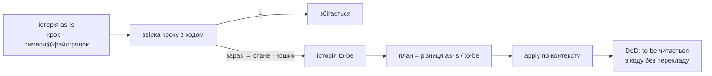

# restrukt

Reengineering за Chikofsky & Cross, процес за OORP, модель за Domain Storytelling і Event Storming, міра за connascence, імена за драбиною Белші. Методи не переказуються: називаються за іменем. Три етапи.



## Codex

У Codex перед роботою прочитай `references/codex.md` і виконуй етап через `$restrukt scan`, `$restrukt apply` або `$restrukt status`. Інструкції Claude Code нижче залишаються для відповідних slash-команд.

| Етап | Команда | Хто | Вихід |
|---|---|---|---|
| 1 Збір | `/restrukt:scan [обсяг]` | оркестратор + `restrukt-scanner` на контекст | `docs/restrukt/plan.md`: історії маршрутів, контексти, шість кошиків пропозицій, шляхи, питання |
| 2 Узгодження | серії `AskUserQuestion` після збору | оркестратор | підтверджені історії; стани рядків у плані: `так` · `ні` · `змінено` |
| 3 Виконання | `/restrukt:apply [контекст]` | `restrukt-builder` на контекст | код, тести, документи; `docs/restrukt/log.md` |

## Три максими

Agree on Maxims, OORP:

**Один прохід.** Step Through the Execution і Read All the Code in One Hour: сканер іде маршрутом від точки входу, файл читається раз, там, де маршрут у нього входить; з проходу пишеться історія маршруту, кожен крок звіряється з кодом, Speculate about Design; зі звірки — кошики, з хвостів «стане» — історія to-be. Один прохід кодом, два проходи історією; інвентаря і судження немає. Виконання читає лише файли з рядків плану.

**Пачка.** Migrate Systems Incrementally: одиницею узгодження і виконання є контекст, Bounded Context за Евансом, або його підконтекст за спільним станом; словник спільний на контекст. Усередині контексту рядки йдуть у порядку кошиків без зупинок.

**Час.** `date` на початку і в кінці кожного помічника; час іде в шапку плану і в лог з тим, де він пішов. Чим швидше, тим краще; цільового числа немає. Рядок без `файл:рядок` і без міри в «чому» не пишеться.

## Шість кошиків

**слова → події → правила → межі → склад → місце.** Кошик є видом розбіжності між кроком історії і кодом. Кожен кошик ослаблює connascence на одну форму або скорочує відстань, тому порядок є порядком виконання. Детектори, драбина Белші, 17 антипатернів Арнаудової, міра і рухи — `references/buckets.md`.

## Кінець

Контекст готовий, коли історія to-be читається з коду без перекладу: кожен крок має один символ в одному домі, кожна подія має ім'я, кожне правило один дім, кожен об'єкт одного писаря, чесне ім'я модуля має не більше двох «і», тека названа за історією, словник збігається з кодом і документами, контракт тримається. Одинадцять пунктів і перевірки — «Ворота» в `references/apply.md`.

## Діаграми

Mermaid там, де картинка коротша за прозу: після кожної історії, Context Map у «Контекстах», «зараз / стане» під кошиками склад і місце. Текст канонічний, діаграма його не повторює.

## Артефакти

```
docs/restrukt/
  plan.md       один план на збір: історії зі звіркою і діаграмами, контексти, кошики, шляхи, питання, стани
  log.md        що виконано, що пропущено, тести до і після; дописується
  glossary.md   терміни цього коду; накопичується
```

Імена файлів латиницею, вміст українською. Інші файли плагін не створює.

## Хто працює

| Хто | Робота | Читає код |
|---|---|---|
| оркестратор | точки входу ґрепом, маршрути, контексти; показує план, записує відповіді; запускає помічників | лише ґрепом |
| `restrukt-scanner` | один контекст: історії маршрутів, шість кошиків, питання, контракт | так, кожен файл раз |
| `restrukt-builder` | один контекст: виконує рядки `так`, збирає, тестує, пише лог | лише файли з рядків |

Оркестратор не читає код і не переказує план своїми словами: він показує таблиці з файлу.

## Довідники

| Файл | Хто читає |
|---|---|
| `references/vocabulary.md` | усі, перед першим записом |
| `references/buckets.md` | scanner, builder |
| `references/scan.md` | оркестратор у зборі, scanner |
| `references/qa.md` | оркестратор в узгодженні |
| `references/apply.md` | оркестратор у виконанні, builder |

Шаблони — `templates/plan.md`, `templates/log.md`, `templates/glossary.md`.
