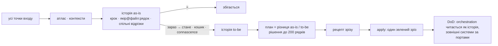

# restrukt

Reengineering за Chikofsky & Cross, процес за OORP, модель за Domain Storytelling і Event Storming, ціль за Ports and Adapters, міра за connascence, імена за драбиною Белші. Методи називаються за іменем, не переказуються.



| Етап | Claude Code | Codex | Хто | Вихід |
|---|---|---|---|---|
| 1 План | `/restrukt:plan [обсяг]` | `$restrukt plan` | п'ять хвиль: оркестратор → `restrukt-collector` → `restrukt-mapper` на контекст → `restrukt-scanner` на групу сценаріїв → `restrukt-checker` на контекст | `docs/restrukt/plan.md` рішення · `atlas.md` індекс · `contexts/Cn.md` · `contexts/Cn/Sn.md` |
| 2 Узгодження | серії `AskUserQuestion` після плану | питання в чаті | оркестратор | стани рядків: `підтвердити` · `так` · `ні` · `змінено` |
| 3 Виконання | `/restrukt:apply [контекст]` | `$restrukt apply` | `restrukt-cutter` рецепт → `restrukt-builder` → `restrukt-cutter` вердикт | код, тести, документи, `docs/restrukt/log.md` |

У Codex спершу `references/codex.md`: `plan` і `apply` оркеструють collaboration agents хвилями; inline-виконання є лише fallback без collaboration tools.

## Правила обсягу

Ліміти в штуках: сценарії, файли, кроки, рядки, виклики інструментів; ліміт є правилом, не порадою. Час лише вимірюється `date` на початку і в кінці кожного відрізка й записується як факт у шапку плану та лог. Рядок без `файл:рядок` і міри connascence не пишеться. Ризиковий рядок має стан `підтвердити` і виконується лише після окремого «так»; види ризику — `references/qa.md`.

## Артефакти

```
docs/restrukt/
  plan.md              рішення: шапка, контексти з картою, питання, пропозиції, імена, шляхи, стани; до 200 рядків
  atlas.md             індекс: усі точки входу, посилання на контексти і сценарії; накопичується
  contexts/Cn.md       контекст: шапка, одна Domain Story всіх маршрутів, контракт, список сценаріїв
  contexts/Cn/Sn.md    сценарій: to-be як приймання, as-is з якорями, покриття, деталі
  log.md               що виконано, що пропущено, тести до і після, вердикти DoD; дописується
  glossary.md          терміни цього коду; накопичується
  recipe.Cn.md         рухи одного зрізу; живе від рецепта до вердикту
```

Progressive disclosure тримає і теки, і форму кожного файла: індекс → контекст → сценарій, зверху загальне, деталі за посиланням; правило — у `references/vocabulary.md`. Частки помічників живуть у теці свого контексту і після збирання видаляються.

Імена файлів латиницею, вміст українською, імена в коді мовою коду. Id рядків стабільні між планами, тому посилання не переїжджають. Інших файлів плагін не створює. Комітить користувач.

## Хто працює

| Хто | Профіль | Робота | Читає код |
|---|---|---|---|
| оркестратор | сесійна | запускає помічників, склеює їхні файли, показує план з файлу, записує відповіді | не читає |
| `restrukt-collector` | механіка · low | один на обсяг: точки входу за видами й за опорами-ідіомами, гіпотеза контекстів, гарячі точки, зовнішні системи, місце збирання, джерела мови, тести | лише ґрепом |
| `restrukt-mapper` | механіка · low | на **кожен** контекст: рядки атласу — актор, намір → результат, вид — і файли-кандидати кожного сценарію | ґрепом, на два виклики вглиб; тіл не тлумачить |
| `restrukt-scanner` | судження · medium | на **групу сценаріїв**, що ділять файли: спільні відрізки, історії, звірка, кошики, імена, порти, питання, контракт; файл на сценарій | кожен файл раз, одним пакетом |
| `restrukt-checker` | механіка · low | на цільовий контекст: якорі існують, однакові адреси мають однакове «стане», міри є, файли-кандидати пояснені | лише `grep -n` за якорями |
| `restrukt-cutter` | судження · medium | на зріз, двічі: рецепт рухів з адресами й сигнатурами; вердикт DoD, to-be проти тіла | файли зрізу й orchestration home |
| `restrukt-builder` | виконання · low | один зріз: рухи рецепта дослівно, контракт до і після, лог | лише файли рецепта |

Профіль зіставляється з моделлю в одному місці — `references/models.md`; Claude Code копіює його у frontmatter ролей, Codex читає через `references/codex.md`. Дешева модель тримає механіку на готовому тексті, але не отримує судження над кодом.

Агентів рівно стільки, скільки потрібно: картограф на контекст; сканер на кожну групу сценаріїв, що ділять файли; перевіряльник на контекст. Незалежні групи нікого не чекають, спільний файл читається раз, спільний відрізок пишеться раз. Окремого обходу викликів перед сканером немає: дешева модель дає адреси, дорога — значення, і файли відкриваються один раз.

## Довідники

| Файл | Що | Хто читає |
|---|---|---|
| `references/vocabulary.md` | нотація, progressive disclosure і яруси файлів, граматика історії | усі, перед першим записом |
| `references/scenarios.md` | атлас-індекс, шари: доменний сервіс, порт, адаптер, місце збирання; контексти, Domain Story контексту, спільні відрізки, orchestration home, ворота трасованості | усі |
| `references/buckets.md` | сім кошиків, принципи, драбина Белші, антипатерни Арнаудової, таблиця імен, видалення, документи | scanner, checker, cutter |
| `references/plan.md` | етап 1: п'ять хвиль, ліміти, артефакти, групи, один прохід сканера, перевірка, збирання, стабільні id, ворота плану | оркестратор, collector, mapper, scanner, checker |
| `references/models.md` | профілі ролей і їх моделі для Claude Code та Codex | той, хто міняє модель |
| `references/qa.md` | етап 2: види питань, ризик, запис станів | оркестратор |
| `references/apply.md` | етап 3: зріз, рецепт, виконання, перевірка, DoD | оркестратор, cutter, builder |
| `references/codex.md` | відмінності Codex | Codex |

Шаблони — `templates/plan.md`, `templates/atlas.md`, `templates/context.md`, `templates/scenario.md`, `templates/recipe.md`, `templates/log.md`, `templates/glossary.md`.
