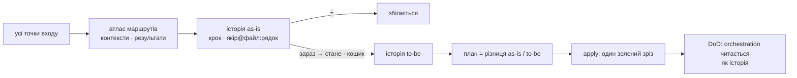

# restrukt

Reengineering за Chikofsky & Cross, процес за OORP, атлас за Use Cases, модель за Domain Storytelling і Event Storming, міра за connascence, імена за драбиною Белші. Методи не переказуються: називаються за іменем. Три етапи.



## Codex

У Codex перед роботою прочитай `references/codex.md` і виконуй етап через `$restrukt scan`, `$restrukt apply` або `$restrukt status`. Інструкції Claude Code нижче залишаються для відповідних slash-команд.

| Етап | Команда | Хто | Вихід |
|---|---|---|---|
| 1 Збір | `/restrukt:scan [обсяг]` | оркестратор + `restrukt-scanner` на контекст | `docs/restrukt/plan.md`: повний атлас, історії, контексти, шість кошиків, шляхи, питання |
| 2 Узгодження | серії `AskUserQuestion` після збору | оркестратор | підтверджені історії; ризикові рядки окремо; стани: `підтвердити` · `так` · `ні` · `змінено` |
| 3 Виконання | `/restrukt:apply [контекст]` | `restrukt-builder` на контекст | код, тести, документи; `docs/restrukt/log.md` |

## Три максими

Agree on Maxims, OORP:

**Один прохід.** Оркестратор спершу складає повний атлас усіх точок входу обраного обсягу. Step Through the Execution і Read All the Code in One Hour: сканер іде кожним бізнес-маршрутом, файл читає раз, пише історію, звіряє кроки з семантичними якорями й дістає кошики. Атлас маршрутів є обов'язковим; окремого інвентаря файлів і повторного проходу кодом немає. Виконання читає лише файли з рядків плану.

**Зелений зріз.** Migrate Systems Incrementally і Always Have a Running Version: модель та словник належать контексту, але один apply виконує найменший зв'язаний зріз одного маршруту або спільного інваріанта — оцінка до 10 хвилин змін, максимум 5 рядків, ризиковий cutover окремо. Широка перебудова спершу розкладається на зелені дочірні кроки. До й після — швидкий контракт; решта підтверджених рядків лишається в плані.

**Час.** Ціль scan і apply — по 15 хвилин для правильно обмеженого обсягу. Apply резервує останні 5 хвилин на перевірку й не починає новий рядок після 10-ї хвилини. Час іде в план і лог; зовнішній test suite довший за бюджет записується окремо. Рядок без `файл:рядок` і міри не пишеться.

## Шість кошиків

**слова → події → правила → межі → склад → місце.** Кошик є видом розбіжності між кроком історії і кодом. Кожен кошик ослаблює connascence на одну форму або скорочує відстань, тому порядок є порядком виконання. Детектори, драбина Белші, 17 антипатернів Арнаудової, міра і рухи — `references/buckets.md`.

Відсутність коду в історіях не є доказом для видалення. Видалення, зміна спостережуваної поведінки, публічного API, формату збережених даних, межі контексту або перебудова модуля мають стан `підтвердити`; шлях автоматично їх не схвалює.

## Кінець

Контекст готовий, коли його атлас повний, а orchestration-код семантично трасується до історій: кожен крок має очевидний якір, причинний порядок читається доменними словами, спільні правила й інваріанти мають один глибокий дім, переходи між контекстами явні, контракт тримається. Ворота — `references/routes.md` і `references/apply.md`.

## Діаграми

Mermaid там, де картинка коротша за прозу: після кожної історії, Context Map у «Контекстах», «зараз / стане» під кошиками склад і місце. Текст канонічний, діаграма його не повторює.

## Артефакти

```
docs/restrukt/
  plan.md       один накопичуваний атлас: маршрути, історії з діаграмами, контексти, кошики, шляхи, питання, стани
  log.md        що виконано, що пропущено, тести до і після; дописується
  glossary.md   терміни цього коду; накопичується
```

Імена файлів латиницею, вміст українською. Інші файли плагін не створює.

Шапка плану фіксує commit і початковий `git status`. Перед apply основа звіряється; при розходженні перечитуються лише файли обраних рядків, а застарілий рядок пропускається з причиною.

## Хто працює

| Хто | Робота | Читає код |
|---|---|---|
| оркестратор | точки входу ґрепом, маршрути, контексти; показує план, записує відповіді; запускає помічників | лише ґрепом |
| `restrukt-scanner` | один контекст: історії маршрутів, шість кошиків, питання, контракт | так, кожен файл раз |
| `restrukt-builder` | один зелений зріз: змінює, перевіряє, пише лог | лише файли зі зрізу |

Оркестратор не читає код і не переказує план своїми словами: він показує таблиці з файлу.

## Довідники

| Файл | Хто читає |
|---|---|
| `references/vocabulary.md` | усі, перед першим записом |
| `references/routes.md` | усі: атлас, контексти, історія ↔ код |
| `references/buckets.md` | scanner, builder |
| `references/scan.md` | оркестратор у зборі, scanner |
| `references/qa.md` | оркестратор в узгодженні |
| `references/apply.md` | оркестратор у виконанні, builder |

Шаблони — `templates/plan.md`, `templates/log.md`, `templates/glossary.md`.
