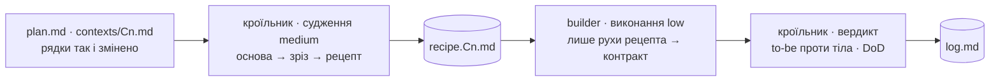

# Етап 3 · Виконання

Restructuring: поведінка та сама, форма інша; підтверджена зміна поведінки оновлює контракт і тести окремим ризиковим зрізом. Ціль — ворота трасованості з `scenarios.md`. На контекст найнижчого рівня: `restrukt-cutter` кроїть рецепт, `restrukt-builder` його виконує, `restrukt-cutter` дає вердикт. Незалежні контексти паралельно, залежні по черзі.

Час лише вимірюється: `date '+%H:%M:%S'` на початку і в кінці кожної ролі, у лог як факт.

## Основа

Кроїльник перед рецептом порівнює поточний commit і `git status --short` з основою в шапці плану, без `docs/restrukt/`. Збігаються — далі. Розійшлися — перечитує лише файли обраних рядків, звіряє символи й хвости «зараз», оновлює їхні `файл:рядок`; рядок, що більше не відповідає коду, — `пропущено: план застарів — <що змінилось>`. Початкові зміни користувача з основи не є змінами restrukt і не переписуються поза узгодженим рядком.

## Зріз

Ціль зрізу — наблизити тіло orchestration home до історії to-be його сценарію. З рядків `так` і `змінено` обраного контексту — один **зелений зріз**: найменша зв'язана зміна одного сценарію, спільного відрізка або спільного інваріанта, до 5 рядків; залежність входить разом із рядком, навіть із попереднього кошика. Окремим зрізом іде ризикове: зміна поведінки, видалення, публічний API, формат даних, межа контексту, cutover перебудови. Батьківський рядок без дочірніх — назад у план на декомпозицію. Порядок у зрізі: схвалене «видалити» після повторного доказу використань, далі слова → події → правила → межі → виходи → склад → місце. `підтвердити` не виконується; рядки поза зрізом лишаються на наступний `/restrukt:apply Cn`.

Рухи — `buckets.md`; ім'я ставиться на сходинку зі «стане», а таблиця імен контексту каже, який саме обов'язок воно покриває. Відсутній orchestration home створюється за `scenarios.md`: handler або application use case, правила й інваріанти — у глибокі модулі й доменні сервіси, зовнішня система — за порт і адаптер, з'єднані в наявному місці збирання.

## Рецепт зрізу

Дешевий builder працює лише тоді, коли рядок є операцією, а не пропозицією. Кроїльник перетворює рядки зрізу на **рецепт** `docs/restrukt/recipe.Cn.md` за `templates/recipe.md`: упорядкований список рухів, кожен з іменем рефакторингу за Фаулером, адресою `файл:рядок`, новим іменем або повною сигнатурою, файлом призначення, переліком викликачів з ґрепу і тестом, який має лишитись зеленим.

Ворота рецепта, рядок за рядком: рух можна виконати як заміну за адресою, переміщення тіла за адресою або новий файл із заданою сигнатурою, без жодного рішення про те, як саме. Рядок, що воріт не проходить, є ще пропозицією: кроїльник повертає його в план із позначкою `потребує декомпозиції: <чого бракує>` і зріз кроїться без нього.

Кроїльник читає лише файли рядків зрізу, orchestration home сценаріїв контексту і ті, куди веде ґреп за перейменованим іменем.

## Виконання

Builder виконує рухи рецепта по порядку і нічого понад них: усе, чого рецепт не каже, іде в лог як `пропущено: рецепт не каже — <що>`. Файли читає лише ті, що названі в рецепті і в переліку викликачів. Імена, сигнатури й місця береться з рецепта дослівно.

## Перевірка

Always Have a Running Version. До правок builder ганяє швидкий контракт контексту з плану. Червоний baseline → код не змінюється, лог отримує тест і помилку. Без швидкого контракту на зріз, що змінює правило, межу, структуру або поведінку непокритого сценарію, — перший зріз лише додає characterization test, і його рецепт пише кроїльник.

Після зрізу — той самий контракт і збірка/typecheck. Падіння → дві fix-forward спроби в межах рецепта, далі зворотним редагуванням прибрати лише поточний рух, повернути зелений стан і `пропущено: <тест>`. Повний suite — при завершенні контексту; інакше `повний suite: очікує`. Кожна зачеплена поведінка контракту — `тримається` або `ні, бо`.

## Документи і тести

Рядок із «розходиться з» — код і документ разом, рух у рецепті. Новий термін — рядок у `glossary.md`. Record Business Rules as Tests: новий тип-правило, порт, власник або матеріальний результат дістає тест у тому самому або попередньому захисному зрізі. Наявні тести лише перейменовуються слідом за кодом.

## Лог

Запис у `docs/restrukt/log.md` за шаблоном: builder пише виконане і пропущене, кроїльник дописує вердикт. Лише рядки зрізу дістають `виконано` або `пропущено: …`. Комітить користувач: жодних `commit`, `add`, `reset`, `revert`, `checkout`, `stash`, гілок. Повідомлення коміта описує зріз: `C1 · S1: orchestration замовлення, правило доставки`. `recipe.Cn.md` після вердикту видаляється.

## DoD контексту

Після зрізу кроїльник пише вердикт на зачеплені пункти; незачеплені — `ще не перевірено`. Повний DoD — коли підтверджених рядків не лишилось і повний suite зелений.

| # | Пункт | Перевірка |
|---|---|---|
| 1 | рядки зрізу `виконано` або `пропущено: <чому>`; решта підтверджених збережена | план |
| 2 | ворота трасованості з `scenarios.md` для сценаріїв зрізу | історія to-be проти тіла orchestration home, ґреп за якорями |
| 3 | кожна «подія» має ім'я в коді, минулий час, сходинка 6 | ґреп за `=` і «стане» подій |
| 4 | кожне «коли …, тоді …» і «перевіряє …» має один дім | одне оголошення |
| 5 | кожен робочий об'єкт має одного писаря | рядки кошика межі |
| 6 | словник = код = документи | рядки «розходиться з» правили документ |
| 7 | збірка чиста, тестів не менше; кожна поведінка контракту має вердикт | `тести до → після` |
| 8 | змін поза рядками плану немає; початкові зміни користувача збережені | `git diff --stat` проти основи |
| 9 | кожне ім'я зрізу стоїть на обіцяній сходинці; чесне і повне ім'я зачепленого модуля має не більше двох «і» | таблиця імен контексту, перечитана по тілу після зрізу |
| 10 | orchestration home не імпортує зовнішніх систем; кожна зовнішня система зрізу стоїть за портом з доменним іменем | ґреп імпортів за списком зовнішніх систем із плану |

Telling the Story of the System як остання перевірка: кроїльник читає сценарій із тіла orchestration home, пише в лог ланцюг якорів і звіряє його з блоком to-be у файлі сценарію `contexts/Cn/Sn.md`, крок за кроком. Крок to-be без якоря в тілі, зайвий порядок, прихована межа, правило, продубльоване в orchestration, або зовнішня система в тілі — пункт 2 або 10 не пройшов.
