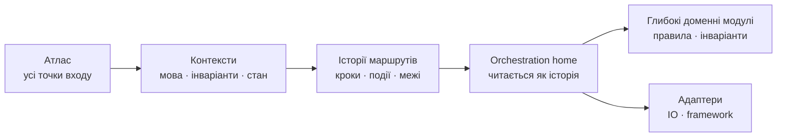

# Атлас і семантична трасованість

**Атлас** є повним переліком зовнішньо запущених маршрутів обраного обсягу. **Семантична трасованість** є ціллю коду: людина читає orchestration маршруту приблизно тими самими доменними словами й у тому самому причинному порядку, що й історію; правила та інваріанти живуть у глибоких модулях під цією поверхнею.

## Межа й точки входу

Спершу назви межу атласу. Для application це inbound adapters: HTTP/RPC handlers, UI actions, CLI commands, consumers і scheduled jobs. Для library або модуля — його публічні операції, які викликає код поза межею. Router, `main`, dependency registration, startup hook і migration є опорами `In`; бізнес-маршрут починається з dispatch leaf або публічної операції, а не з bootstrap-файлу.

**Точка входу** — перший callable усередині обраної межі, який може запустити зовнішній актор або тригер. Внутрішня функція лише тому, що вона `public`, маршрутом не стає. Якщо межа не названа або змішує весь продукт із одним модулем, атлас не можна чесно назвати повним.

## Повнота атласу

Кожна точка входу в обсязі має один кореневий результат:

- `Rn` — маршрут: актор або зовнішній тригер веде систему до основного бізнес-результату;
- `In` — опора: startup, registration, migration або framework glue без самостійного бізнес-результату; у рядку є причина й маршрути, яким вона служить.

Точка входу без кореневого рядка є пропуском. Матеріально інший бізнес-результат того самого входу стає дочірнім `Rnx`, успадковує точку входу `Rn` і не рахується новою точкою входу. Retry, логування, технічна валідація й однакові помилки транспорту лишаються кроками або деталями; `Rnx` потрібен лише для результату, що змінює рішення актора, бізнес-стан або наступний контекст.

Рядок атласу: `id · контекст · актор/тригер · намір → результат · точка входу · вид · контракт · стан`. Стан `атлас` означає, що маршрут описаний на рівні наміру й результату; `детально` — має звірену історію та діаграму; `опора` — пояснений `In`. Атлас створюється до читання реалізації як гіпотеза і уточнюється сканерами. Кожен `Rn` та `Rnx` зрештою переходить у `детально`; кожен `In` — в `опора`.

## Контексти

Маршрути групуються гіпотезою за чотирма ознаками разом:

1. спільна мова робочих об'єктів і подій;
2. спільні правила та інваріанти;
3. власник стану й транзакційна межа;
4. причини змін.

Спільний файл або виклик є доказом зв'язку, але не межею сам по собі. Маршрут може перетинати кілька контекстів: у першому він закінчується командою або поворотною подією, у наступному продовжується з нового семантичного якоря. Один термін із різними значеннями на межі є перекладом, а не причиною злити контексти.

## Історія та код

Історія описує причинний граф маршруту людською мовою. Синхронна частина читається зліва направо; асинхронна межа, розгалуження й повернення позначаються на діаграмі. Кожен крок має **семантичний якір** — функцію, use case, команду, подію, policy або specification, за якою крок однозначно знаходиться в коді. Один якір може складатися з кількох реалізаційних символів, якщо межа між ними видима.

Кожен маршрут має один впізнаваний **orchestration home** на кожен пройдений контекст — handler, use case або application service, чия поверхня:

- використовує слова історії;
- показує кроки в причинному порядку;
- називає матеріальні альтернативні результати;
- закінчується явною командою або подією на межі контексту;
- делегує правила й інваріанти глибоким доменним модулям;
- тримає IO, framework і telemetry за адаптерами.

Окрема wrapper-функція на кожне речення не є ціллю. Спільний доменний модуль, що чесно володіє одним правилом або інваріантом і служить кільком маршрутам того самого контексту, є повторним використанням, не знахідкою кошика «склад».

Orchestration home не є глобальним process manager за замовчуванням. Для choreography end-to-end маршрут має кілька локальних домів, з'єднаних явними подіями; process manager вводиться лише коли домен справді має власника довгого процесу, стан і правила координації. Кілька маршрутів можуть жити методами одного application service, якщо його ім'я та відповідальність лишаються чесними.

## Ворота трасованості

Контекст проходить ворота, коли:

1. кожна його точка входу є в атласі;
2. кожен бізнес-маршрут завершених контекстів має стан `детально`: історію, діаграму й контракт результату;
3. кожен крок має семантичний якір у коді;
4. локальний orchestration home кожного сегмента читається доменними словами в причинному порядку історії;
5. правило або інваріант, спільний для маршрутів, має один дім;
6. перехід між контекстами виражений командою або подією;
7. технічні деталі не розривають доменну поверхню маршруту.

Понад 15 бізнес-маршрутів означає завеликий обсяг для одного короткого збору: атлас однаково лишається повним, активні контексти переходять у `детально`, решта лишається `атлас` і збирається наступними запусками у той самий план. Повний reverse engineering завершується, коли `атлас` лишився лише у явно відкладених контекстах.
