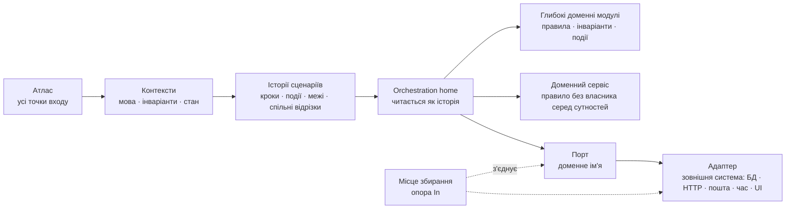

# Атлас, шари й семантична трасованість

**Атлас** — повний перелік зовнішньо запущених сценаріїв обраного обсягу, і водночас індекс: рядок сценарію посилається на його файл. **Семантична трасованість** — ціль коду: людина читає orchestration сценарію тими самими доменними словами й у тому самому причинному порядку, що й історію; правила та інваріанти живуть у глибоких модулях під цією поверхнею; зовнішні системи стоять за портами.

## Шари

Ціль має ім'я: Ports and Adapters за Кокберном, use case за Clean Architecture. Плагін уживає прості слова; канонічні — для довідки.

| Шар | Просте слово | Канонічно | Що там живе | Як знайти механічно |
|---|---|---|---|---|
| вхід | точка входу | driving adapter | handler, UI action, CLI command, consumer, job | збирач: ґреп за видами |
| orchestration | orchestration home | use case, interactor, application service | кроки сценарію в причинному порядку | сканер: символ, чиє тіло кличе якорі сценарію по порядку |
| домен | глибокий модуль | entity, aggregate, domain event | стан і інваріанти одного поняття | кошики 2–4 |
| домен | доменний сервіс | domain service за Евансом | правило або обчислення, що не належить жодній сутності; без власного стану | кошик 3: рішення, яке сьогодні ухвалюють два місця |
| порт | порт | driven port | інтерфейс до зовнішньої системи доменними словами | ґреп: інтерфейс, який кличе orchestration, з єдиною реалізацією в адаптері |
| адаптер | адаптер | driven adapter, infrastructure | реалізація порту для однієї зовнішньої системи | ґреп: файл імпортує зовнішню систему зі списку збирача |
| збирання | місце збирання | composition root | де порти з'єднують з адаптерами: `main`, registration, контейнер | збирач: опора `In` registration |

**Зовнішня система** — driven actor за Кокберном, «IO device» за Мартіном: усе, з чим код говорить не словами домену, а протоколом: база, мережа, файли, годинник, framework UI, стороння бібліотека з побічними діями. Збирач дає їх списком по імпортах обсягу. З зовнішньою системою працює лише адаптер; orchestration home кличе порт.

**Доменний сервіс** — правило, що стосується кількох сутностей або жодної: тарифікація, добір, зіставлення, політика. Він має ім'я сходинки 6, не має власного стану і служить кільком сценаріям контексту. Спільний доменний сервіс не є знахідкою кошика склад: це повторне використання.

Три правила замість тек:

1. orchestration home не імпортує зовнішніх систем зі списку збирача;
2. глибокий модуль і доменний сервіс не імпортують нічого поза своїм контекстом;
3. кожна зовнішня система, яку називає крок історії, має один порт із доменним іменем сходинки 6.

Wrapper на кожне речення не є ціллю; порт на кожен виклик теж. Порт з'являється там, де крок історії називає зовнішню систему, — це кошик виходи в `buckets.md`. Контейнер DI плагін не вводить: порт з'єднують з адаптером у наявному місці збирання, руками або наявним контейнером.

## Межа й точки входу

Спершу назви межу. Для application це inbound adapters: HTTP/RPC handlers, UI actions, CLI commands, consumers, scheduled jobs. Для library або модуля — публічні операції, які викликає код поза межею. Router, `main`, dependency registration, startup hook і migration — опори `In`; бізнес-сценарій починається з dispatch leaf або публічної операції, не з bootstrap-файлу. Внутрішня функція лише тому, що вона `public`, сценарієм не стає. Межа, що змішує весь продукт із одним модулем, повноти атласу не дає.

Опора, що реєструє слухачів або обгортає підписку — власний `observe`, `on`, `subscribe` проєкту, — є ідіомом проєкту: її виклики є точками входу, і збирач ґрепає за її іменем окремо.

## Повнота атласу

Кожна точка входу має один кореневий рядок: `Sn` — актор або тригер веде до бізнес-результату; `In` — опора з причиною і сценаріями, яким служить. Матеріально інший бізнес-результат того самого входу — дочірній `Snx`: результат, що змінює рішення актора, бізнес-стан або наступний контекст. Retry, логування, технічна валідація й однакові помилки транспорту — кроки або деталі.

Рядок атласу: `id · актор/тригер · намір → результат · точка входу · вид · контракт · стан · історія`. Остання колонка — посилання на файл сценарію, коли стан `детально`. Стан `атлас` — намір і результат; `детально` — звірена історія; `опора` — пояснений `In`. Атлас пишеться до читання реалізації як гіпотеза і уточнюється сканерами. Повний reverse engineering завершено, коли `атлас` лишився лише у явно відкладених контекстах.

## Контексти

Сценарії групуються за чотирма ознаками разом: спільна мова робочих об'єктів і подій; спільні правила та інваріанти; власник стану й транзакційна межа; причини змін. Спільний файл або виклик — доказ зв'язку, не межа. Тека `Model/`, `UI/`, `Audio/` — шар, не контекст: контекст «інтерфейс» не існує, дії користувача належать тому контексту, чиї слова й стан вони міняють. Сценарій може перетинати контексти: у першому закінчується командою або поворотною подією, у наступному продовжується з нового якоря. Одне слово з різними значеннями на межі — переклад, не причина злити контексти.

`⇢ Cn` пишеться лише між контекстами верхнього рівня. Передача між підконтекстами одного контексту або виклик глибокого модуля є якорем кроку без стрілки.

## Domain Story контексту

Кожен контекст має **одну** діаграму: Domain Story всіх своїх маршрутів разом. Вона стоїть у файлі контексту одразу під шапкою і відповідає на одне питання — які сценарії яких точок дотику торкаються. Окремих діаграм на сценарій немає.

| Що | Форма | Приклад |
|---|---|---|
| актор або тригер | `(( ))` | `A((Покупець))` |
| подія | `( )` | `E(«замовлення оформлено»)` |
| orchestration home | `[[ ]]` | `H[[PlaceOrder]]` |
| доменний сервіс | `[/ /]` | `V[/ShippingPolicy/]` |
| глибокий модуль | `[ ]` | `M[Order]` |
| порт | `([ ])` | `P([PaymentPort])` |
| зовнішня система | `[( )]` | `X[(банк · HTTP)]` |
| інший контекст | `{{ }}` | `C2{{C2 оплата}}` |

Кожне ребро підписане сценаріями, яким воно служить: `S1`, `S1 · S2`. Контекст обгорнутий у `subgraph`. Порт, якого ще немає, малюється пунктиром до зовнішньої системи і несе id рядка кошика виходи.

## Історія та код

Історія описує причинний ланцюг сценарію. Кожен крок має **семантичний якір** — функцію, use case, команду, подію, policy, specification, доменний сервіс або порт, за якою крок однозначно знаходиться в коді; один якір може складатися з кількох символів за видимої межі.

Кожен сценарій має один **orchestration home** на кожен пройдений контекст — handler, use case або application service, чия поверхня:

- використовує слова історії;
- показує кроки в причинному порядку;
- називає матеріальні альтернативні результати;
- закінчується явною командою або подією на межі контексту;
- делегує правила й інваріанти глибоким модулям і доменним сервісам;
- тримає IO, framework і telemetry за портами й адаптерами.

Кандидат на дім видно механічно: це символ, чиє тіло кличе якорі сценарію в межах контексту в порядку історії. Якщо такого символу немає — якорі висять на різних гілках просто від точки входу — дому немає, і це рядок кошика склад, а не питання смаку.

Кілька сценаріїв можуть жити методами одного application service, поки його ім'я чесне. Для choreography end-to-end сценарій має кілька локальних домів, з'єднаних явними подіями; process manager вводиться лише коли домен справді має власника довгого процесу з власним станом.

## Спільні відрізки

Два і більше сценаріїв однієї групи з тими самими якорями в тому самому порядку мають один **спільний відрізок** `Jn`: власні кроки, власна звірка, власний orchestration home, власний файл. Сценарій-тригер тримає лише свої кроки до відрізка і закінчується `→ J1`; політика Event Storming «коли …, тоді J1» і є таким сценарієм. Відрізок пишеться раз, звіряється раз, кошики його кроків належать йому. Групи складені за спільними файлами, тому спільний відрізок завжди дістається одному сканеру.

## Ворота трасованості

Контекст проходить ворота, коли:

1. кожна його точка входу є в атласі;
2. кожен бізнес-сценарій має стан `детально`: історію і контракт результату;
3. кожен крок має семантичний якір у коді;
4. локальний orchestration home кожного сегмента читається доменними словами в причинному порядку історії;
5. правило або інваріант, спільний для сценаріїв, має один дім: глибокий модуль або доменний сервіс;
6. перехід між контекстами виражений командою або подією;
7. технічні деталі не розривають доменну поверхню сценарію;
8. orchestration home не імпортує жодної зовнішньої системи зі списку збирача: перевірка ґрепом.
