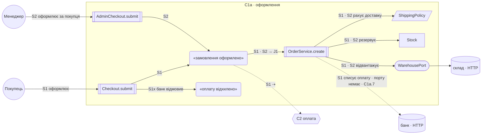

# C1a · Оформлення

Покупець або менеджер перетворює кошик на оформлене замовлення, резервує товар і передає оплату в C2.

файлів 4 · сценаріїв 3 · спільних відрізків 1 · звірка 5 з 11 кроків = · гаряча точка `OrderService.ts` 610 × 27 · orchestration home: немає → [C1a.4a](../plan.md) · пропозицій 14 · [атлас](../atlas.md)

## Domain Story

Усі маршрути контексту разом. Ребро підписане сценаріями, яким служить; пунктир — того, чого ще немає.

## Сценарії

| id | актор / тригер | намір → результат | кроків | звірка | файл |
|---|---|---|---|---|---|
| J1 | — | узгодження замовлення зі складом | 3 | 1 з 3 | [J1.md](C1a/J1.md) |
| S1 | покупець | оформити кошик → замовлення оформлено | 4 | 2 з 4 | [S1.md](C1a/S1.md) |
| S1x | покупець | банк відмовив → замовлення не відвантажено | 2 | 1 з 2 | [S1x.md](C1a/S1x.md) |
| S2 | менеджер | оформити за покупця → замовлення оформлено | 2 | 2 з 2 | [S2.md](C1a/S2.md) |

## Контракт

Тести, що чіпають файли контексту: `OrderServiceTests.ts` 12 · `ShippingPolicyTests.ts` 6. Швидкий контракт: `npm test -- OrderServiceTests`.

Поведінки, що мають лишитись правдою:

1. після скасування резерв знімається, оплата повертається — тест є: `OrderServiceTests.cancelReleasesStock`
2. безкоштовна доставка від 1000 без промокоду — тесту немає
3. …

## Зовнішні системи

| система | порт | адаптер | сценарії | рядок |
|---|---|---|---|---|
| банк · HTTP | немає | немає — `fetch` у `OrderService.ts:140` | S1 | C1a.7 |
| склад · HTTP | `WarehousePort` | `WarehouseHttp.ts` | S1, S2 | — |

## Не дійшов

`Model/LegacyOrder.ts` — жоден крок жодної історії його не називає.

## Відповіді на збіги словника

- `process` 21 — HAL process object, термін Core Audio, не синонім «застосунок»; рядка немає.
- `refresh` 7 — розбіжність справжня, рядок C1a.1.
