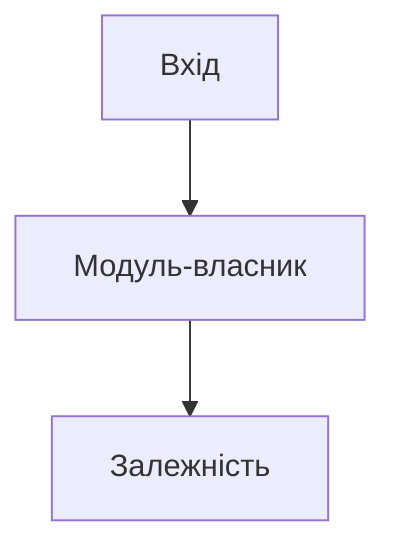
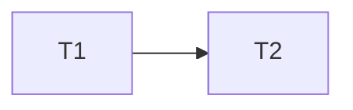

# <Застосунок або обсяг>

<Одне речення: потрібний перевірюваний результат.>

> - **Перевірка цілого** · <стан>
> - **Прогрес** · <N з M задач готові>
> - **Далі** · [<T1 · задача>](#t1--назва-задачі)
> - **Від вас** · <рішення, що чекають користувача, посиланнями на R чи Q, або «нічого»>

**Зміст**

1. [Мета й межі](#1-мета-й-межі)
2. [Завдання](#2-завдання)
3. [Зміни поведінки](#3-зміни-поведінки)
4. [Питання й рішення](#4-питання-й-рішення)
5. [Модель](#5-модель)
6. [Задачі](#6-задачі)
7. [Перевірка плану](#7-перевірка-плану)
8. [Перевірка цілого](#8-перевірка-цілого)
9. [Продовження](#9-продовження)
10. [Додатки](#додаток-а-поведінка)

<Огляд і зміст оформлюй за методикою «Текст плану». Порожній розділ прибери, решту перенумеруй разом із якорями змісту й посилань.>

---

## 1. Мета й межі

**Мета**

- <перевірюваний результат>

**Входить**

- <модуль, тека, сценарій>

**Не входить**

- <виключення>

**Основа** · <початковий commit або без git; початкові правки, які зберігаємо>.

**Обмеження користувача**

- <поведінка, сумісність, явно зафіксоване рішення; джерело>

---

## 2. Завдання

<Лише для `implement`: джерело (текст запиту, шлях або посилання), потрібний результат, критерії приймання з позначкою «з джерела» або «виведено», поза обсягом.>

---

## 3. Зміни поведінки

<Кожна запланована зміна поведінки — одна картка. Решта задач поведінку зберігає.>

### R1 · <Стала назва зміни>

**Було** · <поточна поведінка>.

**Стане** · <нова поведінка>.

**Хто помітить** · <користувачі, інтеграції або ніхто>.

**Підстава** · <вимога, помилка, доказ>.

**Відхилено** · <розглянуті варіанти; порожнє прибери>.

**Рішення** · <безпека/цілісність: агент / описано в завданні: джерело / видимий результат: очікує погодження / погоджено: джерело, дата>. Реалізує [T1](#t1--назва-задачі).

---

## 4. Питання й рішення

<Невідомий потрібний результат і рішення користувача, що не є зміною поведінки. Гіпотези дизайну — біля відповідного D.>

### Q1 · <Питання>

**Контекст** · <чому це важливо>.

**Варіанти** · <наслідки кожного; рекомендація>.

**Блокує** · <задачі>.

**Рішення** · <очікує / наслідок, обсяг і джерело>.

---

## 5. Модель

<Поточна модель: підтверджені проблеми, обмеження міграції, причини змін, складність, яку приховуємо.>



*<Підпис: що показує діаграма й напрямок залежностей.>*

### Власники

| Знання або операція | Власник | Гарантія |
|---|---|---|
| <правило, стан, сценарій> | <модуль> | <що захищає> |

<Ключове дерево, де читати сценарії, зовнішні контракти. Кожне правило має одного власника. Для нової абстракції — прихована складність; для збереженої старої межі — незалежне обґрунтування. Чому саме так — [D1](#d1--назва-рішення).>

**Виконавець обирає сам** · <внутрішні деталі, не обмежені гарантіями>.

### Що зникає

- <класи, інтерфейси, шари, папки, назви, дубльовані рішення>
- <тимчасовий міст — задача та умова видалення>

---

## 6. Задачі

| ID | Задача | Залежить від | Стан |
|---|---|---|---|
| T1 | [<Стала назва результату>](#t1--назва-задачі) | — | очікує |

Стани: `очікує`, `в роботі`, `готово`, `заблоковано: причина`. Стан задачі зберігай лише тут. ID задачі не змінюється й не використовується повторно. У черзі весь обсяг, включно з дослідженням і зведенням.



*Зелене — готово, помаранчеве — в роботі. <Діаграма — від трьох задач із залежностями; інакше прибери.>*

Готові задачі — у [додатку Д](#додаток-д-готові-задачі).

### T1 · <Назва задачі>

<Для першої: tracer bullet — від справжнього входу через усі шари до ефекту.>

**Результат** · <спостережувана поведінка або завершена відповідальність>.

**Контекст** · <посилання на R, Q, D, інваріанти; адреси коду, тестів і доказів; без копії спільних правил>.

**Контракт** · <готові входи від залежностей; операції, результати, гарантії й споживачі на виході>.

**Обсяг і свобода** · <модуль і потрібні викликачі; обмеження й деталі для самостійного вибору>.

**Приймання**

1. <перевірка результату, альтернатив та інтеграції>
2. <потрібне видалення й семантичні імена>

**Невідоме** · <застосовні гіпотези чи питання, як з'ясувати, що блокується; порожнє прибери>.

---

## 7. Перевірка плану

<Сценарії та відома або ймовірна зміна, якими перевірено задум. 2–3 непідтверджені рішення з наслідком помилки; чому tracer bullet перевіряє перше. Які задачі доступні, які заблоковані. Самоперевірка чи незалежний перегляд — назви фактичне; подробиці — у журналі.>

---

## 8. Перевірка цілого

Стан: `очікує` / `потребує виправлень` / `перевірено`.

<Хто перевіряв, фактично переглянутий стан коду, висновок. Кожна доведена знахідка — посилання на задачу виправлення. Подробиці — у [журналі](log.md).>

**Що запустити**

```sh
<команди перевірок>
```

<Наскрізні сценарії для перегляду коду.>

---

## 9. Продовження

<Незавершена задача, стан правок, наступна дія й перевірка. Для `implement` — обраний спосіб виконання. Після перегляду коду — посилання на перевірений підсумок.>

---

## Додаток А. Поведінка

<Історії: актор → дії → результат. Кожен вхід віднесений до сценарію, технічного запуску або черги дослідження. Відомі помилки відділені від потрібної сумісності.>

| Сценарій | Потрібний результат | Доказ | Перевірка |
|---|---|---|---|
| <стала людська назва> | <поведінка й важливі альтернативи> | <файл і символ / джерело> | <команда, сценарій або ще немає> |

## Додаток Б. Інваріанти та знання

### <Стала назва правила, стану чи поняття>

<Зміст одним-двома реченнями.>

- **Де забезпечено** · <усі місця: код, схема, конфігурація, зовнішня система; недосліджене явно>.
- **Де обходиться** · <місця або «ніде»>.
- **Статус** · <вимога / підтверджений факт / гіпотеза; доказ; для гіпотези — спосіб перевірки й залежні рішення>.

### Словник

| Поняття | Назва | Що зникає |
|---|---|---|
| <поняття> | <слово словника> | <синоніми> |

## Додаток В. Рішення дизайну

### D1 · <Назва рішення>

**Підстави** · <сценарії, правила, обмеження>.

**Вибір** · <рішення і чому>.

**Відхилено**

- <варіант — чому ні>

**Ціна** · <компроміс>.

**Що спростує** · <припущення, спосіб перевірки, залежні задачі>.

## Додаток Г. Можливі доопрацювання

- <Лише необов'язкове: недолік, адреса, користь. Порожнє прибери.>

## Додаток Д. Готові задачі

<Картка задачі в стані `готово` переноситься сюди без змін.>
