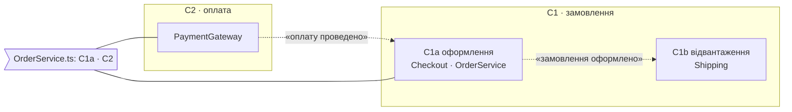
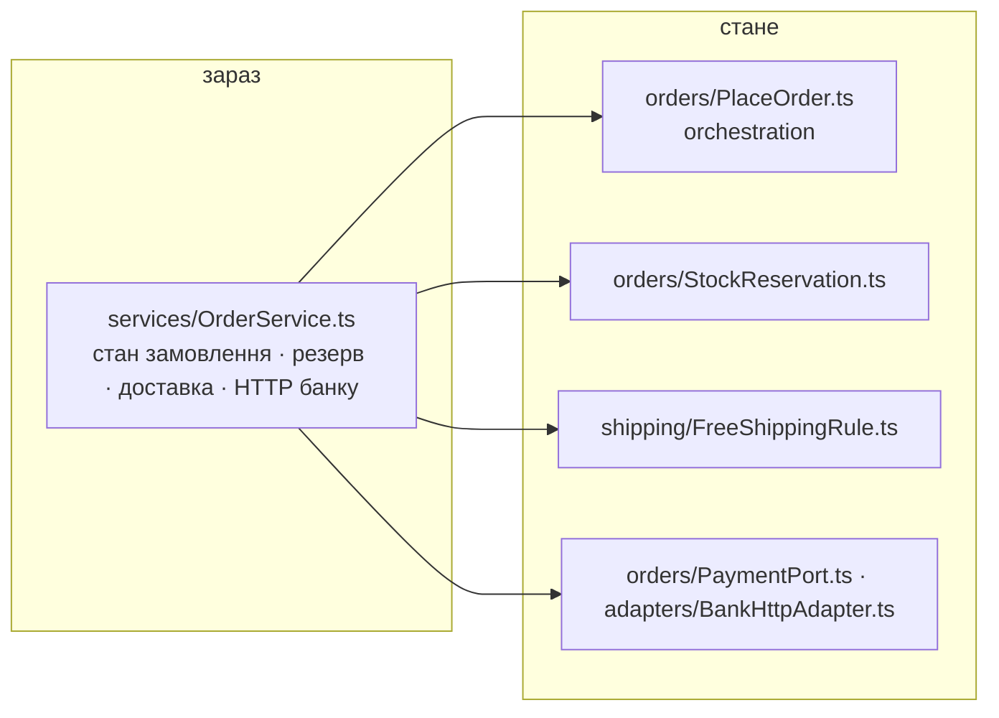

# План restrukt: <проєкт>

<дата> · N файлів · N точок входу · N бізнес-сценаріїв · N опор · N контекстів · N пропозицій · тестів N · час: оркестратор N хв · збирач N · атлас N · сканери N · перевірка N · збирання N

Межа атласу: `<application inbound adapters | public API модуля/library>` · обсяг: `<шлях>` · індекс: [atlas.md](atlas.md)

Основа: commit `<sha>` або «без git» · робоче дерево без `docs/restrukt/`: чисто або `<git status --short>`

Цільові контексти: C1a, C1b — <чому саме вони одним реченням>. Решта — `атлас` до наступного запуску.

## Контексти

Межа там, де історія міняє слова на той самий об'єкт або несе `⇢`. Кожен контекст має свій файл: `docs/restrukt/contexts/Cn.md`.

| id | назва | сценарії | файли | гаряча точка | файл контексту | пропозицій |
|---|---|---|---|---|---|---|
| C1 | замовлення: спільні слова order, stock, shipping | | | | | |
| C1a | оформлення | S1 покупець оформлює · S2 менеджер оформлює за покупця | `Checkout.ts`, `OrderService.ts` | `OrderService.ts` 610 × 27 | [C1a.md](contexts/C1a.md) · 2 з 5 кроків = | 14 |
| C1b | відвантаження | S6 склад відвантажує | `Shipping.ts` | `Shipping.ts` 480 × 9 | [C1b.md](contexts/C1b.md) · 4 з 4 = | 9 |
| C2 | оплата | S9 повернення коштів | `PaymentGateway.ts` | `PaymentGateway.ts` 210 × 6 | атлас | — |

### Між контекстами

| id | кошик | де | зараз | стане | чому: connascence | стан |
|---|---|---|---|---|---|---|
| X.1 | склад | S1.2, S9.3 · `OrderService.ts` | один файл тримає кроки C1a і C2 | `OrderService` лише C1a; кроки повернення → `RefundService` у C2 | сильна на відстані: 2 контексти, 1 файл | |

## Питання до тебе

| # | контекст | питання | варіанти | відповідь |
|---|---|---|---|---|
| Q1 | C1 | `order` означає замовлення покупця і ордер на відвантаження. Розвести? | a `order` + `pickList` · b лишити одне слово | |

## Шляхи

Один зелений зріз — до 5 рядків за `references/apply.md`. Більше — шлях є послідовністю зрізів; ризиковий cutover окремо.

| шлях | що входить | зрізи | id |
|---|---|---|---|
| A | слова, події й порти всіх контекстів | 2 | C1a.1–C1a.2 · C2.1–C2.3 |
| B | S1 end-to-end, потім S1x | 2 | C1a.1–C1a.3 · C1a.5 |
| C | контекст за контекстом | 3 | усі |

## Джерела мови

`CLAUDE.md` · `docs/glossary.md` · `docs/adr/*.md` — або «не виявлено». Словник: N слів заборон · N збігів в обсязі — або «словника немає».

## Зовнішні системи й місце збирання

Зовнішні системи обсягу: `fetch` 3 файли · `pg` 2 · `Date.now` 4 — або «не виявлено». Місце збирання: `main.ts:12`, контейнер: ручне — або «не знайдено».

## Тести

Швидкий контракт контексту: `npm test -- OrderServiceTests`, очікувано до 2 хв. Повний suite: `npm test`, N тестів у `tests/…`. Непокриті результати: S1x — «оплату відхилено». Або «швидкого контракту немає» / «тестів немає».

---

## C1a · Оформлення

Контракт: `OrderServiceTests.ts` 12 · `ShippingPolicyTests.ts` 6. Поведінки: після скасування резерв знімається, оплата повертається · … Повний перелік і Domain Story — [contexts/C1a.md](contexts/C1a.md).

Гаряча точка: `OrderService.ts` 610 × 27. Orchestration home: немає — кроки S1 живуть у `Checkout.ts` і `OrderService.ts` → C1a.4a.

Зовнішні системи: банк · порт немає · `OrderService.ts:140` кличе `fetch` → C1a.7 · склад · порт `WarehousePort` · адаптер `WarehouseHttp.ts` · S1.4.

### Імена

| id | зараз · сх | антипатерн | чесно і повно | стане · сх | «і» |
|---|---|---|---|---|---|
| C1a.1 | `check()` 2 | B.2 | перевіряє залишок і зменшує його і пише рядок у журнал | `reserveStock()` 5 | 3 → C1a.4a |
| C1a.2 | `isDone` 2 | D.2 | тримає номер стадії замовлення, де 2 означає «оформлено» | `orderPlaced` 6 | 1 |
| C1a.3 | немає 0 | — | вирішує, чи доставка безкоштовна, за сумою і промокодом | `FreeShippingRule` 6 | 2 |
| C1a.4 | `OrderService` 1 | — | тримає стан замовлення і резервує товар і рахує доставку | `PlaceOrder` 5 · `StockReservation` 6 · `ShippingPolicy` 6 | 3 → C1a.4a–C1a.4b |
| C1a.7 | `fetch` у сервісі 0 | — | списує оплату через HTTP банку | `PaymentPort` 6 · `BankHttpAdapter` 4 | 1 |

### Пропозиції

Спершу `підтвердити` і рядки, залежні від `Qn`; далі за порядком кошиків.

| id | кошик | де | зараз | стане | чому: connascence | розходиться з | стан |
|---|---|---|---|---|---|---|---|
| C1a.4b | склад | S1.2, S2.1 · `OrderService.ts` | резерв пишуть два доми | перевести S1 і S2 на `StockReservation`; cutover | сильна на відстані: 2 історії, 3 обов'язки | — | підтвердити |
| C1a.1 | слова | S1.2 · `OrderService.ts:88` | `check()` 2 | `reserveStock()` 5 | Meaning ×4: місця виклику не знають, що буде резервування | `docs/glossary.md:12` «check» уникати | |
| C1a.2 | події | S1.1 · `Checkout.ts:40` | `isDone` 2, прапорець | «замовлення оформлено» = `orderPlaced` 6, збирається в `Checkout.submit()` | Meaning ×3, 2 модулі: `CartView.ts:40`, `Mail.ts:22` | — | |
| C1a.3 | правила | S1.3 · `OrderService.ts:120`, `CartView.ts:77` | `if total >= 1000 && !promo` у двох домах | тип `FreeShippingRule` 6, дім `ShippingPolicy`; «невідомо» → платна | Algorithm ×2, 2 модулі; гілка «невідомо» дозвільна | `docs/adr/0003.md:14 «Free»` — сходинка 2 | |
| C1a.7 | виходи | S1.4 · `OrderService.ts:140` | orchestration кличе `fetch` банку напряму | `PaymentPort` 6, адаптер `BankHttpAdapter`, з'єднання в `main.ts:12` | Type ×2, Name: `OrderService` знає URL і формат банку | — | |
| C1a.4a | склад | S1.2, S2.1 · `OrderService.ts` | резерв залежить від внутрішнього стану service | ввести `StockReservation` за чинним інтерфейсом; без cutover | сильна на відстані: 2 історії, 2 модулі | — | |

Стан: порожньо — чекає · `підтвердити` — ризиковий рядок чекає окремого питання · `так` · `ні` · `змінено: …` · `виконано` · `пропущено: …` · `знято: …` · `без відповіді`.
