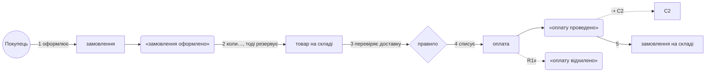
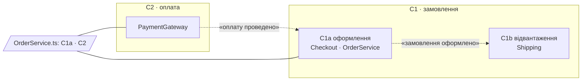
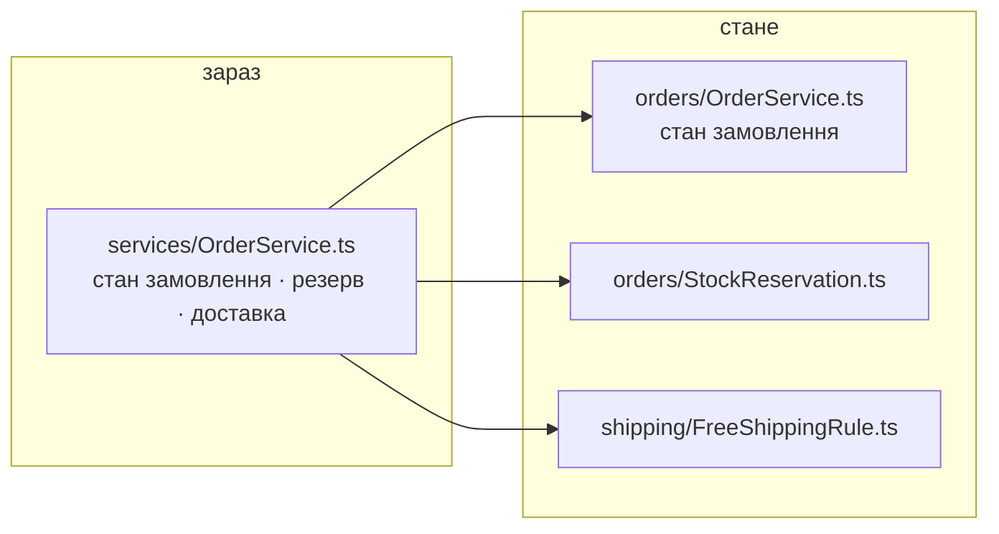

# План restrukt: <проєкт>

<дата> · N файлів · N точок входу · N сценаріїв · N контекстів · N пропозицій · тестів N · час: оркестратор N хв · сканери N хв · злиття N хв

## Історії

Крок: речення без коду · `символ@файл:рядок` · звірка. Звірка `=` — код каже те саме, що крок; інакше `зараз: символ n → стане: ім'я m · кошик`, сходинки за Белші. Хвости «стане» разом є історією to-be.

```
R1 · Покупець оформлює замовлення
1. Покупець натискає «Оформити» → «замовлення оформлено» · submit()@Checkout.ts:40 · зараз: isDone 2 → стане: orderPlaced 6 · події
2. коли замовлення оформлено, тоді магазин резервує товар на складі · check()@OrderService.ts:88 · зараз: check() 2 → стане: reserveStock() 5 · слова
3. правило перевіряє, чи замовлення дотягує до безкоштовної доставки · OrderService.ts:120, CartView.ts:77 · зараз: два доми → стане: FreeShippingRule 6, ShippingPolicy · правила
4. магазин списує оплату → «оплату проведено» = paymentCaptured ⇢ C2 · PaymentGateway.ts:12 · =
5. замовлення йде на склад · Warehouse.ts:30 · =
R1x · банк відмовив
1. банк повертає відмову → «оплату відхилено» · PaymentGateway.ts:41 · зараз: status = 2 0 → стане: paymentDeclined 6 · події
2. сторінка показує помилку · Checkout.ts:90 · =
```



## Шляхи

Рядків до 30 — один рядок «усе: N рядків», шляхів і питання про шлях немає. Понад 30:

| шлях | що входить | id | рядків |
|---|---|---|---|
| A | слова і події всіх контекстів | C1a.1–C1a.2 · C2.1–C2.3 | n |
| B | C1a цілком | C1a.1–C1a.4 | n |
| C | усе: прогін 1 — C1a; прогін 2 — C1b, C2 | усі | n + n |

## Питання до тебе

| # | контекст | питання | варіанти | відповідь |
|---|---|---|---|---|
| Q1 | C1 | `order` означає замовлення покупця і ордер на відвантаження. Розвести? | a `order` + `pickList` · b лишити одне слово | |

## Контексти

Гіпотеза оркестратора, перерізана в злитті за історіями: межа там, де історія міняє слова на той самий об'єкт або несе `⇢`. Контекст без підконтекстів — один рядок; з підконтекстами — рядок на кожен, словник спільний на контекст.

| id | назва | маршрути | файли | гаряча точка | пропозицій |
|---|---|---|---|---|---|
| C1 | замовлення: спільні слова order, stock, shipping | | | | |
| C1a | оформлення | R1 покупець оформлює · R2 менеджер оформлює за покупця | `Checkout.ts`, `OrderService.ts` | `OrderService.ts` 610 × 27 | 14 |
| C1b | відвантаження | R6 склад відвантажує | `Shipping.ts` | `Shipping.ts` 480 × 9 | 9 |
| C2 | оплата | R9 повернення коштів | `PaymentGateway.ts` | `PaymentGateway.ts` 210 × 6 | 5 |



### Між контекстами

| id | кошик | де | зараз | стане | чому: connascence | стан |
|---|---|---|---|---|---|---|
| X.1 | склад | R1.2, R9.3 · `OrderService.ts` | один файл тримає кроки C1a і C2 | `OrderService` лише C1a; кроки повернення → `RefundService` у C2 | сильна на відстані: 2 контексти, 1 файл | |

## Джерела мови

`CLAUDE.md` · `docs/glossary.md` · `docs/adr/*.md` — або «не виявлено». Словник: N слів заборон · N збігів в обсязі — або «словника немає».

## Тести

`npm test`, N тестів у `tests/…`. Або «тестів немає».

---

## C1a · Оформлення

Контракт: `OrderServiceTests.ts` 12 · `ShippingPolicyTests.ts` 6. Поведінки: після скасування резерв знімається, оплата повертається · …

Гаряча точка: `OrderService.ts` — тримає стан замовлення і резервує товар і рахує доставку: 3 «і» → C1a.4.

| id | кошик | де | зараз | стане | чому: connascence | розходиться з | стан |
|---|---|---|---|---|---|---|---|
| C1a.1 | слова | R1.2 · `OrderService.ts:88` | `check()` 2 | `reserveStock()` 5 | Meaning ×4: місця виклику не знають, що буде резервування | `docs/glossary.md:12` «check» уникати | |
| C1a.2 | події | R1.1 · `Checkout.ts:40` | `isDone` 2, прапорець | «замовлення оформлено» = `orderPlaced` 6, збирається в `Checkout.submit()` | Meaning ×3, 2 модулі: `CartView.ts:40`, `Mail.ts:22` | — | |
| C1a.3 | правила | R1.3 · `OrderService.ts:120`, `CartView.ts:77` | `if total >= 1000 && !promo` у двох домах | тип `FreeShippingRule` 6, дім `ShippingPolicy`; «невідомо» → платна | Algorithm ×2, 2 модулі; гілка «невідомо» дозвільна | `docs/adr/0003.md:14 «Free»` — сходинка 2 | |
| C1a.4 | склад | R1.2, R2.1 · `OrderService.ts` | 3 «і» | розібрати: `StockReservation` окремо; перебудова | сильна на відстані: 2 історії, 3 обов'язки | — | потрібен контекст C2 |



Не дійшов: — або перелік файлів.

Стан: порожньо — чекає · `так` · `ні` · `змінено: …` · `виконано` · `пропущено: …` · `без відповіді`.
