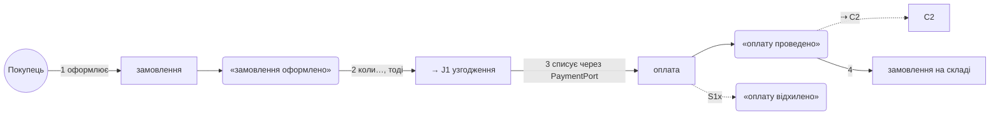

# Історії C1a · Оформлення

Рівень 2 угорі: контракт, спільні відрізки й історії to-be — текст приймання для builder. Рівень 3 нижче: as-is з якорями, покриття, діаграми, деталі графа, відповіді на словник. Рядки плану — `plan.md`, секція C1a.

## Контракт

Тести, що чіпають файли контексту: `OrderServiceTests.ts` 12 · `ShippingPolicyTests.ts` 6. Швидкий контракт: `npm test -- OrderServiceTests`.

Поведінки, що мають лишитись правдою:

1. після скасування резерв знімається, оплата повертається — тест є: `OrderServiceTests.cancelReleasesStock`
2. безкоштовна доставка від 1000 без промокоду — тесту немає
3. …

## To-be

### J1 · узгодження замовлення зі складом

1. правило добирає бажаний набір товарів (`WantedStock`)
2. склад резервує бракуюче (`reserveStock`)
3. правило перераховує доставку (`FreeShippingRule` у `ShippingPolicy`)

### S1 · Покупець оформлює замовлення

1. Покупець оформлює кошик → «замовлення оформлено» (`orderPlaced`)
2. коли замовлення оформлено, тоді → J1
3. магазин списує оплату → «оплату проведено» (`paymentCaptured`, через `PaymentPort`) ⇢ C2
4. замовлення йде на склад (`Warehouse.receive`)

### S1x · банк відмовив

1. банк повертає відмову → «оплату відхилено» (`paymentDeclined`)
2. сторінка показує помилку

### S2 · Менеджер оформлює за покупця

to-be = as-is

---

## As-is

### J1 · узгодження замовлення зі складом · звірка: 1 з 3 кроків = · граф: 9 вузлів, 3 якорі, 6 деталей, 0 не пояснених, 0 виходів · сценарії: S1, S2

1. правило добирає бажаний набір товарів · `OrderService.ts:110` · зараз: тернарник без імені 0 → стане: `WantedStock` 6 · правила · Algorithm ×2: `OrderService.ts:110`, `CartView.ts:70`
2. склад резервує бракуюче · `check()@OrderService.ts:88` · зараз: `check()` 2 → стане: `reserveStock()` 5 · слова · Meaning ×4
3. правило перераховує доставку · `ShippingPolicy.ts:20` · =

Деталі графа: `logger.info@:92` — лог; `mapToDto@:95` — мапінг.

### S1 · Покупець оформлює замовлення · звірка: 2 з 4 кроків = · граф: 14 вузлів, 4 якорі, 9 деталей, 0 не пояснених, 1 вихід

1. Покупець натискає «Оформити» → «замовлення оформлено» · `submit()@Checkout.ts:40` · зараз: `isDone` 2 → стане: `orderPlaced` 6 · події · Meaning ×3, 2 модулі
2. коли замовлення оформлено, тоді → J1 · `OrderService.create@OrderService.ts:70` · =
3. магазин списує оплату → «оплату проведено» = `paymentCaptured` ⇢ C2 · `OrderService.ts:140` ⇥ `fetch` · зараз: HTTP банку в orchestration 0 → стане: `PaymentPort` 6 · виходи · Type ×2, Name
4. замовлення йде на склад · `Warehouse.receive@Warehouse.ts:30` · =

Деталі графа: `logger.info@Checkout.ts:74` — лог; `retry@Http.ts:30` — retry; `PaymentGateway.ts:41` — гілка, історія S1x.

### S1x · банк відмовив · звірка: 1 з 2 кроків = · граф: гілка S1, 4 вузли, 2 якорі, 2 деталі, 0 не пояснених

1. банк повертає відмову → «оплату відхилено» · `PaymentGateway.ts:41` · зараз: `status = 2` 0 → стане: `paymentDeclined` 6 · події · Meaning ×2
2. сторінка показує помилку · `Checkout.ts:90` · =

### S2 · Менеджер оформлює за покупця · звірка: 2 з 2 кроків = · граф: 5 вузлів, 2 якорі, 3 деталі, 0 не пояснених

1. менеджер обирає покупця і кошик · `AdminCheckout.ts:22` · =
2. коли кошик обрано, тоді → J1 · `OrderService.create@OrderService.ts:70` · =

Не дійшов: `Model/LegacyOrder.ts` — жоден вузол графів його не називає.

## Відповіді на збіги словника

- `process` 21 — HAL process object, термін Core Audio, не синонім «застосунок»; рядка немає.
- `update` 8 — `updateStandby()` читається чесно, standby переставляється, не узгоджується; рядка немає.
- `refresh` 7 — розбіжність справжня, рядок C1a.1.
