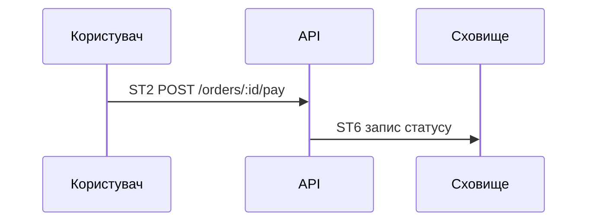
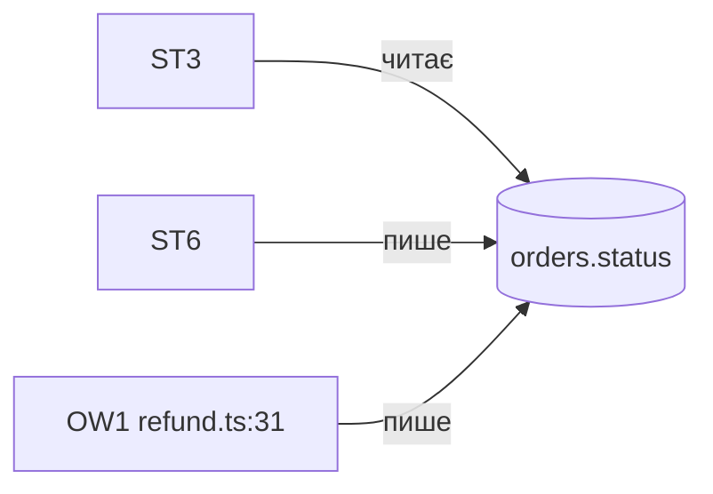
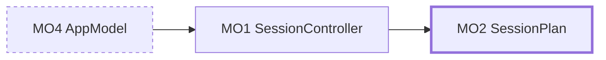

# Діаграми

Діаграма ставиться там, де спрацювала умова.

| Діаграма | Тип mermaid | Обов'язкова, коли | Файл |
|---|---|---|---|
| Маршрут | `sequenceDiagram` | завжди, у шапці | маршрут |
| Стан | `flowchart LR` | сутність має чужих писарів | маршрут |
| Життєвий цикл | `stateDiagram-v2` | маршрут міняє статус сутності | маршрут |
| Карта сценаріїв | `flowchart LR` | повний огляд | `_map.md` |
| Цільова карта | `flowchart LR` | шар 5 | судження |
| Кластер | `flowchart LR` | завжди | фрагмент |

Понад 12 вузлів — клубок. Розбивай або згортай.

## Ідентифікатори

Префікс латиницею, підпис українською, ідентифікатор першим у підписі. Вузол діаграми дорівнює рядку таблиці.

`IN` вхід · `ST` крок · `DE` рішення · `EF` ефект · `FA` факт · `BO` межа · `SK` непройдені двері · `S` сутність стану · `OW` чужий писар · `MO` модуль цільової карти · `J` рядок судження

Колір і форма позначають клас, не якість: червоних вузлів для «поганого» в інвентарі немає.

## Зразки

Товста рамка — модуль, якого ще немає. Пунктир — модуль, який зникає.
