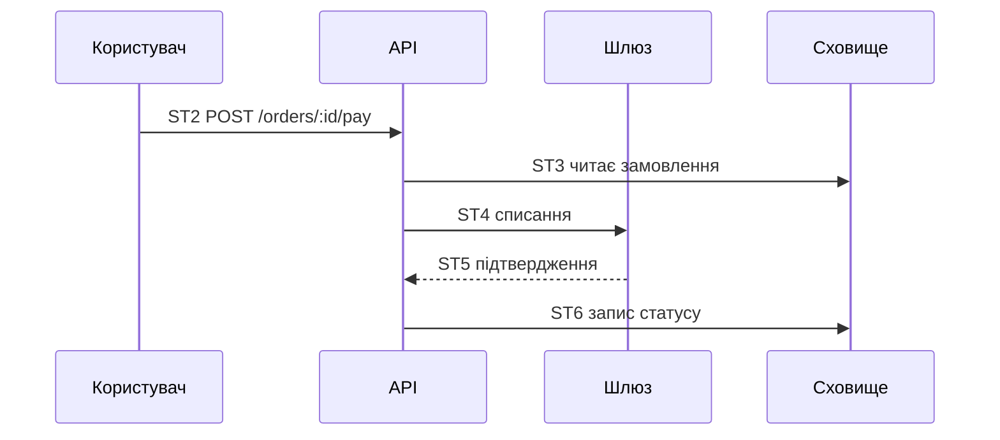
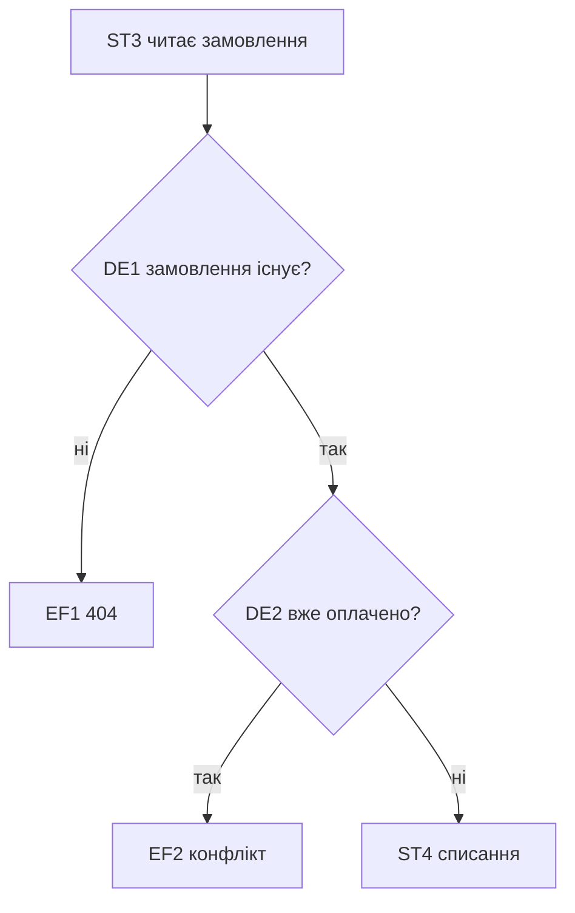
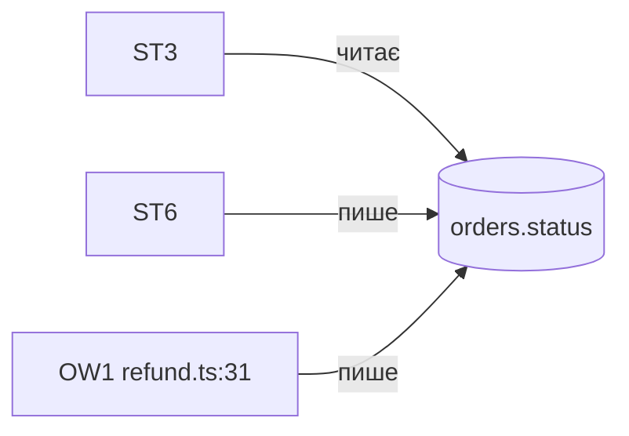
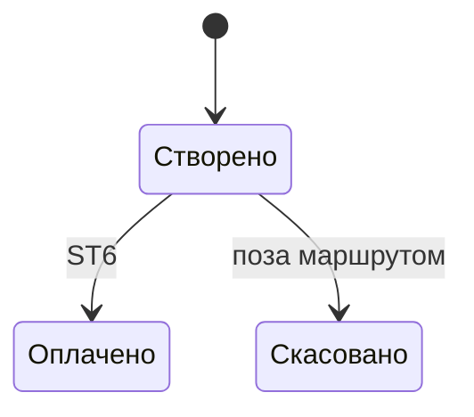
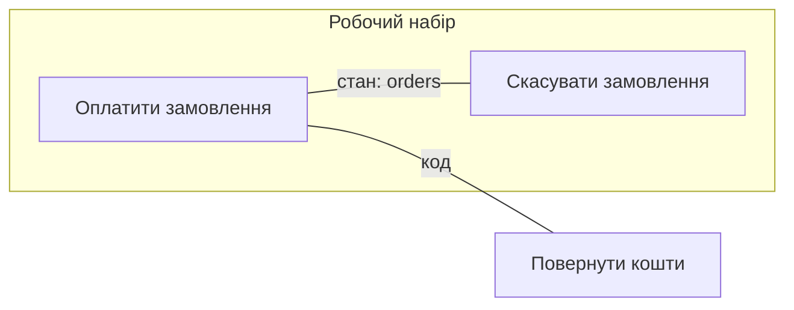
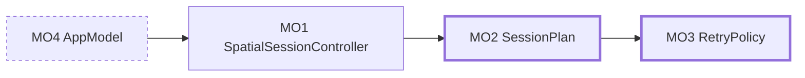
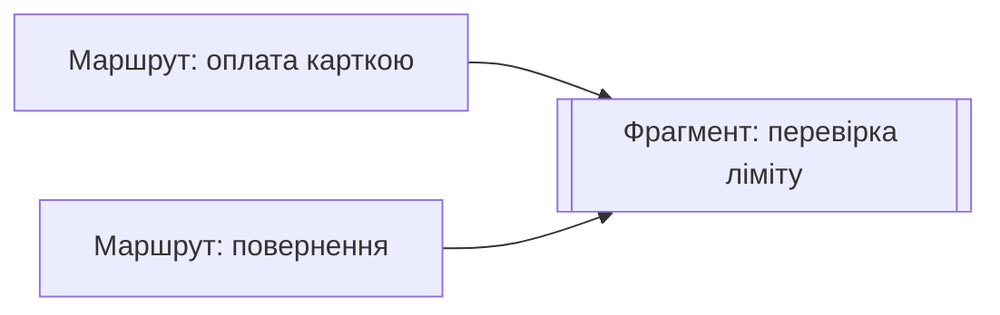

# Діаграми

Діаграма ставиться там, де спрацювала умова, а не там, де здалося доречним. Перевір усі сім умов перед завершенням етапу.

| Діаграма | Тип mermaid | Обов'язкова, коли | Файл |
|---|---|---|---|
| **Карта сценаріїв** | `flowchart LR` | завжди | `_map.md` |
| **Маршрут** | `sequenceDiagram` | маршрут перетинає хоч одну межу | файл маршруту |
| **Рішення** | `flowchart TB` | рішень два або більше | файл маршруту |
| **Стан** | `flowchart LR` | сутність є і у прихованих входах, і в ефектах | файл маршруту |
| **Життєвий цикл** | `stateDiagram-v2` | маршрут міняє статус сутності | файл маршруту |
| **Кластер** | `flowchart LR` | завжди | кожен файл фрагмента |
| **Цільова карта** | `flowchart LR` | завжди | файл моделі |

Жодна умова не спрацювала — діаграм у цьому файлі немає, таблиць достатньо.

## Ідентифікатори

Префікс латиницею, підпис українською. Нумерація наскрізна в межах файлу.

| Префікс | Що | Приклад |
|---|---|---|
| `IN` | вхід | `IN3 сума до списання` |
| `ST` | крок | `ST4 списання` |
| `DE` | рішення | `DE2 вже оплачено?` |
| `EF` | ефект | `EF1 запис статусу` |
| `FA` | факт | `FA2 замовлення оплачено` |
| `BO` | межа | `BO1 API → шлюз` |
| `SK` | непройдені двері | `SK1 formatMoney()` |
| `S` | сутність стану | `S1 orders.status` |
| `OW` | чужий писар | `OW1 refund.ts:31` |
| `MO` | модуль цільової карти | `MO2 SessionPlan` |

Латиниця тому, що парсер mermaid не спотикається, і `grep -o 'ST[0-9]*'` працює.

## Три правила

**Вузол діаграми дорівнює рядку таблиці.** Кожен `ST3`, `DE1`, `EF2` існує рядком у відповідному реєстрі. Підписи без рядка в таблиці не ставляться.

**Ідентифікатор іде першим у підписі.** `ST4 списання`, не `списання (ST4)`.

**Колір і форма позначають клас сутності.** Якість вузла вони не позначають: червоних вузлів для «поганого» в Акті I немає.

## Зразки

### Маршрут

### Рішення

### Стан

### Життєвий цикл

### Карта сценаріїв

### Цільова карта, у файлі моделі

Товста рамка — модуль, якого ще немає. Пунктир — модуль, який зникає. Звичайна — лишається.

### Кластер, у файлі фрагмента

Форма `[[ ]]` у mermaid означає підпрограму. Фрагмент нею і є.
