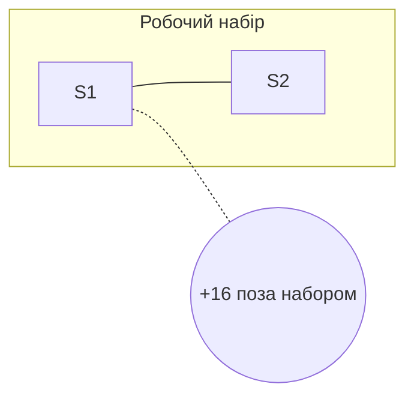

# Подання

Плагін бере інформацію, яка вже є в коді, і перекладає її у форму, яку витримує людська голова. Це мета нарівні з якістю коду, не оздоблення.

Людський контекст вужчий за твій. Файл на 400 рядків виснажує читача ще до того, як він дійде до цінного.

## Правило шапки

Кожен артефакт починається шапкою, яку видно без прокрутки:

1. **Рядок чисел** — скільки чого. Одне речення.
2. **Головне** — те, заради чого цей файл існує. Робочий набір, або головна знахідка.
3. **Мала діаграма** — тільки головне, без сусідів.
4. **«Помітне»** — 4–6 рядків таблиці, що випливають із підрахунку.

Далі — деталі, кожна під згорткою.

«Помітне» ранжує за підрахунком і зв'язністю. Це вимір, не оцінка: «спільний для 7 сценаріїв із 20» лишається в Акті I, «забагато» — ні.

## Правило згортки

Кожна деталь загортається в `<details>`, і **підпис називає, коли її відкривати**:

```markdown
<details><summary>46 точок входу — відкрий, коли шукаєш, звідки щось починається</summary>

...таблиця...

</details>
```

Підпис із тригером прибирає страх пропустити: читач знає, за якої потреби туди лізти, і не гадає.

Підпис без тригера — `<summary>Точки входу</summary>` — цього не робить.

## Правило діаграми

У шапці — **лише головне і ребра всередині нього**. Решта світу — одним вузлом-лічильником.



Повна діаграма йде під згортку з підписом-тригером.

Понад 12 вузлів в одній діаграмі — клубок. Розбивай або згортай.

## Порядок секцій

Спадання за цінністю для людини, не за номером реєстру. У файлі маршруту це означає: **факти йдуть перед рішеннями**, бо безіменна подія цінніша за сто гілок.
