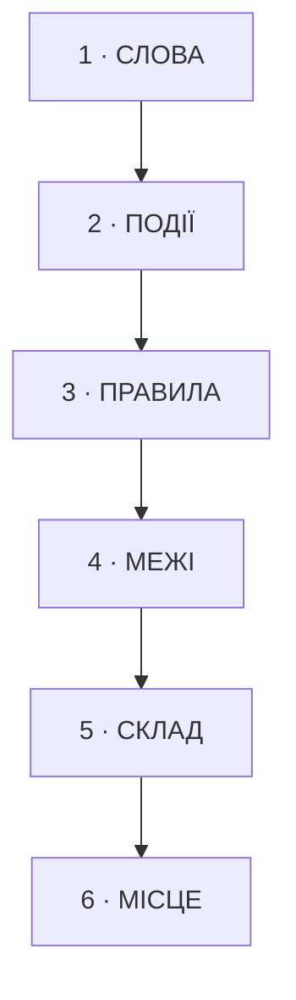

# Етап 3: Діагноз

Перетворює інвентар на перелік знахідок. Вимагає маршрут із пройденим тестом повноти.

## Правило, що прибирає шум

**Діагноз читає інвентар, а не код.**

Тест повноти етапу 2 стверджує: поведінку маршруту можна відтворити з інвентаря, не відкриваючи файли. Отже код уже не потрібен. Відкрити рядок коду можна лише щоб підтвердити конкретну знахідку — той рядок, на який вона посилається, і тільки його.

Знахідка без посилання на рядок реєстру не записується.

## Шість шарів

Знахідки впорядковані за залежністю, не за тяжкістю. Нижній шар без верхнього нечинний.



| Шар | Читає | Детектори | Канонічна назва |
|---|---|---|---|
| **1 Слова** | `_glossary.md`, колонки «як названо зараз» | слово з двома значеннями всередині контексту; `is*` повертає не булеве; `get*` робить більше, ніж повертає; однина з колекцією; множина з одним значенням; `validate*`, що нічого не відхиляє | порушення Ubiquitous Language; Linguistic Antipattern за каталогом Арнаудової |
| **2 Події** | реєстр 5, реєстр 2 | факт із прапорцем `безіменний`; кроки однієї події в різних модулях; крок без власного імені | відсутній Domain Event; temporal decomposition |
| **3 Правила** | реєстр 3 | те саме рішення на кількох маршрутах; рішення з порожнім доменним прочитанням; рішення, що читає стан чужої сутності; **гілка «невідомо» є дозвільною** | Repeated Switches → витягти Policy; Feature Envy; порушення fail-safe defaults |
| **4 Межі** | секція «Стан», реєстри 6 і 4 | сутність із чужими писарями; ефекти кількох класів в одному кроці; запис у сховище поза межею транзакції | межа Aggregate протікає; Divergent Change |
| **5 Склад** | таблиця модулів, `_map.md` | чесне і повне ім'я з трьома «і» й більше; модуль, який чіпають три сценарії й більше з різних причин; публічних членів більше, ніж кроків у модулі; кроки однієї фази часу замість однієї теми | Divergent Change; мілкий модуль; temporal decomposition |
| **6 Місце** | `_journal.md`, реєстр 1 | однакові сигнатури в різних модулях; функція в модулі, що змінюється з іншої причини; прихований вхід, ніде не оголошений | Duplicated Code; information leakage |

Шари йдуть поспіль, згори вниз, над одним прочитаним інвентарем. Помічники тут не потрібні: робота мала, а підготовка контексту для кожного коштує більше за саму роботу.

## Сходинка імені

Кожна знахідка шару 1 несе рядок **«Сходинка».** Це поточний рівень імені за `references/naming-ladder.md`, від 0 до 6. Діагноз його читає, а не призначає цільовий: цільову сходинку обирає Модель.

Ту саму сходинку впиши в колонку словника `docs/revision/_glossary.md` — етап 1 лишив її порожньою.

## Таблиця модулів

Шар 5 починається з таблиці. Один рядок на кожен модуль, у якому маршрут має хоч один крок — список береться з реєстру 2, нічого дочитувати не треба.

| модуль | кроків тут | чесне і повне ім'я | «і» | сценаріїв, що чіпають |
|---|---|---|---|---|
| `Model/AppModel.swift` | 9 | `AppModelThatHoldsUIStateAndReconcilesSessionsAndOwnsPermissionAndDecidesStandby` | 3 | 6 |

Чесне і повне ім'я пишеться для **кожного** модуля, зокрема для того, чиє ім'я не бреше. Саме такі модулі проходять усі інші детектори живими: `AppModel` чесно зветься моделлю застосунку, тому жоден лінгвістичний антипатерн на ньому не спрацьовує.

Це опис, не пропозиція. Ім'я перелічує те, що модуль робить за реєстром 2, і нічого не радить.

## Формат знахідки

Чотири рядки. Більше не пишеться.

```markdown
### DG3 · шар 2 · FA7

**Спостереження.** Після ST9 сесія перестає бути живою. У коді цього не названо.
**Канонічна назва.** Відсутній Domain Event.
**Якщо не чіпати.** Три місця самостійно вирішують, чи сесія жива: ST9, ST14, `SpatialSessionController.swift:230`.
**Тримає.** DG8, DG11 спираються на цю подію.
```

Знахідки шару 1 несуть додатковий рядок **«Сходинка.»** Знахідки шару 5 — рядок **«Чесне і повне ім'я.»**

Рядок «Якщо не чіпати» називає **конкретний наслідок**, який видно в інвентарі: скільки місць, які саме рядки. Не оцінку.

## Чого діагноз не робить

Він описує те, що знайшов. Пропозиція, що з цим робити, належить етапу 4, Моделі.

Причина практична: знахідка з причепленою пропозицією читається як завдання, і читач починає обговорювати рішення замість того, щоб побачити картину цілком. Спершу вся картина.

## Фільтри

| Фільтр | Куди йде відсіяне |
|---|---|
| поза робочим набором | список `відкладене`, без шарів і без деталей |
| без посилання на реєстр | не записується взагалі |
| знання про це нічого не змінює в моделі | список `відкладене` |

## Артефакт

`docs/revision/<сценарій>/<маршрут>.diagnosis.md` за шаблоном `templates/diagnosis.md`.

Окремий файл від маршруту, бо інший строк життя: інвентар є контрактом і стабільний, діагноз є судженням і змінюється разом із розумінням.

Подання — за `presentation.md`: шапка, шар 1 відкритий, шари 2–6 під згортками.

## Гілка «невідомо»

Кожне рішення реєстру 3 має стан, якого воно не впізнає: сутності немає в переліку, статус недоступний, конфігу бракує, відповідь не прийшла. Знайди, **куди веде цей стан**.

Веде в дозвільний бік — це знахідка. Канонічно: порушення fail-safe defaults.

Найчастіші форми:

| форма | невідоме — це |
|---|---|
| літеральний перелік, за яким класифікують зовнішні сутності | те, що з'явилося після нас |
| статус, який не вдалося прочитати | збій читання, витлумачений як дозвіл |
| конфіг або прапорець, якого немає | відсутність, витлумачена як згода |

Літеральний перелік сам по собі стерпний: його можна оновити. Небезпечним його робить дозвільна гілка.

Рядок «Якщо не чіпати» називає **конкретну сутність, якої в переліку немає, і що з нею станеться**. Шкода за таким дефектом настає в користувача, не в тестах.

## Сусідні маршрути

Стовпчик «сценаріїв, що чіпають» уже називає сусідів. Випиши їх у `_map.md`, розділ «Сусідні маршрути».

Причина — це відкрите питання, яке маршрут закриє, а не спільність сама по собі. «Ділить `AppModel`» причиною не є. «Підтвердить або зніме вирок «розбирається» для `AppModel`» є.

## Ворота виходу

1. Кожна знахідка посилається на рядок реєстру.
2. Кожна віднесена до одного з шести шарів.
3. Кожна має канонічну назву або позначку `без канонічної назви`.
4. Кожна має рядок «Якщо не чіпати» з конкретним наслідком.
5. Кожна знахідка шару 1 має поточну сходинку, і ту саму сходинку вписано у словник.
6. Кожен модуль із реєстру 2 має рядок у таблиці модулів із чесним і повним іменем.
7. Знахідки поза робочим набором винесені у `відкладене`.
8. Кожна знахідка описує стан речей. Пропозицій щодо змін немає.
9. Друга думка запитана; збіги й розбіжності зведені в розділ «Друга думка».
10. Сусідні маршрути виписані в `_map.md`, у кожного названо відкрите питання.
