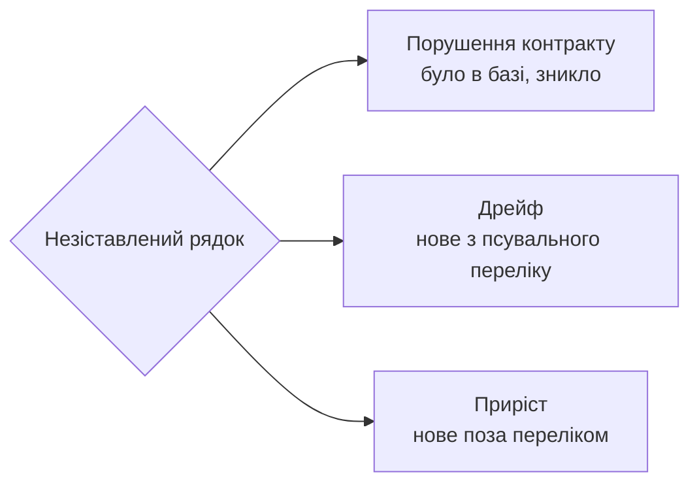

# Етап 6: Звірка

Проходить маршрут заново і звіряє з контрактом.

Два входи, одна машинерія:

| Коли | Навіщо |
|---|---|
| одразу після перебудови | чи вижила поведінка |
| будь-коли після сесії з агентом | чи не поповз код |

## Механіка

Новий обхід пише в `docs/revision/.new/`. Наявний інвентар лишається базою. Заміна — тільки за словом користувача.

Інакше база затирається тим, чого ми ще не подивилися.

## Правило зіставлення

Реєстри **не** звіряються текстовим дифом: `FA3` перенумеровується, адреси зсуваються, і діф стає суцільним шумом.

Рядок бази і рядок нового обходу збігаються, якщо збігається **те, що вони описують**, а не їхній номер чи адреса. Зіставляй за змістом:

| Реєстр | За чим зіставляти |
|---|---|
| Факти | що стає правдою |
| Ефекти | що змінюється і якого класу |
| Рішення | доменне прочитання |
| Межі | що переходить і куди |
| Модулі | чесне і повне ім'я та кількість «і» |

Незіставлені рядки з обох боків і є результат звірки.

## Три вердикти

| Вердикт | Що саме |
|---|---|
| **Порушення контракту** | факт, ефект або термінатор із бази більше не настає — поведінка змінилась |
| **Дрейф** | безіменний факт · новий прихований вхід · те саме рішення в ще одному місці · ще один писар того самого стану · слово набуло другого значення · **чесне і повне ім'я модуля дістало ще одне «і»** |
| **Приріст** | названий факт · крок, що лишився в одному модулі · новий термін у словнику |

Третій вердикт обов'язковий. Без нього кожна нова фіча читається як деградація, звіт кричить вовком, і його перестають читати.

## Артефакт

`docs/revision/<сценарій>/<маршрут>.verify.md`. Коротко за природою: це діф, а не інвентар.

Шапка називає три числа — порушень, дрейфу, приросту — і далі по рядку на кожне.

## Ворота виходу

1. Кожен рядок бази або зіставлений, або віднесений до порушень.
2. Кожен новий рядок віднесений до дрейфу або приросту.
3. Жоден рядок не лишився без вердикту.
4. Кожен модуль бази має нове чесне і повне ім'я, і «і» в ньому не побільшало.
5. Якщо звірка йде після перебудови — склад модулів збігається з цільовою картою моделі.
6. База не замінена без слова користувача.
