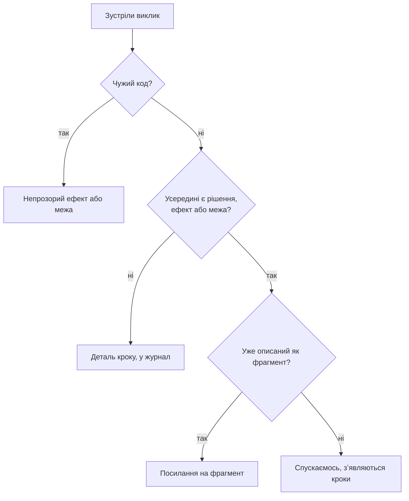
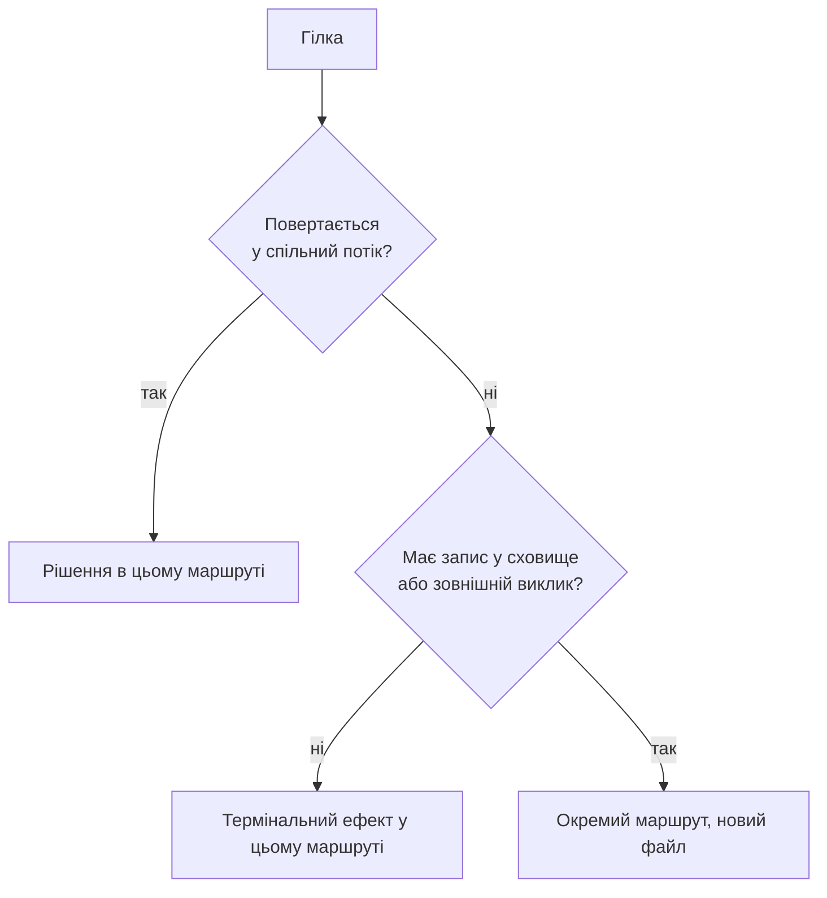

# Етап 2: Маршрут

Один прохід від точки входу до термінаторів. Реєстри заповнюються **по дорозі**, не другим заходом.

Вимагає `docs/revision/_map.md` з обраним робочим набором.

## Як іти

Від точки входу читай код уперед. На кожному виклику застосовуй правило глибини, на кожній гілці — правило ширини, на кожній межі — правило зшивання. Зупиняйся на термінаторах.

Кожен крок, рішення, ефект, факт і межу записуй одразу, поки файл перед очима. Другого проходу немає.

### Правило глибини

Зазирай у кожен виклик, спускайся лише за причиною. Зазирнути дешево: відкрий, проглянь на розгалуження і ввід-вивід, закрий.

### Правило ширини

### Правило зшивання

| Межа | За чим зшивати |
|---|---|
| HTTP | метод + шаблон шляху |
| Черга | топік або тип повідомлення + реєстрація консюмера |
| Подія | ім'я події + підписка |
| RPC | ім'я методу в контракті |
| Спільна схема | тип або таблиця, що є по обидва боки |

Зшити не вдалося — маршрут **не закінчився**. Це відкрита межа: у шапку і в журнал.

### Термінатори

Три, інших немає:

1. Ефект, видимий користувачеві: відповідь, екран, лист.
2. Ефект, що назавжди покидає систему: запис у сховище, публікація події, виклик стороннього сервісу.
3. Межа, за яку ми свідомо не йдемо: інший продукт, чужа команда.

## Шість реєстрів

| # | Реєстр | Що записуємо |
|---|---|---|
| 1 | Входи | явні з сигнатури; приховані за переліком класів із `vocabulary.md` |
| 2 | Кроки | упорядкований хребет без розривів |
| 3 | Рішення | вираз **і** доменне прочитання |
| 4 | Ефекти | зміни світу, віднесені до класу |
| 5 | Факти | що стає правдою після кроку |
| 6 | Межі | перетини процесу, сервісу, транзакції |

Кожен запис несе `файл:рядок`, поточну назву і позначку, чи має власне ім'я.

## Що до реєстру не потрапляє

Реєстр існує заради знахідок. Рядок, що не веде до знахідки, коштує токенів і нічого не додає.

| Що | Правило |
|---|---|
| **Рішення без доменного прочитання** | `if x == nil { return }`, перевірки формату, захист від подвійного виклику — це деталі кроку, не рядки реєстру 3 |
| **Виклики в чужий код** | журнал отримує один рядок на бібліотеку в межах, не рядок на виклик |
| **Логи й метрики** | рахуємо: «ST4: 3 логи». Не перелічуємо |
| **Чужі писарі** | факт існування і `файл:рядок`. Їхню поведінку не розбираємо |

## Стан

Стан не окремий реєстр. Він видно на перетині реєстрів 1 і 4: сутність, що є у прихованих входах одного кроку і в ефектах іншого. Після проходу склади секцію «Стан» і ґрепом знайди чужих писарів поза маршрутом.

## Межа кроку

1. Новий крок починається там, де з'являється новий факт або новий ефект.
2. Перетворення даних без ефекту — деталь кроку.
3. Перетин межі — завжди новий крок.

## Реєстр 5 ставить прапорець, а не назву

Факт без імені в коді позначається `безіменний` і отримує робочий опис. Канонічну назву дає етап 4, Модель: назва — рішення про мову всього проєкту, а не про цей маршрут.

## Журнал

Спільний `docs/revision/_journal.md`, накопичується між маршрутами: дублювання видно тільки між маршрутами.

| id | що | де | модуль | сигнатура | хто ще кличе | причина | маршрут |
|---|---|---|---|---|---|---|---|

Причини: `без рішень і ефектів` · `чужа бібліотека` · `описаний як фрагмент` · `межа відкрита` · `інший маршрут`.

## Тест повноти

Відтвори поведінку маршруту, користуючись **лише інвентарем**, не відкриваючи код. Кожне місце, де довелося зазирнути у файл — діра. Залатай і повтори.

Тест пройдено — інвентар став контрактом поведінки.

## Ворота виходу

1. Кожна гілка закінчується термінатором або позначена як відкрита межа.
2. Кроки утворюють ланцюг: у кожного є попередник і наступник.
3. Кожне рішення в реєстрі 3 має непорожнє доменне прочитання.
4. Кожен ефект віднесено рівно до одного з шести класів.
5. Кожен факт має прапорець: ім'я в коді або `безіменний`.
6. Кожна межа має записане правило зшивання.
7. Перелік класів прихованого входу пройдено повністю.
8. Секція «Стан» складена, чужі писарі знайдені.
9. Діаграми побудовані за умовами з `diagrams.md`.
10. Тест повноти пройдено.
11. Кожне речення описує те, що є.

## Подання

Файл маршруту — за `references/presentation.md`: шапка з числами й діаграмою, факти і стан відкриті, довгі реєстри під згортками з підписами-тригерами. Факти йдуть перед рішеннями.
