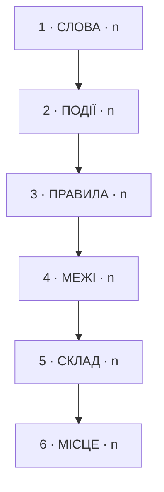

# Діагноз: <маршрут>

N знахідок · шар 1: n · шар 2: n · шар 3: n · шар 4: n · шар 5: n · шар 6: n · відкладено: n

## Помітне

| | |
|---|---|
| Найбільше знахідок | шар N |
| Безіменних подій | n |
| Слів із двома значеннями | ... |
| Модуль із найдовшим чесним іменем | `<модуль>` — n «і» |
| Знахідка, від якої залежить найбільше інших | DGn |

Нижній шар без верхнього нечинний: не можна назвати події, поки слова означають різне.

## Шар 1 · Слова

### DG1 · шар 1 · <рядок реєстру>

**Спостереження.**
**Канонічна назва.**
**Сходинка.** n — <назва сходинки>
**Якщо не чіпати.**
**Тримає.**

---

Шар 2 · Події · n знахідок — відкрий, коли слова вже узгоджені

Шар 3 · Правила · n знахідок — відкрий, коли події вже названі

Шар 4 · Межі · n знахідок — відкрий, коли правила вже мають дім

Шар 5 · Склад · n знахідок — відкрий, щоб побачити, які модулі перевантажені

Один рядок на кожен модуль, у якому маршрут має хоч один крок.

| модуль | кроків тут | чесне і повне ім'я | «і» | сценаріїв, що чіпають |
|---|---|---|---|---|
| `<файл>` | n | `<ім'я, що називає все>` | n | n |

### DGn · шар 5 · <модуль>

**Спостереження.**
**Канонічна назва.**
**Чесне і повне ім'я.** `<ім'я>` — n «і»
**Якщо не чіпати.**
**Тримає.**

Шар 6 · Місце · n знахідок — відкрий останнім: розташування є наслідком шарів 1–5

## Друга думка

Консультант читав лише інвентар, без коду і без цього файлу.

| шар | збіг | розбіжність |
|---|---|---|
| 1 Слова | n з n | `<що>` — консультант бачить <…>, я <…> |

Чого консультантові бракувало в інвентарі: <…, або «нічого»>

Відкладене · n — поза робочим набором або нічого не міняє в моделі

| id | що | де | чому відкладено |
|---|---|---|---|

