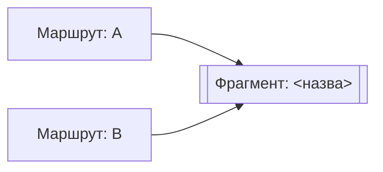

# Фрагмент: <назва>

N маршрутів ділять його · N кроків · висота: риба · `файл:рядок`

## Помітне

| | |
|---|---|
| Що він робить одним реченням | ... |
| Хто його ділить | ... |
| Чи має власне ім'я в коді | так \| ні |
| Сходинка імені | n — <назва сходинки> |

---

Маршрути, які його використовують — відкрий, щоб знати, кого зачепить зміна

| маршрут | на якому кроці |
|---|---|
|  | ST3 |

Кроки фрагмента — відкрий, щоб побачити нутрощі

| id | крок | де | як названо зараз | має власне ім'я |
|---|---|---|---|---|
| ST1 |  | `файл:рядок` |  | так \| ні |

