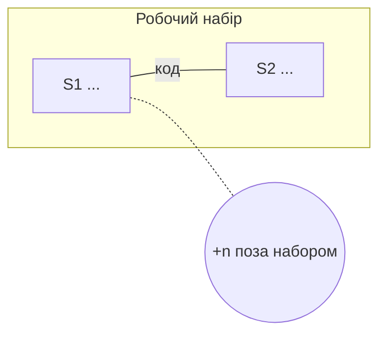

# Карта: <проєкт>

N файлів · N точок входу · N сценаріїв · N інфраструктурних точок

## Обрано

**<Sn · актор + дієслово + результат>** — маршрут від <EPn>, бо <причина>.

## Сценарії

| id | актор + дієслово + результат | точки входу | маршрутів пройдено |
|---|---|---|---|
| S1 |  | EP1, EP4 | 0 |

## Джерела мови

Документи, де терміни або правила імен уже записані. Судження ґрепає їх за словами кожного імені; цілком не читає.

| файл | що задає: терміни \| правила імен | рядків |
|---|---|---|
| `CLAUDE.md` |  |  |

Не виявлено: <де шукав>

## Сусідні маршрути

Заповнює судження. Порожньо, доки не пройдено жодного маршруту.

| маршрут | що відкриє | користь |
|---|---|---|

---

Точки входу · N — відкрий, коли шукаєш, звідки щось починається

| id | вид | шлях або сигнатура | де | сценарій |
|---|---|---|---|---|
| EP1 |  |  | `файл:рядок` | S1 \| інфраструктурна |

Види, яких немає: <вид — де шукав>

<!-- Секції нижче заповнює лише повний огляд, /restrukt:map на обсязі понад 50 файлів. -->

Робочий набір і ребра — відкрий, коли питаєш «кого я зламаю, якщо це зміню»

| між | тип: код \| стан \| слово | що саме спільне | значень у слова |
|---|---|---|---|

Висота сценаріїв — відкрий, коли сценарій здається завеликим або замалим

| id | висота: море \| хмара \| фрагмент | чому |
|---|---|---|

