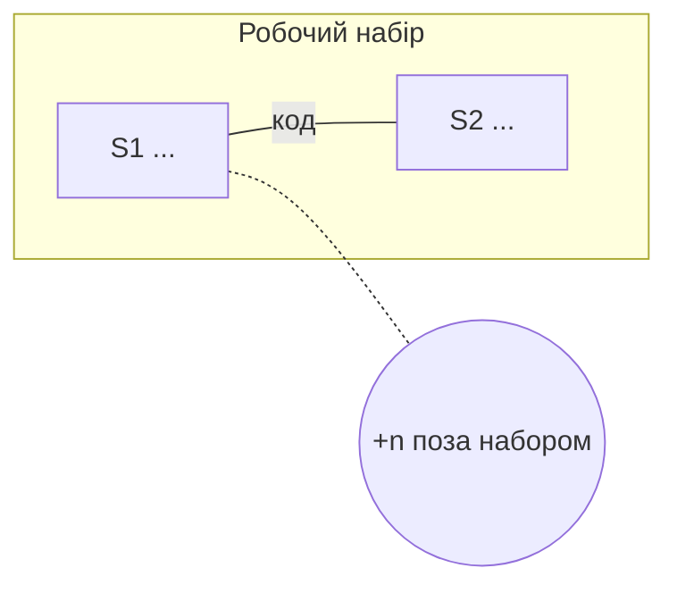

# Карта сценаріїв — <проєкт>

N точок входу · N сценаріїв · N фрагментів · N хмар · N двозначних слів

## Робочий набір

**<сценарії одним рядком>**

Тримає їх разом: <ребра одним реченням>



## Помітне

| | |
|---|---|
| Центр тяжіння | `функція()` — спільна для n сценаріїв із N |
| Другий за зв'язністю | `функція()` — n сценаріїв |
| Слова з двома значеннями | ... |
| Фрагменти без сценарію | ... |
| Видів точок входу немає | ... |

## Сусідні маршрути

Заповнює етап 3, оновлює етап 4. Порожньо, доки не пройдено жодного маршруту.

| маршрут | що спільного з пройденим | що відкриє | користь |
|---|---|---|---|
| S3 → `<точка входу>` | модуль `<X>` | вирок «розбирається» для `<X>` | висока |

Користь: **висока** — закриє відкрите питання · **середня** — підтвердить власника стану або спільний фрагмент · **низька** — спільний модуль без відкритого питання.

---

<details><summary>Повна карта · N сценаріїв — відкрий, коли треба бачити всі звʼязки разом</summary>

```mermaid
flowchart LR
```

</details>

<details><summary>Точки входу · N — відкрий, коли шукаєш, звідки щось починається</summary>

| id | вид | шлях або сигнатура | де | сценарій |
|---|---|---|---|---|
| EP1 |  |  | `файл:рядок` | S1 |

### Види, яких у проєкті немає

| вид | де шукав |
|---|---|

</details>

<details><summary>Сценарії · N — відкрий, коли обираєш, що ревізувати наступним</summary>

| id | актор + дієслово + результат | висота | точки входу |
|---|---|---|---|
| S1 |  | 🌊 море | EP1 |

### Хмари

| хмара | точки входу | розкладена на |
|---|---|---|

### Риби (фрагменти)

| id | фрагмент | де | маршрути |
|---|---|---|---|

</details>

<details><summary>Ребра · N — відкрий, коли питаєш «кого я зламаю, якщо це зміню»</summary>

| між | тип | що саме спільне | де |
|---|---|---|---|

</details>

<details><summary>Спільні слова · N — відкрий, коли назви в коді починають суперечити одна одній</summary>

| термін | сценарії | значень |
|---|---|---|

Повний словник проєкту — `docs/revision/_glossary.md`.

</details>
