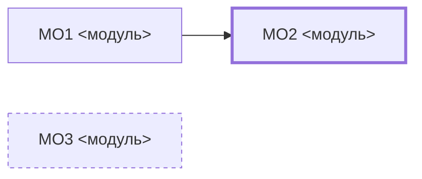

# Модель: <маршрут>

N перейменувань · N названих подій · N правил із домом · N сутностей із власником · N модулів на ремонт · N на перебудову · контракт: N фактів без змін

## Помітне

| | |
|---|---|
| Режим | n модулів ремонт · n перебудова |
| Найбільше змін | шар N |
| Ім'я, що чіпає найбільше місць | ... |
| Нових модулів | n: ... |
| Модулів зникає | n: ... |
| Контракт | N фактів, жоден не зник, жоден не додався |
| Винесено як фіча | ... |

### Цільова карта

Виведена з реєстрів маршруту, не з дерева файлів.

## Шар 1 · Слова

| зараз | стане | сходинка | чому | де вжито |
|---|---|---|---|---|
|  |  | n → n |  | `файл:рядок` |

## Шар 2 · Події

| id факту | що стає правдою | ім'я | сходинка | де збирається |
|---|---|---|---|---|
| FA1 |  | «…» — минулий час | n → 6 |  |

---

Шар 3 · Правила — відкрий, коли події вже названі

| id рішень | правило | дім | адреса |
|---|---|---|---|

Шар 4 · Межі — відкрий, коли правила вже мають дім

| сутність | власник | через що пишуть решта |
|---|---|---|

Шар 5 · Склад — відкрий, щоб побачити вирок кожному модулю

### Звідки взялася цільова карта

| з чого в реєстрах | що народжується | ім'я модуля |
|---|---|---|
| FA… про одну сутність | агрегат |  |
| EF… класу «зовнішня система» | порт |  |
| правило з шару 3 | тип-політика |  |

### Вирок модулям

| модуль | «і» | сценаріїв | вирок | режим | підстава |
|---|---|---|---|---|---|
| `<файл>` | n | n | лишається \| чиститься \| розбирається \| новий | ремонт \| перебудова |  |

Вирок «розбирається» потребує двох пройдених маршрутів через модуль. Пройдено один — пиши `розбирається, потрібен ще маршрут` і назви сценарій.

### Що виходить з кожного розібраного

| що було в модулі | куди переїжджає | з якого пункту випливає |
|---|---|---|

Шар 6 · Місце — відкрий останнім

| що | звідки | куди | з якого пункту випливає |
|---|---|---|---|

Контракт — відкрий, щоб переконатися, що поведінка не міняється

Перелік фактів із інвентаря, які мають настати після перебудови так само.

| id | що стає правдою | після перебудови |
|---|---|---|

## Друга думка

Консультант читав лише інвентар, без коду і без цього файлу.

| шар | збіг | розбіжність |
|---|---|---|
| 5 Склад | n вироків з n | `<модуль>` — консультант каже <…>, я <…> |

Чого консультантові бракувало в інвентарі: <…, або «нічого»>

## Сусідні маршрути

Скопійовано з `_map.md`, оновлено вироками шару 5.

| маршрут | що відкриє | користь |
|---|---|---|

## Підтвердження

Імена: користувач підтвердив — так \| ні
Вироки модулям: користувач підтвердив — так \| ні

## Хід перебудови

Заповнює етап 5, рядок на шар. У шарі 5 — рядок на модуль.

| шар | стан | повідомлення для коміта |
|---|---|---|
| 1 Слова | — | `шар 1: N перейменувань` |
| 2 Події | — | |
| 3 Правила | — | |
| 4 Межі | — | |
| 5 Склад | — | `шар 5: <модуль> розібрано на N` |
| 6 Місце | — | |

Стан: `—` не починали · `зроблено` · `пропущено` з причиною.
