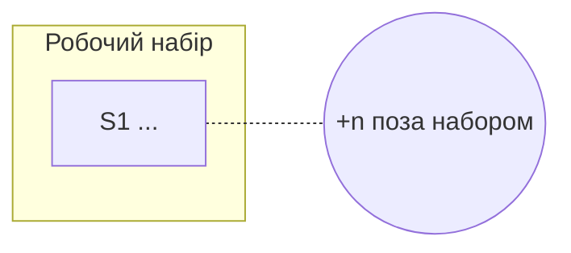
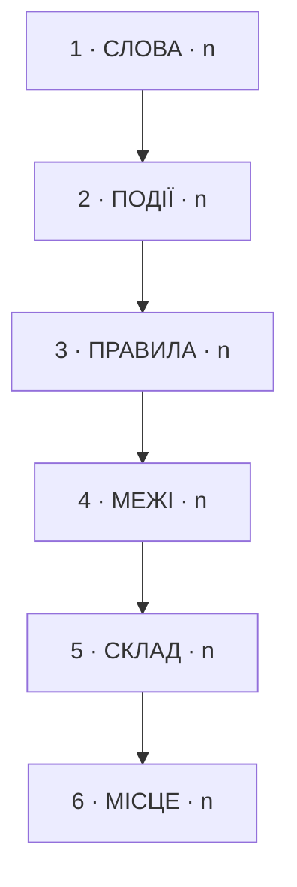

# Ревізія: <проєкт>

<дата> · N сценаріїв · N маршрутів · N знахідок · N безіменних подій

## Робочий набір

**<сценарії одним рядком>**

Тримає їх разом: <ребра>

## Що знайдено

| Шар | Знахідок | Найважливіша |
|---|---|---|
| 1 Слова | n | DGn — ... |
| 2 Події | n | DGn — ... |
| 3 Правила | n | DGn — ... |
| 4 Межі | n | DGn — ... |
| 5 Склад | n | DGn — ... |
| 6 Місце | n | DGn — ... |

## Безіменні події

Те, заради чого все це робилося: що відбувається в коді і не має назви.

| id | що стає правдою | де розсипане |
|---|---|---|

## Що я вирішив без тебе

| Рішення | Що обрано | Чому |
|---|---|---|

## Перевантажені модулі

Чесне і повне ім'я називає все, що модуль робить. Кожне «і» в ньому — лінія розрізу.

| модуль | «і» | сценаріїв, що чіпають | що це означає |
|---|---|---|---|

## Що лишилось відкритим

| | |
|---|---|
| Відкриті межі | ... |
| Маршрути без тесту повноти | ... |
| Слова з двома значеннями, не рознесені | ... |

## Куди далі

<один абзац: що дає найбільше, якщо взятися першим, і чому>

---

Файли ревізії — відкрий, коли потрібні деталі

| файл | що в ньому |
|---|---|
| `docs/revision/_map.md` | карта сценаріїв, точки входу, ребра |
| `docs/revision/_glossary.md` | терміни цього коду |
| `docs/revision/_journal.md` | виклики, у які не спускались |
| `docs/revision/<сценарій>/<маршрут>.md` | інвентар маршруту, контракт поведінки |
| `docs/revision/<сценарій>/<маршрут>.diagnosis.md` | знахідки по шарах, таблиця модулів |

