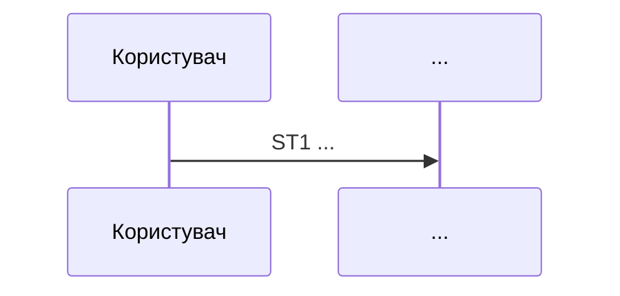
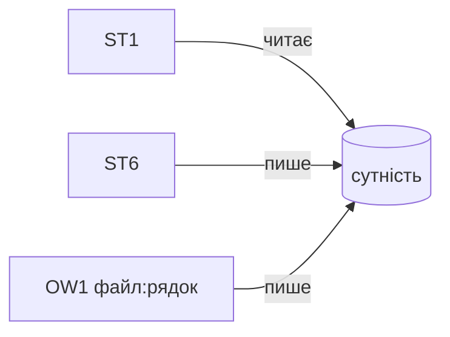
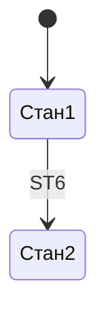
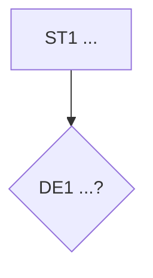

# Маршрут: <назва>

N кроків · N рішень · N ефектів · **N безіменних фактів** · N меж

Сценарій:
Точка входу: <вид> — `файл:рядок`
Термінатори: <id + тип>
Відкриті межі: <id, або «немає»>
Фрагменти: <посилання, або «немає»>
Реєстри заповнені: так \| ні · Тест повноти: пройдено \| ні

## Помітне

| | |
|---|---|
| Безіменних фактів | n із N |
| Крок із найбільшою кількістю ефектів | STn — n ефектів n класів |
| Сутність із чужими писарями | ... |
| Найглибша гілка | n кроків до термінатора |

## Факти (реєстр 5)

Що стає правдою на цьому маршруті. Саме заради цього реєстру все інше й збиралося.

| id | крок | що стає правдою | стан імені |
|---|---|---|---|
| FA1 | ST1 |  | `безіменний` \| ім'я в коді |

## Стан

| id | сутність | читає | пише | чужі писарі |
|---|---|---|---|---|
| S1 |  | ST1 | ST6 | OW1 `файл:рядок` |

## Життєвий цикл

---

Кроки · N — відкрий, коли треба пройти маршрут крок за кроком

| id | крок | де | як названо зараз | має власне імʼя |
|---|---|---|---|---|
| ST1 |  | `файл:рядок` |  | так \| ні |

Рішення · N — відкрий, коли шукаєш, за яких умов щось стається

| id | крок | вираз | доменне прочитання | де |
|---|---|---|---|---|
| DE1 | ST1 | `` |  | `файл:рядок` |

Ефекти · N — відкрий, коли питаєш, що саме цей маршрут міняє у світі

| id | крок | клас | що змінює | де |
|---|---|---|---|---|
| EF1 | ST1 |  |  | `файл:рядок` |

Входи · N явних, N прихованих — відкрий, коли шукаєш приховані залежності

### Явні

| id | що | тип | де |
|---|---|---|---|

### Приховані

| id | що | клас | де |
|---|---|---|---|

Межі · N — відкрий, коли маршрут покидає процес або сервіс

| id | між чим і чим | що переходить | формат | зшито за |
|---|---|---|---|---|

Тест повноти

Пройдено: так \| ні
Діри, знайдені й залатані:

