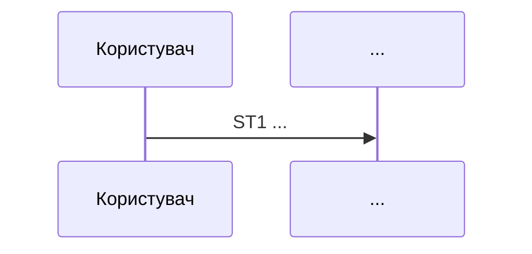

# Маршрут: <назва>

N кроків · N рішень · N ефектів · **N безіменних фактів із N** · N меж

Сценарій: <id · актор + дієслово + результат>
Точка входу: <вид> — `файл:рядок`
Термінатори: <id + тип>
Відкриті межі: <id, або «немає»>
Тест повноти: пройдено \| ні
Судження: `<маршрут>.judgement.md`, шари 1–2

## Помітне

| | |
|---|---|
| Безіменних фактів | n із N |
| Центральний факт маршруту | FAn — ... |
| Сутність із чужими писарями | Sn — n писарів |
| Крок із найбільшою кількістю рішень | STn — n |

## Факти (реєстр 5)

Контракт поведінки: що стає правдою на цьому маршруті.

| id | крок | що стає правдою | стан імені |
|---|---|---|---|
| FA1 | ST1 |  | `безіменний` — «робочий опис» \| ім'я в коді |

## Стан

| id | сутність | читає | пише | чужі писарі |
|---|---|---|---|---|
| S1 |  | ST1 | ST6 | OW1 `файл:рядок` |

---

Кроки · N — відкрий, коли треба пройти маршрут крок за кроком

| id | крок | де | як названо зараз | рішень і ефектів поза реєстром |
|---|---|---|---|---|
| ST1 |  | `файл:рядок` |  | 2 перевірки, 3 логи |

Входи · N — відкрий, коли питаєш, звідки крок бере дані

| id | крок | явний \| прихований | клас | що | де |
|---|---|---|---|---|---|

Рішення · N — відкрий, коли шукаєш, за яких умов щось стається

| id | крок | вираз | доменне прочитання | гілка «невідомо» веде до | де |
|---|---|---|---|---|---|

Ефекти · N — відкрий, коли питаєш, що маршрут міняє у світі

| id | крок | клас | що змінює | де |
|---|---|---|---|---|

Межі · N — відкрий, коли маршрут покидає процес або сервіс

| id | між чим і чим | що переходить | зшито за |
|---|---|---|---|

Фрагменти запропоновані · Тест повноти

Фрагменти: <назва, кроки, хто ще ділить — або «немає»>
Діри, знайдені й залатані: <або «немає»>

